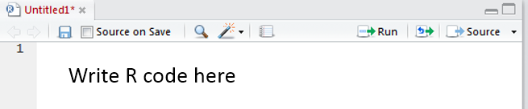
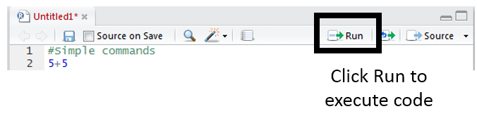
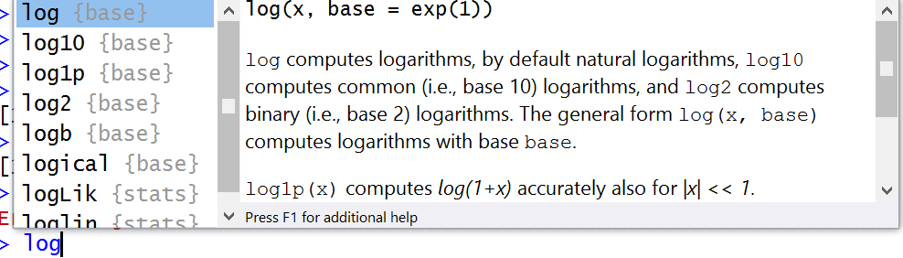
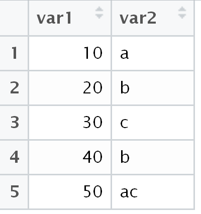
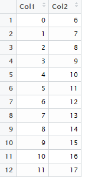
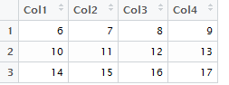
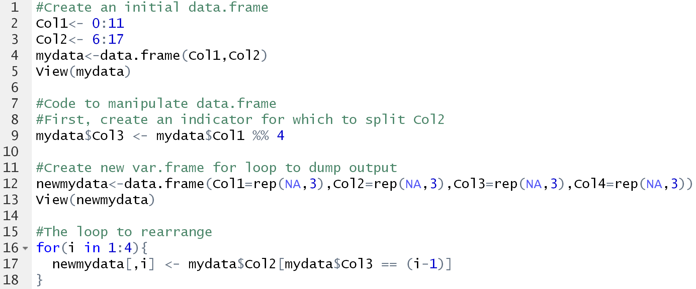

R: Programming in R

  ----------------------------------------------------------------------------------------------------------------------------------------------------------------------------- ------------------------------------------------------------------------------------------------------------------------------
  R is one of the most common software packaged used for data science. Python is a second software package often utilized in data science. The use of R is widespread because   {width="1.3440857392825898in" height="1.0416666666666667in"}
                                                                                                                                                                                
  -   R has the ability to deal with data, and                                                                                                                                  
                                                                                                                                                                                
  -   R is a programming language.                                                                                                                                              
                                                                                                                                                                                
  ----------------------------------------------------------------------------------------------------------------------------------------------------------------------------- ------------------------------------------------------------------------------------------------------------------------------

A script window in R allow you to write code which can later be
executed. A script window can be obtained in R Studio near the
upper-left corner. R is interactive in that you can write code directly
into the R console; however, I’d encourage you write your code in the
script window.

The following can be used to obtain a R script window.

{width="3.8608694225721787in"
height="1.3287412510936134in"}

***Getting Started***

R code can be written directly into the R Script window. Commenting code
is important in any language. A comment line in the R script window
stats with \#. That is, any line that starts with \# will be ignored
upon submitting the code to be executed.

{width="4.072916666666667in"
height="0.8454779090113735in"}

Write the following two lines of code in the script window. Click Run to
execute this code.

  -------------------
  \#Simple commands
  
  \#Addition
  
  5+5
  -------------------

{width="4.302083333333333in"
height="1.0502416885389327in"}

Consider the following code

  -----------------------------------------------
  \#Simple commands
  
  \#Addition
  
  5+5
  
  \#Multiplication
  
  5\*5
  
  \#Powers
  
  2\^3
  
  \#Using log functions, base e
  
  log(5)
  
  \#Log function with base=10
  
  log(5,base=10)
  
  \#Log 10 is common enough that log10() exists
  
  log10(5)
  
  \#Modular arithmetic, 4 mod 2
  
  4 %% 2
  -----------------------------------------------

The &gt; log(5) command used above is a example of a built-in *function*
in R. When using functions, it may be useful to hit the TAB key. For
example, enter “log” at the prompt and then select the TAB key. R then
displays information about functions whose names begin with “log.”

{width="4.513369422572178in"
height="1.2889818460192477in"}

The expressions from above are evaluated and the results are printed to
the screen. The results can be assigned to an object with the use of
assignment operators, i.e. “&lt;-“. For example, the following will save
the result into a variable named Ten.

  -----------------------------------------------
  \#Assigning the outcome to a variable
  
  Ten &lt;- 5 + 5
  
  \#Type variable name is see outcome
  
  Ten
  
  \#Identify internal structure of variable Ten
  
  str(Ten)
  -----------------------------------------------

Assigning a set of values to a vector. The c() syntax is used to create
a vector from scratch. Often R allows operators/functions to work within
other functions. Consider the following examples.

  ----------------------------------------------------
  \#Assign a set of values to a vector - Version \#1
  
  mydata &lt;- c( 10 , 6 , 2 )
  
  \#Assign a set of values to a vector - Version \#2
  
  mydata &lt;- c( 5+5 , 3\*2 , 3-1 )
  ----------------------------------------------------

***Using Basic Operators in R***

R uses the following comparison operators.

  = =     Equal
  ------- --------------------------
  !=      Not equal
  &gt;    Greater than
  &gt;=   Greater than or equal to
  &lt;    Less than
  &lt;=   Less than or equal to

  -------------------------------------------
  \#Which data elements are greater than 5?
  
  mydata &gt; 5
  -------------------------------------------

> \[1\] TRUE TRUE FALSE

Next, use the previous command to obtain a subset of data that includes
only the value that are greater than 5.

  ----------------------------------------------------------------------------------------------------
  \#Obtain subset of data; only observations &gt; 5
  
  mydata\[ mydata &gt; 5 \]
  
  \#Obtain subset of data; only observations &gt; 5; assign subset into data.greater.than.5 variable
  
  mydata.greater.than.5 &lt;- data\[ data &gt; 5 \]
  ----------------------------------------------------------------------------------------------------

Using the which() function to identify only the TRUE outcomes.

  -----------------------------------------
  \#Using which() to locate TRUE outcomes
  
  which(mydata &gt; 5)
  -----------------------------------------

> \[1\] 1 2

The which() function simple returns the identifiers for the elements
that were TRUE.

  R Code                   Element 1   Element 2   Element 3
  ------------------------ ----------- ----------- -----------
                           10          6           2
  mydata &gt; 5            TRUE        TRUE        FALSE
  which( mydata &gt; 5 )   1           2           

***Using Compound Operators in R***

  &   AND returns TRUE if both comparisons return TRUE
  --- ---------------------------------------------------------
  |   OR returns TRUE if at least one comparison returns TRUE
  !   NOT returns the negation of a logical vector.

Again, working the data vector created above.

  ----------------------------------------
  \#Getting data values &gt; 8 or &lt; 3
  
  mydata &gt; 8 | mydata &lt; 3
  ----------------------------------------

> \[1\] TRUE FALSE TRUE

Create the following simple data.frame in R.

  -----------------------------------------------------------------------------------
  \#Creating a simple data.frame with two variables
  
  var1 &lt;- c(10,20,30,40,50)
  
  var2 &lt;- c("a","b","c","b","ac")
  
  var12 &lt;- data.frame(var1,var2)
  
  \#To view the data.frame, use the View() function; \*Note\*: Capital “V” in View.
  
  View(var12)
  -----------------------------------------------------------------------------------

{width="1.8472222222222223in"
height="1.9672922134733157in"}

Consider the following commands. For each command, verify that the
desired output is returned.

  --------------------------------------------------------------
  \#Getting rows for which var1 &gt; 10
  
  var12\[var12\$var1 &gt; 10, \]
  
  \#Gettign rows for which var1 &gt; 10 and var2 == b
  
  var12\[var12\$var1 &gt; 10 & var12\$var2 == "b", \]
  
  \#Getting rows for which var2 contains only an a or only a c
  
  var12\[var12\$var2 %in% c("a","c"), \]
  
  \#Getting rows for which var2 contains an any a
  
  var12\[grep("a",var12\$var2), \]
  --------------------------------------------------------------

***\
***

***For Loops / IF Statements in R***

Consider the following structure of a for() loop in R. Here i is the
index, the loop runs from i=1 to i=10. Once again the \[ \] syntax is
used to place the output into its respective element of the output
vector.

++
|  |
++

Write the following code in the script window. Execute this code to
obtain the desired output vector.

  -------------------------------------------------------- -------------------------------------------------
  \#For Loops in R                                           ---------------------------------------------
                                                                    initial output   updated
  \#Creating an initial vector filled with NAs                                       
                                                                                     output &lt;- i \* 2
  output &lt;- rep(NA,10)                                    ------ ---------------- ---------------------
                                                             i=1    NA               2
  \#or creating an initial vector filled with 0s           
                                                             i=2    NA               4
  output &lt;- rep(0,10)                                   
                                                             i=3    NA               6
  \#or creating an initial vector filled with NAs          
                                                             i=4    NA               8
  output &lt;- c( )                                        
                                                             i=5    NA               10
  \#\#\#\#\#\#\#\#\#\#\#\#\#\#\#\#\#\#\#\#\#\#\#\#\#\#\#   
                                                             i=6    NA               12
  \#The for loop                                           
                                                             i=7    NA               14
  for( i in 1 : 10 ) {                                     
                                                             i=8    NA               16
  output\[ i \] &lt;- i \* 2                               
                                                             i=9    NA               18
  }                                                        
                                                             i=10   NA               20
                                                             ---------------------------------------------
                                                           
  -------------------------------------------------------- -------------------------------------------------

Consider the following use of the an IF() statement. This purpose of
this statement is to set the output value equal to 50 for i=5. The
remaining iterations should be the same as above.

  -------------------------- -------------------------------------------------
  for(i in 1:10){              ---------------------------------------------
                                      initial output   updated
  if(i == 5) {                                         
                                                       output &lt;- i \* 2
  > output\[i\] &lt;- 50       ------ ---------------- ---------------------
                               i=1    NA               2
  } else {                   
                               i=2    NA               4
  > output\[i\] &lt;- i\*2   
                               i=3    NA               6
  }                          
                               i=4    NA               8
  }                          
                               i=5    NA               **50**
                             
                               i=6    NA               12
                             
                               i=7    NA               14
                             
                               i=8    NA               16
                             
                               i=9    NA               18
                             
                               i=10   NA               20
                               ---------------------------------------------
                             
  -------------------------- -------------------------------------------------

Write the following code in the script window. Execute this code to
obtain the desired output vector.

  ------------------------------------------------
  \#Creating an initial vector filled with NAs
  
  output &lt;- rep(NA,10)
  
  \#The for loop that contains an if() statement
  
  for(i in 1:10){
  
  if(i == 5) {
  
  output\[i\] &lt;- 50
  
  } else {
  
  output\[i\] &lt;- i\*2
  
  }
  
  }
  ------------------------------------------------

*\
*

*Questions*:

1.  Consider the following modification of the code presented above. The
    else{} portion of the IF() statement has been removed. Explain why
    the output vector has a value of 10 (instead of 50) for i=5.

  ------------------------ --------------------------------
  for(i in 1:10){                   output &lt;- i \* 2
                             ------ ---------------------
  if(i == 5) {               i=1    2
                             i=2    4
  > output\[i\] &lt;- 50     i=3    6
                             i=4    8
  }                          i=5    ~~50~~ 10
                             i=6    12
  output\[i\] &lt;- i\*2     i=7    14
                             i=8    16
  }                          i=9    18
                             i=10   20
                           
  ------------------------ --------------------------------

1.  Write the following code in R.

  ---------------------------------------------------------------------------------------
  > \#Create the initial data.frame
  
  Col1&lt;- 0:11
  
  Col2&lt;- 6:17
  
  mydata&lt;-data.frame(Col1,Col2)
  
  View(mydata)
  
  \#Code to manipulate data.frame
  
  \#First, create an indicator for which to split Col2
  
  mydata\$Col3 &lt;- mydata\$Col1 %% 4
  
  \#Create new var.frame for loop to dump output
  
  newmydata&lt;-data.frame(Col1=rep(NA,3),Col2=rep(NA,3),Col3=rep(NA,3),Col4=rep(NA,3))
  
  View(newmydata)
  
  \#The loop to rearrange
  
  for(i in 1:4){
  
  newmydata\[,i\] &lt;- mydata\$Col2\[mydata\$Col3 == (i-1)\]
  
  }
  ---------------------------------------------------------------------------------------

The code above transform the original data.frame to the desired
data.frame provided below.

  ------------------------------------------------------------------------------------------- ----------- -------------------------------------------------------------------------------
  Original data.frame                                                                         Transform   Desired data.frame
                                                                                                          
  {width="0.8684219160104987in" height="1.8333333333333333in"}               {width="2.3125in" height="0.8591896325459317in"}
  ------------------------------------------------------------------------------------------- ----------- -------------------------------------------------------------------------------

Consider again the code used to transform this data.frame to its desired
structure.

{width="5.6018525809273845in"
height="2.329915791776028in"}

a.  What is the purpose of Line 9? Discuss.

b.  Consider Line 12, what is rep(NA,3) doing?

c.  Consider Line 17, what are the value of mydata\$Col2\[mydata\$Col3
    == (i=1)\] for i=2?

d.  Consider Line 17, why is i used for newmydata\[,i\], but (i-1) being
    used for mydata\$Col2\[mydata\$Col3 == (i=1)\]?

e.  Rewrite Line 17 to read: newmydata\[,i\] = Col2\[(Col1 %% 4) ==
    (i-1)\] Is the mydata data.frame needed or is this loop able to work
    directly with the individual vectors? Briefly discuss.

