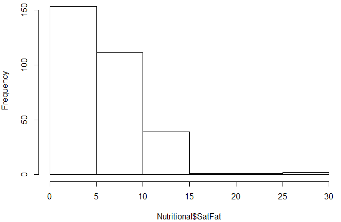
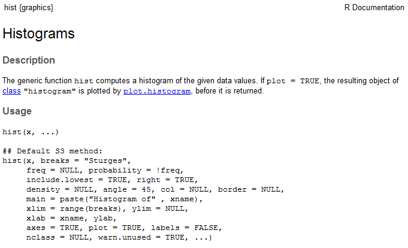
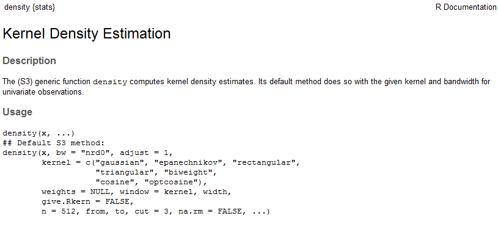
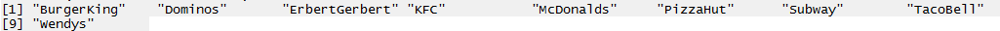
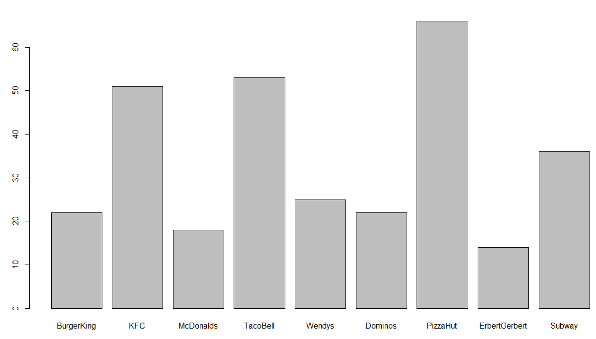
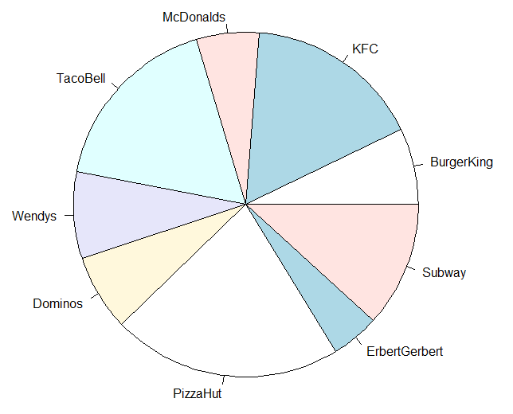
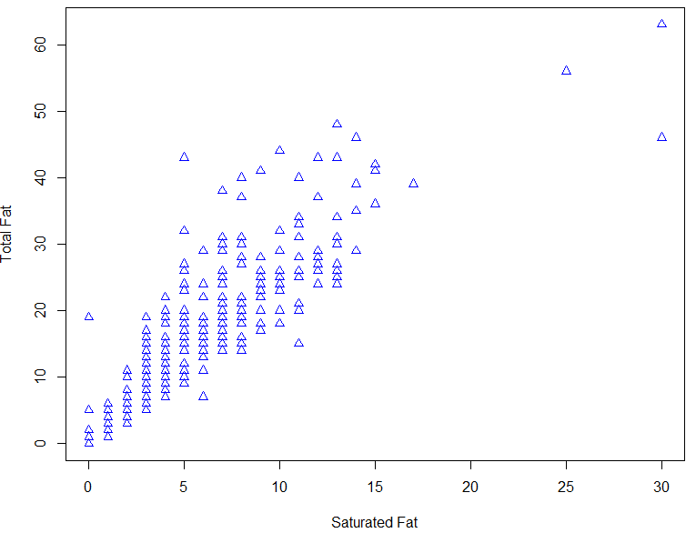
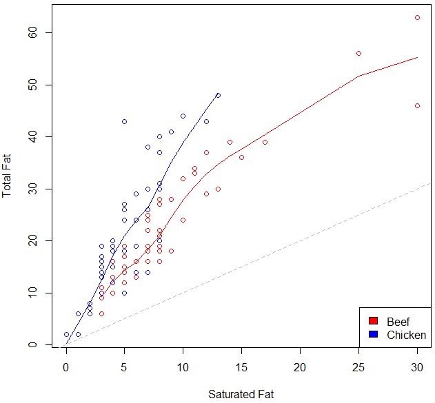
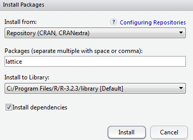
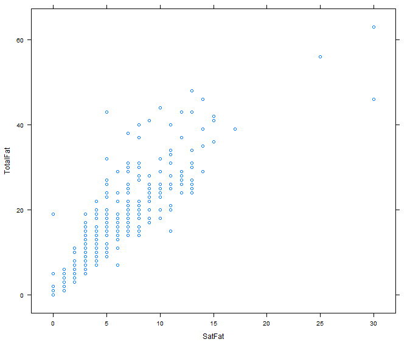

Handout 4: Basic Graphics in R

This handout will provide an introduction to creating graphics in R.
Here, we will cover only the more basic, traditional graphics. You
should be aware, however, that more advanced users can create more
complex and interesting graphical summaries of data using R.

First, to see some examples of graphs that can be created in R, enter
the following command at the prompt.

&gt; demo(graphics)

***\
Histograms and Density Smoothers***

Read the NutritionData file into R.

{width="6.0in"
height="1.1645833333333333in"}

Once this data set has been attached, the names in this data frame are
as follows.

&gt; names(NutritionData)

\[1\] "Location" "ItemName" "Type" "Calories" "TotalFat"

\[6\] "SatFat" "Cholesterol" "Sodium" "Carbohydrates" "Fiber"

***\
\
***The most basic form of the hist() function is employed below.

&gt; hist(NutritionData\$SatFat)

{width="2.991304680664917in"
height="1.94330927384077in"}

***\
***

As shown in the following documentation, several optional arguments
exist that can be used to modify the resulting plot.

{width="5.906884295713036in"
height="3.5913035870516183in"}

For example, enter the following options to the hist() function.

&gt; hist(NutritionData\$SatFat,breaks=20,freq=F,xlab="Saturated Fat",
main="Histogram of Saturated Fat",col='gray')

{width="3.4895833333333335in"
height="2.8058562992125986in"}

*\
*

*Questions*:

1.  What happens when the freq= option is set to TRUE. What changes?

2.  Can you figure out how to change the breaks option so that there are
    breakpoints at 0, 5, 10, 15, 20, 25, and 30? Hint: These values will
    need to be entered as a vector.

***Adding a Density Smoother to a Histogram in R***

The following command will add a “trend” to the histogram. This trend
line is called a density smoother.

&gt; hist(NutritionData\$SatFat,breaks=20,freq=F,xlab="Saturated Fat",
main="Histogram of Saturated Fat",col='gray')

&gt; lines(density(NutritionData\$SatFat))

{width="3.278261154855643in"
height="2.387363298337708in"}

Once again, several optional arguments exist that can be used to modify
the resulting density smoother.

&gt; help(density)

{width="5.81003280839895in"
height="2.6521741032370953in"}

&gt; help(lines)

{width="6.0in"
height="1.9291666666666667in"}

For example, we can modify the appearance of the histogram/density
smoother as follows:

&gt; hist(NutritionData\$SatFat,breaks=40,freq=F,xlab="Saturated Fat",
main="Histogram of Saturated Fat", col='gray')

&gt; lines(density(NutritionData\$SatFat,adjust=0.50),lty=2)

{width="5.269564741907262in"
height="3.4441240157480313in"}

*Questions*:

1.  Change the adjust= option to a few different values. What changes?

2.  Change the lty= option to 5 and then to “dotted”. What changes?

***\
***

***Boxplots in R***

The most basic form of the boxplot() function is employed below.

&gt; boxplot(NutritionData\$SatFat)

{width="2.572889326334208in"
height="2.3389490376202975in"}

You can learn more about the optional arguments from the help
documentation.

&gt; help(boxplot)

The following can be used to obtain boxplots for Saturated Fat for each
restaurant location.

&gt; boxplot(NutritionData\$SatFat \~ NutritionData\$Location)\
{width="6.0in"
height="3.3444444444444446in"}

The order in which the restaurants are plotted is determine by the
factor levels. Most often these are alphabetical in order.

{width="6.0in"
height="1.156522309711286in"}

To existing order can be identified using the levels() function.

&gt; levels(NutritionData\$Location)
{width="6.0in" height="0.1875in"}

A new vector for the factor level settings can be used to reassign
levels. The following will reorder the levels so that all the Fast Food
locations are listed first, the Pizza locations second, followed by the
Subs locations.

{width="1.6695647419072617in"
height="1.7777777777777777in"}

&gt; \#Change order of factor levels

&gt;
NutritionData\$Location&lt;-factor(NutritionData\$Location,levels=c("BurgerKing","KFC","McDonalds","TacoBell","Wendys","Dominos","PizzaHut","ErbertGerbert","Subway"))

{width="5.140433070866142in"
height="3.012270341207349in"}

***Bar Charts / Pie Charts in R***

Barchart are commonly used to display counts from categorical data. The
table() function is used to obtain counts in R.

&gt; table(NutritionData\$Location)

{width="6.0in"
height="0.19166666666666668in"}

We can pass the output from the table() function directly in the
barplot() function.

&gt; barplot(table(NutritionData\$Location))

{width="4.74846675415573in"
height="2.705087489063867in"}

A pie chart can be obtained in a similar way.

&gt; pie(table(NutritionData\$Location))

{width="3.496933508311461in"
height="2.8234503499562553in"}

Plots for two-dimensional tables are

&gt; table(NutritionData\$Type, NutritionData\$Location)

{width="6.0in"
height="1.4527777777777777in"}

Getting a stacked barchart for this table. A more appropriate 100%
stacked barchart is provided below.

&gt; barplot(table(NutritionData\$Type, NutritionData\$Location),
legend=TRUE)

{width="6.0in"
height="3.702777777777778in"}

A 100% stacked barchart can be obtained as follows.

&gt;
table.of.counts&lt;-table(NutritionData\$Type,NutritionData\$Location)

&gt; barplot(prop.table(table.of.counts,2),legend=TRUE)

{width="4.982608267716535in"
height="2.900178258967629in"}

***\
***

***Scatterplots and Smoothers***

Scatterplots are simple to create in R using the plot() function. For
example, we could examine the relationship between *Saturated Fat* and
*Total Fat* by creating the following plot.

&gt; plot(TotalFat\~SatFat,data=NutritionData)

{width="4.452174103237096in"
height="3.3860225284339456in"}

To add a trend line (i.e., the regression line) to this plot, you can
use the abline() and lm() function.

&gt; abline(lm(TotalFat\~SatFat,data=NutritionData))

{width="4.052174103237095in"
height="3.0316262029746284in"}

***\
***

Loess smoothers are a common alternative to regression models in data
science. Loess models are more flexible than regression-type smoothers.
There are advantages and disadvantages to all models.

Loess Regression Wiki page:
<https://en.wikipedia.org/wiki/Local_regression>

{width="5.373912948381452in"
height="2.6098304899387577in"}

The loess() function in R can be used to obtain a loess smoother in R. 
=======================================================================

&gt; \#Creating the intial plot

&gt; plot(TotalFat\~SatFat,data=NutritionData)

&gt;

&gt; \#Fitting a loess model

&gt; fit&lt;-loess(TotalFat\~SatFat,data=NutritionData)

&gt;

&gt; \#Using a generic sequence for x to obtain a prediction line

&gt; \#lines(seq(0,30,1),
predict(fit,newdata=data.frame(SatFat=seq(0,30,1))))

&gt;

&gt; \#Using actual SatFat data valus to obtain a prediction

&gt; lines(sort(NutritionData\$SatFat),
predict(fit,newdata=NutritionData\[order(NutritionData\$SatFat),\]))

The span= option within the loess() function controls the amount of
smoothing being done. The lower the span value, the less smoothing that
is done.

&gt; fit&lt;-loess(TotalFat\~SatFat,data=NutritionData, span=.4)

***\
***

  ---------------------------------------------------------------------------- --------------------------------------------------------------------------------------------
  Span = 0.75 (default setting)                                                Span = 0.3
                                                                               
  {width="2.6in" height="2.420647419072616in"}   {width="2.6086953193350833in" height="2.4266305774278214in"}
  ---------------------------------------------------------------------------- --------------------------------------------------------------------------------------------

***(Optional) Graphical Parameters***

&gt; par(mfrow=c(1,2)) \#Create a 1 x 2 grid for plotting

&gt; par(pty="s") \#Force square plotting region, par(pty="m") will
change back to default

&gt;help(par) \# for others – several to choose from

{width="6.0in" height="2.58125in"}

The following command will change the range on the x- and y-axis from
the defaults.

&gt; plot(TotalFat\~SatFat,data=NutritionData, xlab="Saturated Fat",
ylab="Total Fat", xlim=c(0,60), ylim=c(0,60))

{width="3.847587489063867in"
height="2.9391305774278216in"}

Options can be specified for the points as well. The col= option can be
used to change the color and the pch= option specifies the plotting
character. The list of plotting characters is provided here.

{width="6.0in"
height="0.5076924759405075in"}

To following change the color to blue and uses plotting character 2,
i.e. a triangle.

&gt; plot(TotalFat\~SatFat,data=NutritionData, xlab="Saturated Fat",
ylab="Total Fat", col="blue",pch=2)

{width="4.365217629046369in"
height="3.3436351706036747in"}

***\
***

For the next set of plots, we will create a subset of the NutritionData

&gt; BeefChickenData &lt;- NutritionData\[NutritionData\$Type %in%
c("Beef","Chicken"), \]

***\
***

  -- --------------------------------------------------------------------------------------------
     Consider the following subset for next plot…\
     {width="3.991304680664917in" height="0.37005468066491687in"}
  -- --------------------------------------------------------------------------------------------

The following sequence of commands will create the plot below.

&gt; plot(TotalFat\~SatFat,data=BeefChickenData,xlab="Saturated Fat",
ylab="Total Fat",
col=c("red","blue")\[match(Type,c("Beef","Chicken"))\])

&gt;
abline(lm(TotalFat\~SatFat,data=BeefChickenData\[BeefChickenData\$Type=="Beef",\]),col="red")

&gt;
abline(lm(TotalFat\~SatFat,data=BeefChickenData\[BeefChickenData\$Type=="Chicken",\]),col="blue")

&gt; abline(0,1,col="gray",lty=2)

{width="4.611562773403325in"
height="3.486715879265092in"}

A legend can be added to this plot using the legend() function.

&gt;
legend("bottomright",legend=c("Beef","Chicken"),fill=c("red","blue"))

The following code is used to add loess smoothers to the scatterplot.

&gt; \#Plots with Loess smoothers

&gt; plot(TotalFat\~SatFat,data=BeefChickenData,xlab="Saturated Fat",
ylab="Total Fat",

+ col=c("red","blue")\[match(Type,c("Beef","Chicken"))\])

&gt;

&gt;
fit.beef&lt;-loess(TotalFat\~SatFat,data=BeefChickenData\[BeefChickenData\$Type=="Beef",\])

&gt; lines(sort(BeefChickenData\[BeefChickenData\$Type == "Beef",6\]),
sort(predict(fit.beef,newdata=BeefChickenData\[BeefChickenData\$Type ==
"Beef",\])), col="red")

&gt;

&gt;
fit.chicken&lt;-loess(TotalFat\~SatFat,data=BeefChickenData\[BeefChickenData\$Type=="Chicken",\])

&gt; lines(sort(BeefChickenData\[BeefChickenData\$Type ==
"Chicken",6\]),
sort(predict(fit.chicken,newdata=BeefChickenData\[BeefChickenData\$Type
== "Chicken",\])), col="blue")

&gt; abline(0,1,col="gray",lty=2)

&gt;
legend("bottomright",legend=c("Beef","Chicken"),fill=c("red","blue"))

{width="5.182608267716535in"
height="4.80471019247594in"}

The type=”n” option in the plot() function prevents the points from
being plotted.

&gt; plot(TotalFat\~SatFat,data=BeefChickenData,xlab="Saturated Fat",
ylab="Total Fat",

+ col=c("red","blue")\[match(Type,c("Beef","Chicken"))\], type="n")

***\
***

***Advanced Plotting***

The lattice package is a powerful graphical package available in R. The
most cutting-edge package for plotting is ggplot2. The ggplot2 package
will not be covered in this handout.

{width="3.1043471128608924in"
height="2.2524945319335083in"}

To load this (or any other) package in R, go to the lower right-hand
window of the R Studio window. You can search for the package of
interest.

{width="5.260416666666667in"
height="0.6875in"}

Here, you can check the box next to “lattice” and note that R
automatically runs the following command.

&gt; library(lattice)

***\
***

***Obtaining a Histogram Using the Lattice Package***

You can use the histogram() function once the lattice package has been
installed:

&gt; histogram( \~ SatFat, data=NutritionData)

{width="4.235849737532808in"
height="3.1131496062992126in"}

A more interesting display would compare the distribution of Saturated
Fat across Location. This is easily implemented with lattice graphics.

&gt; histogram(\~SatFat|Location,data=NutritionData, col="gray")

{width="5.0434776902887135in"
height="3.4936581364829395in"}

***\
***

***Obtaining a Density Plot Using the Lattice Package***

&gt; densityplot(\~SatFat|Location,data=NutritionData, col="black",
plot.points=FALSE)

{width="6.0in"
height="4.267361111111111in"}

*\
Question:* Re-submit the above command with the plot.points argument
omitted. What happens?

Note that instead of displaying the density plots in a separate panels
for each location, R can alternatively overlay the density plots as
following by way of the groups= option.

&gt; densityplot(\~SatFat, data=NutritionData, groups=Location,
plot.points=FALSE, auto.key=TRUE)

  ------------------------------------------------------------------------------------------- --------------------------------------------------------------------------------------------
  {width="4.110429790026247in" height="2.9805369641294837in"}   {width="1.6354166666666667in" height="1.3020833333333333in"}
  ------------------------------------------------------------------------------------------- --------------------------------------------------------------------------------------------

An example with more clarity is given for the Beef and Chicken subset
datasets.

&gt; densityplot(\~SatFat, data=BeefChickenData, groups=Type,
plot.points=FALSE, auto.key=TRUE)

  ------------------------------------------------------------------------------------------ --------------------------------------------------------------------------------------------
  {width="3.732483595800525in" height="2.059346019247594in"}   {width="1.3312095363079615in" height="1.3312095363079615in"}
  ------------------------------------------------------------------------------------------ --------------------------------------------------------------------------------------------

Notice that the legend is incorrect and appears to be using the factor
levels from the NutritionData and not the Beef and Chicken subset.

&gt; str(BeefChickenData)

{width="6.0in"
height="1.1854166666666666in"}

Update the factor level settings for Type in the Beef and Chicken
subset.

&gt;
BeefChickenData\$Type&lt;-factor(BeefChickenData\$Type,levels=c("Beef","Chicken"))

&gt; str(BeefChickenData)

{width="6.0in" height="1.21875in"}

The legend now correctly corresponds with the plot.

&gt; densityplot(\~SatFat, data=BeefChickenData, groups=Type,
plot.points=FALSE, auto.key=TRUE)

  -------------------------------------------------------------------------------------------- --------------------------------------------------------------------------------
  {width="3.6496817585301837in" height="2.4855008748906386in"}   {width="1.3125in" height="0.4166666666666667in"}
  -------------------------------------------------------------------------------------------- --------------------------------------------------------------------------------

***\
***

***Obtaining a Scatterplot Using Lattice***

&gt; xyplot(TotalFat\~SatFat, data=NutritionData)

{width="3.0188681102362205in"
height="2.5216633858267716in"}

Next, note that you can also obtain the scatterplot above for each
location fairly easily using the built-in conditioning functionality
provided by the lattice package.

&gt; xyplot(TotalFat\~SatFat | Location, data=NutritionData)

{width="5.047169728783902in"
height="4.310540244969379in"}

&gt; xyplot(TotalFat\~SatFat|Location,data=NutritionData, type="smooth")

{width="2.97169728783902in"
height="2.526286089238845in"}

&gt; xyplot(TotalFat\~SatFat|Location,data=NutritionData,
type=c("p","smooth"))

{width="4.984156824146981in"
height="4.320754593175853in"}

Finally, a completely custom panel function can be specified. The
following custom panel function will use plotting character 2, the size
of the points will be reduced using cex, the loess fit will be blue and
thicker than usual through the use of the lwd option.

&gt; panel.smoother &lt;- function(x, y) {

+ panel.xyplot(x, y, pch=2, cex=0.5) \# show points

+ panel.loess(x, y, col="black", lwd=2) \# show smoothed line

+ }

This custom function is then called with the panel= option in the
xyplot.

&gt; xyplot(TotalFat\~SatFat|Location,data=NutritionData, panel =
panel.smoother)

{width="5.075472440944882in"
height="4.397567804024497in"}

***\
***

***Obtaining Scatterplot Matrices without Lattice Package***

&gt; pairs(NutritionData\[,5:10\], panel=panel.smooth)

{width="6.0in"
height="4.514583333333333in"}

There is a function that accompanies the “An R Companion to Applied
Regression.” This package is called car. Install this package and load
it contents into R.

{width="3.3317716535433073in"
height="2.3773589238845143in"}

{width="5.291666666666667in"
height="0.8229166666666666in"}

After the car package is downloaded and installed, the
scatterplotMatrix() function can be used to create a scatterplot matrix
with loess smoothers in each panel. The syntax of this function is akin
to the lattice package.

&gt; scatterplotMatrix( \~ (TotalFat+SatFat+Carbohydrates+Fiber)|Type,
data=BeefChickenData)

{width="5.462264873140858in"
height="4.0372714348206475in"}

***Task***

For this task, we will consider the airline data. Of interest is the
rate in which flights are cancelled or delayed. This data can be
downloaded from the following site:

<http://www.transtats.bts.gov/DL_SelectFields.asp?Table_ID=236&DB_Short_Name=On-Time>

{width="6.0in"
height="3.6493055555555554in"}

You must specify which Field Names to include. The following fields
should be downloaded.

  ---------------------------------------------------------------------------
  **Fields/Variables to download**
  ---------------------------------- ---------------- -----------------------
  -   Day of Week
  
  -   FlightDate
  
  -   UniqueCarrier
  
  -   Origin
  
  -   Dest
  
  ---------------------------------------------------------------------------

*\
*

*Questions*

1.  Create a barplot to show the cancellation rate of flights by day of
    week. Which day of the week has the largest percentage of flights?

2.  Create a barplot to show the cancellation rate of flights by
    carrier, i.e. airline. Which carrier appears to cancel the largest
    percentage of flights?

For the following you may want to create a subset of the full dataset.
You can create a subset however you’d like, e.g. narrow your focus to
just Chicago O’Hare – Code: ORD. The following can be used to create a
random subset of 10000 observations from a data.frame named Delay.

> &gt; mysubset&lt;-Delay\[sample(1:dim(Delay)\[1\],size=10000),\]

1.  Use a command similar to this to obtain the average delay across all
    flights for Carrier delay, weather delay, NAS delay, security delay,
    and late aircraft delay. These columns are contained within columns
    13:17 for my data.frame.

> &gt; apply(Delay\[,13:17\],2,function(x){mean(x,na.rm=TRUE)})

Which type of delay is the longest on average? Why is the na.rm required
for the apply function to work?

1.  Create some type of plot for the averages from above. What type of
    plot did you decide to create?

2.  Consider the above problem, which type of delay has the most amount
    of variation, i.e. largest standard deviation?

3.  Your friend insists on flying early in the day to avoid delays. Is
    there any truth that flights earlier in the day are less likely be
    delayed? Create a plot to communicate your findings.

4.  How often does a flight leave early and arrive early? How often does
    a flight leave late, but arrive early? Hint: You will likely need to
    create new variables for this and then use the table() function on
    your new variables.

