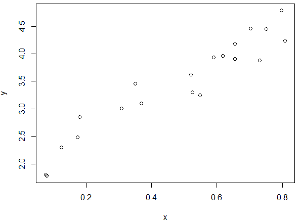

Handout 6: Writing Custom Functions

Before we discussing writing new functions in R, let’s examine an
existing function more closely. For more insight into the coding behind
the median() function, consider the following R commands and output.

&gt; median

function (x, na.rm = FALSE)

UseMethod("median")

&lt;bytecode: 0x000000000b265d20&gt;

&lt;environment: namespace:stats&gt;

&gt; methods(median)

\[1\] median.default

&gt; median.default

function (x, na.rm = FALSE)

{

if (is.factor(x) || is.data.frame(x))

stop("need numeric data")

if (length(names(x)))

names(x) &lt;- NULL

if (na.rm)

x &lt;- x\[!is.na(x)\]

else if (any(is.na(x)))

return(x\[FALSE\]\[NA\])

n &lt;- length(x)

if (n == 0L)

return(x\[FALSE\]\[NA\])

half &lt;- (n + 1L)%/%2L

if (n%%2L == 1L)

sort(x, partial = half)\[half\]

else mean(sort(x, partial = half + 0L:1L)\[half + 0L:1L\])

}

When determining how to use this function, note that this function
contains two arguments: x and na.rm. For more information on these
arguments, you should review the help documentation for median.

&gt; help("median")

{width="4.322916666666667in"
height="2.425399168853893in"}

Notice that by default, the na.rm argument is set to FALSE. This means
that the following arguments both return the same result:

&gt; \#Creating a vector of ages that represents typical ages for
working adults

&gt; ages &lt;- seq(18,65)

&gt;

&gt; \#Taking a (random) sample of 10 ages -- with replacement

&gt; mydata &lt;- sample(ages,size=10,replace=TRUE)

&gt; mydata

\[1\] 47 42 54 46 49 21 32 56 21 26

&gt;

&gt; \#Setting a seed to ensure we get the same random sample

&gt; set.seed(987654321)

&gt;

&gt; mydata &lt;- sample(ages,size=10,replace=TRUE)

&gt; mydata

\[1\] 35 56 44 26 49 24 43 34 51 53

&gt;

&gt; \#Compute median of x

&gt; median(mydata)

\[1\] 43.5

&gt;

&gt; \#Creating some missingness, replace the 5^th^ number with NA

&gt; mydata\[5\] &lt;- NA

&gt; mydata

\[1\] 35 56 44 26 NA 24 43 34 51 53

&gt; median(mydata)

\[1\] NA

&gt; median(mydata,na.rm=TRUE)

\[1\] 43

The previous example gives us some insight into how functions are
written with arguments that are called within R. You can learn a lot
about R programming by examining the code behind functions that were
written by others. The remainder of this handout provides an
introduction to the basics of writing your own functions in R.

***\
***

***WRITING NEW FUNCTIONS IN R***

One of the advantages of using a scripting language like R is the
ability to write your own functions (or to modify existing functions).
An R programmer can define their own functions using the function() and
return() functions.

**Example 1: Creating a simple function**

Note that the sum() function already exists in R and can be used to add
two numbers; for illustrative purposes, however, we will write our own
simple function to do this. The parameters (or values) being used by
this function have been generically named param1 and param2.

> &gt; \#Add two function
>
> &gt; Addtwo &lt;- function(param1,param2){
>
> + param1 + param2
>
> + }

This new function will be listed in your Global Environment under
Functions.

> {width="3.1145833333333335in"
> height="0.858918416447944in"}

To call the function, enter the following at the prompt.

> &gt; Addtwo(param1=3,param2=9)
>
> \[1\] 12

You can shortcut the function call as follows (dropping the parameter
names).

> &gt; Addtwo(3,9)
>
> \[1\] 12

***\
***R uses a local environment for function parameters. For example, if
param1 exists in the global environment and also in the local
environment, R will use the value in the local function environment.

> &gt; param1 &lt;- 10
>
> &gt; Addtwo(param1=3,param2=9)
>
> \[1\] 12

{width="3.4699529746281716in"
height="1.5in"}

Suppose a parameter does not exist in the local function environment,
then R will search and use this parameter if it exists in the global
environment.

> &gt; \#Add three function
>
> &gt; Addthree &lt;- function(param1,param2){
>
> + param1 + param2 + param3
>
> + }
>
> &gt; \#Using the Addthree function
>
> &gt; param3 &lt;- 100
>
> &gt; Addthree(param1=3,param2=9)
>
> \[1\] 112

**Example 2: Creating a simple function – with default values**

Default vales can be specified for a function. Parameter specification
is done when specifying arguments for the function.

> &gt; \#Add two function with default value for param2
>
> &gt; Addtwo &lt;- function(param1,param2=100){
>
> + param1 + param2
>
> + }
>
> &gt; \#Usage of this version, only param1 being specified in function
> call
>
> &gt; Addtwo(param1=10)
>
> \[1\] 110

Specify a default value for the first parameter.

> &gt; \#Add two function with default value for param1
>
> &gt; Addtwo &lt;- function(param1=-500,param2){
>
> + param1 + param2
>
> + }
>
> &gt; \#Usage of this version
>
> &gt; Addtwo(,param2=5)
>
> \[1\] -495
>
> &gt; Addtwo(,5)
>
> \[1\] -495

The following will not work, as this is setting param1 = 5, and no value
has been specified for param2.

> &gt; Addtwo(5)
>
> Error in Addtwo(5) : argument "param2" is missing, with no default

***Example 3: Creating a function to compute multiple quantities***

Next, suppose you want to write a function in R to both find the
difference between two values and the ratio of those two values. You may
start with the following.

> &gt; Myfunction &lt;- function(a,b){
>
> + a-b
>
> + a/b
>
> + }
>
> &gt; \#Using this function
>
> &gt; MyFunction(4,2)
>
> \[1\] 2

Note that the function returns the result of only the last of the
computations. To report all of the results, you can use the return
statement as shown below.

&gt; MyFunction &lt;- function(a,b){

+ return(c(a-b, a/b ))

+ }

&gt; MyFunction(4,2)

\[1\] 2 2

Finally, note that it may be more useful to assign names to the values
calculated and to return a more flexible data type (such as a list
object) to provide more information about the calculations that have
been performed. The following programming statements return the results
in a list.

&gt; MyFunction &lt;- function(a,b){

+ Result1 = a-b

+ Result2 = a/b

+ return(list(Difference=Result1,Ratio=Result2))

+ }

&gt; MyFunction(4,2)

\$Difference

\[1\] 2

\$Ratio

\[1\] 2

***\
***

***Example 4: Computing the mean of a vector of numbers\
***\
Once again, note that the mean() function already exists in R and can be
used to find the average of a vector of numbers; for illustrative
purposes, however, we will write our own simple function to do this.
Suppose we want to name our function average. We can check to make sure
that this is not already a keyword in R (we wouldn’t want to overwrite
an existing function!).

&gt; ?average

No documentation for ‘average’ in specified packages and libraries:

you could try ‘??average’

Next, we can write the function as follows.\
\
&gt; average &lt;- function(x){

+ s = sum(x)

+ avg = s/length(x)

+ return (avg)

+ }

Note that this function can now be applied to calculate the average of
any vector in R.

&gt; average(x)

\[1\] 0.4783486

***\
\
Example 5: Dealing with missing values***

Missing values should be considered when writing custom functions. For
example, the average() function written above will not work with
missingness present.

&gt; x\[2\]&lt;-NA

&gt; x

\[1\] 0.36888095 NA 0.54802340 0.17993140 0.65435477 0.12500433
0.52510142 0.35084670 0.70311331

\[10\] 0.73129676 0.61784387 0.52065692 0.75065050 0.58954068 0.65485598
0.07954121 0.30900394 0.79808945

\[19\] 0.07708921 0.17460408

&gt; average(x)

\[1\] NA

Missing values can be dealt with easily in this simple case by adding
na.rm=TRUE to the sum() function. In addition, na.omit() will be used to
omit any missing values when computing the length of the vector.

&gt; average &lt;- function(x){

+ s = sum(x, na.rm=TRUE)

+ avg = s/length(na.omit(x))

+ return (avg)

+ }

&gt; average(x)

\[1\] 0.4609699

A check to make sure NA is being properly ignored. The x\[-2\] syntax
simply removes the second element to x.

&gt; average(x\[-2\])

\[1\] 0.4609699

***\
Example 6: Modifying the summary() function***

R allow us to expand upon existing functions. Consider the following in
which the summary() function is being applied to a data.frame.

&gt; set.seed(987654321)

&gt; x&lt;-runif(20,0,1)

&gt; summary(x)

Min. 1st Qu. Median Mean 3rd Qu. Max.

0.07709 0.27670 0.53660 0.47830 0.66690 0.80850

We will now add to the standard list of summaries the standard
deviation, mean absolute deviation, and the count. The following code
will add these summaries to standard output provided by the summary()
function.

&gt; num.summary &lt;- function(x){

+ original = summary(x)

+ stdev = sd(x,na.rm=TRUE)

+ mean.abs.dev = mean(abs(na.omit(x)-mean(na.omit(x))))

+ n=length(na.omit(x))

+ list(c(original,"Std Dev" = stdev, "MAD" = mean.abs.dev,"Count"=n))

+ }

The modified summary function includes the additional summaries.

&gt; num.summary(x)

\[\[1\]\]

Min. 1st Qu. Median Mean 3rd Qu. Max. Std Dev MAD Count

0.0770900 0.2767000 0.5366000 0.4783000 0.6669000 0.8085000 0.2498250
0.2161887 20.0000000

Finally, note that you could change the layout of the output. The
paste() and round() functions are used here for writing to the screen
and for rounding output.

&gt; num.summary &lt;- function(x){

+ Min = summary(x)\[1\]

+ Q1 = summary(x)\[2\]

+ Q2 = summary(x)\[3\]

+ Q3 = summary(x)\[5\]

+ Max = summary(x)\[6\]

+ Mean = summary(x)\[4\]

+ s = sd(x,na.rm=TRUE)

+ mean.abs.dev = mean(abs(na.omit(x)-mean(na.omit(x))))

+ n=length(na.omit(x))

+ cat(paste("Min: ", Min))

+ cat("\\n")

+ cat(paste("Q1: ", Q1))

+ cat("\\n")

+ cat(paste("Median: ", Q2))

+ cat("\\n")

+ cat(paste("Q3: ", Q3))

+ cat("\\n")

+ cat(paste("Max: ", Max))

+ cat("\\n")

+ cat(paste("Mean: ", Mean))

+ cat("\\n")

+ cat(paste("Standard Deviation: ", round(s,4)))

+ cat("\\n")

+ cat(paste("Mean Absolute Deviation: ", round(mean.abs.dev,4)))

+ cat("\\n")

+ cat(paste("Sample Size: ", round(n,0)))

+

+ }

The output with custom printing.

&gt; num.summary(x)

Min: 0.07709

Q1: 0.2767

Median: 0.5366

Q3: 0.6669

Max: 0.8085

Mean: 0.4783

Standard Deviation: 0.2498

Mean Absolute Deviation: 0.2162

Sample Size: 20

***Example 7: Modifying the plot() function***

Consider the following data and its associated plot.

&gt; \#Getting a vector of random data

&gt; set.seed(987654321)

&gt; x&lt;-runif(20,0,1)

&gt; y&lt;-2 + 3\*x + runif(20,-0.5,0.5)

&gt;\
&gt; plot(x,y)

{width="3.3645833333333335in"
height="2.5050590551181102in"}

Suppose you want the plot() function to use a very large triangle
plotting character that is red. The plot() function can be modified as
follows. R allows you to pass an unspecified number of parameters to a
function using the … notation. Note: One should carefully consider the
order of the arguments in the list when using the … notation.

&gt; myplot &lt;- function(..., pch.new=2, col.new="red", cex.new=4.0 )
{

+ plot(..., pch=pch.new, col=col.new, cex=cex.new )

+ }

&gt;

&gt; \#USing the new plottign function

&gt; myplot(x,y)

{width="3.4583333333333335in"
height="2.625988626421697in"}

*\
*

*Tasks*:

1.  Recall that the formula for a sphere is ^4^⁄~3~πr^3^. Write a
    function named sphere.volume that returns the volume of a sphere
    when given the radius *r* as a parameter. Then, call the function to
    return the volume of a sphere with a radius of 5. Call the function
    again to return the volume of a sphere with a radius of 10.

2.  Write a function named myplot which calls the plot() function but
    uses a blue open circles as the default plotting symbol. Create a
    plot using your new myplot() function.

