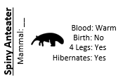
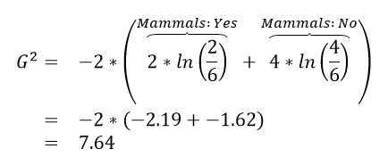
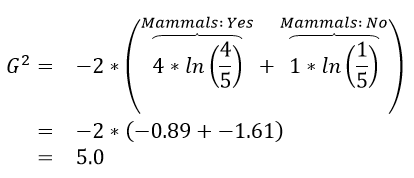
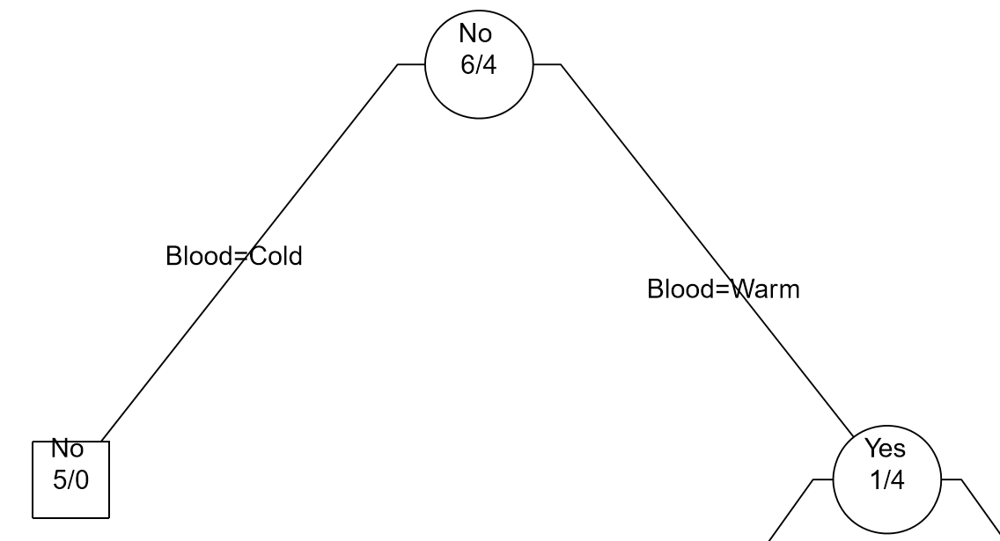
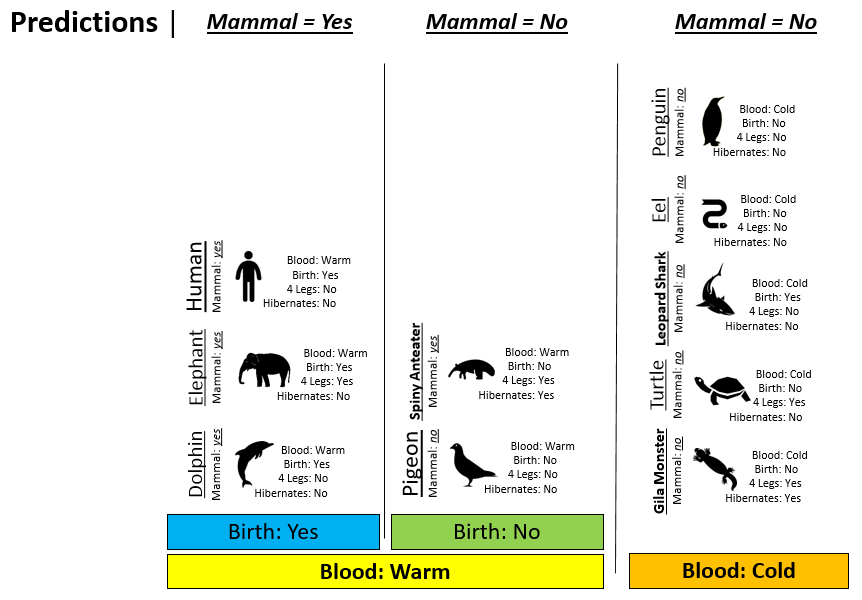
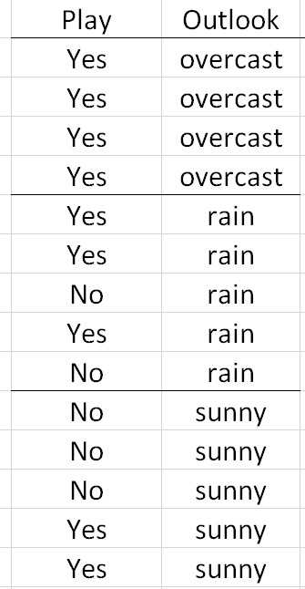
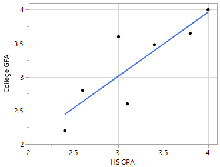

Handout 8: Classification Trees in R

A classification tree is an example of a simple machine learning
algorithm – an algorithm that uses data to learn how to best make
predictions. Classification trees can be applied to a large class of
problems, e.g. to determine whether or not a credit card transaction is
fraudulent or to determine whether or not someone has cancer.

*Example 8.1*: Consider the following animals. The machine learning goal
here is to separate (or classify) these animals into two groups –
mammals and non-mammals.

{width="2.9583333333333335in"
height="2.1059153543307088in"}

The most obvious way to separate/classify these animals is divide the
groups based on whether or not the animal is a mammal. However, this
approach has absolutely no *predictive* ability because you are using
the outcome to predict the outcome. This would be akin to placing a beat
on the Super Bowl in Las Vegas after the Super Bowl has been played.

{width="3.53125in"
height="1.7509109798775153in"}

The approach taken above does not allow us to make prediction for a new
mammal, say a Spiny Anteater.

{width="1.796434820647419in"
height="1.1458333333333333in"}

*Tasks*

1.  Visit the course website, click on the Training web link. Use the
    four predictor variables: 1) Blood (Warm/Cold), 2) Gives Birth
    (Yes/No), 3) 4 Legs (Yes / No), and 4) Hibernates (Yes / No) to
    build a set of rules for classifying each animal as a mammal or
    non-mammal. Briefly describe your process below.

2.  Next, click on the Test web link. Apply the rule you developed above
    to classify each of the animals provided here. How well did your
    rule work? Discuss.

3.  Compare and contrast your rule against a classmate. Which rule is
    better – yours or theirs? How did you define “better”? Discuss.

*Development of a Classification Rule*

Machine learning requires that the methodology being used makes
predictions in a logical, systematic, and precise manner.

{width="3.4479166666666665in"
height="2.454430227471566in"}

Consider the following two rules for classifying animals into Mammals
and Non-mammals.

+-----------------------+-----------------------+-----------------------+
|                       | Rule \#1: Hibernates  | Rule \#2: Blood &gt;  |
|                       | &gt; Blood &gt; Give  | Give Birth            |
|                       | Birth                 |                       |
+=======================+=======================+=======================+
| *Step 1*              | Divide animal into    | Divide animal into    |
|                       | two groups –          | two groups – Blooded  |
|                       | hibernates = No, and  | = Warm and Blooded =  |
|                       | hibernates = Yes.\    | Cold.                 |
|                       | \                     |                       |
|                       | {width="3.409 | ge6.png){width="2.645 |
|                       | 0923009623797in"      | 7600612423446in"      |
|                       | height="1.45833333333 | height="1.62589895013 |
|                       | 33333in"}             | 12335in"}             |
+-----------------------+-----------------------+-----------------------+
| *Step 2*              | Divide each           | Divide Blooded = Warm |
|                       | respective group into | group into Gives      |
|                       | – blooded = Warm and  | Birth = Yes and Gives |
|                       | blooded = Cold.       | Birth = No.           |
|                       |                       |                       |
|                       | {width="2.729 | ge8.png){width="2.905 |
|                       | 1666666666665in"      | 5774278215223in"      |
|                       | height="1.18672134733 | height="1.97647528433 |
|                       | 15836in"}             | 94575in"}             |
+-----------------------+-----------------------+-----------------------+
| *Step 3*              | Divide Hibernates =   |                       |
|                       | No, Blooded = Warm    |                       |
|                       | into two additional   |                       |
|                       | groups, Gives Birth = |                       |
|                       | Yes, and Gives Birth  |                       |
|                       | = No.                 |                       |
|                       |                       |                       |
|                       | {width="3.322 |                       |
|                       | 9166666666665in"      |                       |
|                       | height="1.31638670166 |                       |
|                       | 2292in"}              |                       |
+-----------------------+-----------------------+-----------------------+

Comment: Rule \#2 is a better rule as this rule is able to able to make
valid predictions in less steps than Rule \#1. Simplicity is a positive
trait of a classification rule; however, a rule with optimal predictive
ability is also important!

An algorithm will need to be able to identify which predictor variable
is most advantages to use at any given step. The following quantity is
used by R in the development of their classification trees.

$$G^{2} = - 2*\sum_{j}^{}{n_{i,j}*ln\left( \frac{n_{i,j}}{n_{i}} \right)}$$

where $n_{i} = Number\ in\ node\ i$ and
$n_{i,\ k} = Number\ in\ node\ i\ that\ are\ of\ type\ j$.

*Calculations for G^2^ for each of the above rules*

  > Iniital Value   {width="2.196984908136483in" height="0.8923611111111112in"}
  ----------------- -------------------------------------------------------------------------------------------
                    {width="2.420138888888889in" height="1.7227985564304462in"}

  > Rule \#1   {width="2.2347287839020122in" height="0.90625in"}             {width="2.1875in" height="0.8687204724409449in"}
  ------------ ------------------------------------------------------------------------------------------- --------------------------------------------------------------------------------
               {width="2.3020833333333335in" height="2.006101268591426in"}   {width="2.375in" height="1.5276093613298338in"}

  > Rule \#2   {width="2.1804757217847768in" height="0.9375in"}   {width="1.4166666666666667in" height="0.6633595800524934in"}
  ------------ -------------------------------------------------------------------------------- --------------------------------------------------------------------------------------------
               {width="2.5625in" height="1.9554385389326334in"}   {width="1.4375in" height="2.5555555555555554in"}

The initial or starting G^2^ value is about 13.5. When using Rule \#1,
the combined G^2^ value from the two nodes, i.e. Hibernates = Yes and
Hibernates = No drops to (7.64 + 5.55) = 13.19. When using Rule \#2, the
combined G^2^ value from Blood: Warm and Blood: Cold drops to (5.0 +
0.0) = 5.0. The drop in G^2^ is considerable larger for Rule \#2 – thus
dividing the animal by Warm/Cold Blood is more advantageous.

+-----------------------+-----------------------+-----------------------+
| Step                  | Rule \#1              | Rule \#2              |
+=======================+=======================+=======================+
| 0                     | 13.46                 | 13.46                 |
+-----------------------+-----------------------+-----------------------+
| 1                     | (7.64 + 5.55) =       | (5.0 + 0.0) = 5.0\    |
|                       | 13.19\                | 63% drop              |
|                       | 2% drop               |                       |
+-----------------------+-----------------------+-----------------------+
| 2                     | (3.81 + 0.0 + 0.0) =  | 1.  + 0.0+ 0.0) = 0.0 |
|                       | 3.81\                 |                       |
|                       | 72% drop              |     100% drop         |
+-----------------------+-----------------------+-----------------------+
| 3                     | (0.0+0.0+0.0+0.0) =   |                       |
|                       | 0.0\                  |                       |
|                       | 100% drop             |                       |
+-----------------------+-----------------------+-----------------------+

Classification rules are often arranged in a tree-type structure, hence
the name **Classification Tree**.

                                                            Appearance in JMP                                                                            Appearance in R via post() function
  --------------------------------------------------------- -------------------------------------------------------------------------------------------- -------------------------------------------------------------------------------------------
  *Step 0:*                                                 {width="1.0520833333333333in" height="0.7246139545056868in"}   {width="1.0694444444444444in" height="0.811563867016623in"}
  *Step 1:* Divide on Warm/Cold Blooded                     {width="1.4893602362204725in" height="1.1157403762029747in"}   {width="2.5in" height="1.3533650481189852in"}
  *Step 2:* Divide Warm Blooded into Gives Birth Yes / No   {width="2.4409722222222223in" height="1.7900459317585302in"}   {width="2.361111111111111in" height="1.7196248906386702in"}

As seen above, the Classification Tree for Rule \#1 contains an
additional layer that is not necessary.

{width="4.495370734908136in"
height="2.6074114173228344in"}

*Measuring Predictive Ability*

Recall for Example 8.1, you were asked to construct a classification
rule using the training dataset which included animals such as
porcupine, salmon, bat, eagle, etc. After constructing your rule, a
**test dataset** can be used to measure the overall quality of your
predictions

-   Training Dataset: Data used to build / construct a predictive model

-   Test Dataset: Data used to measure the predictive ability of a model

Consider the following animals that will be used as test cases to
measure the quality of Rule \#1 from Example 8.1.

{width="3.46875in"
height="2.6508508311461068in"}

  Classification Rule \#2                                                                      Using Rule \#2 to make predictions
  -------------------------------------------------------------------------------------------- --------------------------------------------------------------------------------
  {width="2.7291666666666665in" height="1.9159569116360455in"}   {width="3.9375in" height="2.7406846019247593in"}

Next, we must systematically check the validity of our predictions in
each node. We can see that we have predicted the Spiny Anteater to be a
Non-mammal when in fact it is a mammal.

  Prediction model made a mistake for Spiny Anteater
  ------------------------------------------------------------------------------------------- ------------------------------------------------------------------------------------------
  {width="3.0520833333333335in" height="2.111350612423447in"}

There are a variety of measures that can be used to measure the quality
of your prediction. One of the simplest measures is simply the
misclassification rate. A misclassification matrix is commonly used to
understand the nature of the misclassifications. The off-diagonal values
in this matrix are cases that have been misclassified.

+-----------------------------------+-----------------------------------+
|                                   | Predicted Outcome via\            |
|                                   | Classification Rule               |
+===================================+===================================+
|                                   | Mammal                            |
+-----------------------------------+-----------------------------------+
| > Actual Outcome                  | Mammal                            |
+-----------------------------------+-----------------------------------+
|                                   | Non-Mammal                        |
+-----------------------------------+-----------------------------------+

A misclassification rate can be computed. For Example 8.1, the
misclassification rate for test dataset is 10%.

$$Misclassification\ Rate\ for\ Predictions = \ \frac{\mathbf{0 + 1}}{10} = 10\%$$

  ------------------------------------------------------------------------------------------------------------------------------ --------------------------------------------------------------------------------------------
  *Example 8.2*: Consider the following example where the goal is classify whether or not one should play golf on a given day.   {width="2.2915758967629047in" height="1.7891918197725285in"}
                                                                                                                                 
  > Response: Play Golf (Yes / No)                                                                                               
  >                                                                                                                              
  > Predictor variables: 1) Outlook (overcast, rain, sunny), 2) Temperature (^O^F), 3) Humidity (%), and 4) Windy (Yes, No).     
  ------------------------------------------------------------------------------------------------------------------------------ --------------------------------------------------------------------------------------------

*Dealing with numerical predictors*

The methodology for developing classification rules when using numerical
predictors is similar to binary predictors. For numerical predictors,
the algorithm will attempt to find an optimal cut-point that best
separates the response variable. In a classification tree, all
rules/decisions are binary (i.e. one either move to the left or right
down the tree); thus, only a single cut-point is needed.

Suppose the classification rule is considering using Humidity to
separate Play = Yes from Play = No.

{width="3.42129593175853in"
height="1.080851924759405in"}

One can see that various cut-points will not be very useful in trying to
separate Play = Yes from Play = No. Thus, humidity is likely not to
appear early in the development of a classification tree.

  -------------------------------------------------------------------------------------------- --------------------------------------------------------------------------------
  *Will 82 work as a cut-point? No…*                                                           *Will 73 work as a cut-point? No…*
                                                                                               
  {width="3.1590277777777778in" height="1.0222222222222221in"}   {width="3.2875in" height="1.0527777777777778in"}
  -------------------------------------------------------------------------------------------- --------------------------------------------------------------------------------

A situation in which Humidity would be a powerful predictor in
separating Play = Yes from Play = No.

{width="3.865409011373578in"
height="1.3194444444444444in"}

*Dealing with categorical predictors that are not binary*

Consider again previous example that involved building a classification
rule for playing golf. The Outlook predictor variable has three levels:
overcast, rain, and sunny. As stated above, all rules/decisions are
binary in a classification tree. Therefore, categorical predictors with
multiple levels must be combined in a way to form binary sets that are
disjoint.

  ------------------------------------------------------------------------------------------- ------------------------------------------------------------------------------------------------------------------------------------------------------------------------------------------------------------------------------------------------------------------------------------
  *Decisions rules must be binary; thus, the following is not allowed*                        *Here, the classification rule divided Outlook into two sets {overcast} and {rain, sunny}. In subsequent branches of the tree, Outlook could be used again to separate Play = Yes from Play = No or rules using other predictor variables, e.g. Temperature, may be more optimal.*
                                                                                              
  {width="1.1355850831146106in" height="2.189815179352581in"}   {width="4.564815179352581in" height="1.9117607174103237in"}
  ------------------------------------------------------------------------------------------- ------------------------------------------------------------------------------------------------------------------------------------------------------------------------------------------------------------------------------------------------------------------------------------

The complete classification tree fit using rpart() and post() function
in R.

{width="4.912037401574803in"
height="3.5306135170603676in"}

*The Concept of Overfitting*

  ------------------------------------------------------------------------------------------------------------------------------------------------------------------------------------------------------------------------------------------------------------------------------------------------------------------------------------------------------------------------------------------------------------------------------------------------------------------------------------------------ --------------------------------------------------------------------------------------------------------------------------
  Overfitting is a concept that naïve data scientists often overlook or are simple unaware of. Overfitting happens when a machine learning algorithm relies *too much* on the data being used to construct the predictive model. The most common way of identifying overfitting is a predictive model with good predictive ability for the data used to construct the predictive model, but a substantial decrease in predictive ability for new cases, i.e. cases in a test or holdout dataset.   {width="0.8450054680664917in" height="1.2637095363079616in"}
  ------------------------------------------------------------------------------------------------------------------------------------------------------------------------------------------------------------------------------------------------------------------------------------------------------------------------------------------------------------------------------------------------------------------------------------------------------------------------------------------------ --------------------------------------------------------------------------------------------------------------------------

In the golf example (see Example 8.2) all available data was used to
build the classification tree; thus, no data has been left out to test
or verify the predictive ability of the model. However, other signals
exist that overfitting may be taking place. For example, consider the
lower branches of the classification tree provided for the golf data.
Notice that very few observations are being selected for each branch –
which may be a warning sign of overfitting. Finally, the golf example
only had 14 observations; thus, overfitting is very likely to have
occurred.

Another common problem in using trees is the over reliance on certain
predictors. This appears to be the case for the golf example as
Temperature is used repeated in this tree. To alleviate this problem,
more complex algorithms, e.g. random forests, randomly select a set of
predictors for consideration when building the predictive model.

{width="4.437964785651793in"
height="3.1478258967629045in"}

*\
*

Overfitting may occur in any type of predictive model – not just
classification trees. For example, suppose one wants to build a
predictive model for College GPA using a person’s High School GPA. A
predictive model that simply connects the dots would rely *too much* on
the data being used to build the model.

  -------------------------------------------------------------------------------------------------------------------------------------------------------------------------------------------------------------------------------------------------------------------
  Relationship between College GPA and HS GPA                                                One possible predictive model is the trend line through the middle of the data
                                                                                             
  {width="2.2987806211723534in" height="1.75in"}               {width="2.2774562554680666in" height="1.7294050743657043in"}
  ------------------------------------------------------------------------------------------ ------------------------------------------------------------------------------------------------------------------------------------------------------------------------
  A second predictive model that is more flexible than the trend line provided above.        Connecting the dots would be considered overfitting as there is no residual error for this data and this model would have low predictive ability for a new prediction.
                                                                                             
  {width="2.74373687664042in" height="2.0578029308836396in"}   {width="2.8681364829396325in" height="2.185247156605424in"}
  -------------------------------------------------------------------------------------------------------------------------------------------------------------------------------------------------------------------------------------------------------------------

*Classification Trees in R*

We will begin with fitting the golf classification tree. The following
code can be used to read in the golf.csv file.

\#Reading in the golf data and viewwing

golf\_df &lt;- read.csv(file.choose(),header=T,stringsAsFactors = TRUE)

View(golf\_df)

{width="2.2173917322834646in"
height="0.5327066929133858in"}

The classification tree will be constructing using the rpart() function
that can be found in a package named rpart. The generic syntax for
constructing a model has the following form.

Response \~ Predictor1 + Predictor2 + …

In the context of the golf example, the model would have the following
form. The data should be passed into the rpart() function. The control
option can be used to control the size of the tree – here a complete
tree is being constructed for demonstration purposes.

Play \~ Outlook + Temperature + Humidity + Windy

\#Using the rpart() function to fit the classification tree

library(rpart)

\#Building the classification tree, using control option to build a
complete tree

golf\_tree &lt;- rpart(Play \~ Outlook+Temperature+Humidity+Windy,
data=golf\_df, control = rpart.control(minsplit=1))

To plot the actual tree, two options are available 1) standard plotting,
and 2) plotting via prp() function

++
|  |
++

The summary() function can be used to view details of the classification
tree.

&gt; summary(golf\_tree)

Call:

rpart(formula = Play \~ Outlook + Temperature + Humidity + Windy,

data = golf\_df, control = rpart.control(minsplit = 1))

n= 14

CP nsplit rel error xerror xstd

1 0.20 0 1 1.0 0.3585686

2 0.01 5 0 1.6 0.3703280

Variable importance

Temperature Outlook Windy

76 20 4

Node number 1: 14 observations, complexity param=0.2

predicted class=Yes expected loss=0.3571429 P(node) =1

class counts: 5 9

probabilities: 0.357 0.643

left son=2 (10 obs) right son=3 (4 obs)

Primary splits:

Outlook splits as RLL, improve=1.4285710, (0 missing)

Humidity &lt; 82.5 to the right, improve=0.9174603, (0 missing)

Temperature &lt; 84 to the right, improve=0.8901099, (0 missing)

Windy splits as RL, improve=0.4285714, (0 missing)

:

etc…

Next, consider the construction of a classification tree for the mammals
dataset. The first step is to read in the mammals data.

\#Reading in the mammals data and viewing the data

mammals\_df &lt;- read.csv(file.choose(),header=T,stringsAsFactors =
TRUE)

View(mammals\_df)

{width="2.921738845144357in"
height="2.8016666666666667in"}

Recall, this dataset is divided into two parts 1) training datasets and
2) test dataset. The predictive model should be built using only the
training cases.

\#Fitting the classification tree to the training data, filter() from
dplyr package is being used to fit only the Training dataset

library(dplyr)

\#Fitting a complete tree for the training data

mammals\_tree &lt;- rpart(Mammal\~Blood+Birth+X4Legs+Hibernates,
data=filter(mammals\_df,Designation == "TrainingData"),
control=rpart.control(minsplit = 1))

\#Plotting the classification tree

prp(mammals\_tree,type=4,extra=3)

{width="1.7739129483814524in"
height="2.0889074803149605in"}

This data contains test cases; thus, predictions can be made using the
classification tree to evaluate the predictive ability of this model.

\#Gettting the Test Dataset via filter()

&gt; filter(mammals\_df,Designation=="TestData")

Name Mammal Blood Birth X4Legs Hibernates Designation

1 Human Yes Warm Yes No No TestData

2 Pigeon No Warm No No No TestData

3 Elephant Yes Warm Yes Yes No TestData

4 Leopard Shark No Cold Yes No No TestData

5 Turtle No Cold No Yes No TestData

6 Penguin No Cold No No No TestData

7 Eel No Cold No No No TestData

8 Dolphin Yes Warm Yes No No TestData

9 Spiny Anteater Yes Warm No Yes Yes TestData

10 Gila Monster No Cold No Yes Yes TestData

The generic predict() function in R can be used to make predictions. The
test dataset will be passed into the predict() function. It should be
noted that the structure of the test data.frame should be the same as
the training data.frame. The use of filter() ensure that this will be
the case. The type=”class” should be specified in the predict() function
to ensure proper labeling of the output.

&gt; mammal\_predict &lt;-
predict(mammals\_tree,newdata=filter(mammals\_df,Designation=="TestData"),type="class")

The predicted outcomes for these 10 animals are shown here.

&gt; mammal\_predict

1 2 3 4 5 6 7 8 9 10

Yes No Yes No No No No Yes No No

Levels: No Yes

The predicted outcomes should be compared against the actual outcomes.
We can see that case \#9, i.e. the Spiny Anteater, has been
misclassified. This is the only animal to be misclassified in the test
dataset.

&gt; filter(mammals\_df,Designation=="TestData")\$Mammal

\[1\] Yes No Yes No No No No Yes Yes No

Levels: No Yes

A custom function, named Misclassify(), is created to automatically
print the misclassification matrix and to compute the misclassification
rate for the predictions in the test / holdout dataset.

Misclassify = function(Predicted,Actual) {

temp &lt;- table(Predicted,Actual)

cat("\\n")

cat("Table of Misclassification\\n")

cat("(rows: predicted, columns: actual)\\n")

print(temp)

cat("\\n")

numcorrect &lt;- sum(diag(temp))

numincorrect &lt;- length(Actual) - numcorrect

mcrate &lt;- numincorrect/length(Actual)

cat(paste("Misclassification Rate = ",100\*round(mcrate,3),"%"))

cat("\\n")

}

Using the Misclassify() function to evaluate the quality of the
prediction for the mammals test dataset.

\#Using the misclass() function to obtain the

&gt;
Misclassify(mammal\_predict,filter(mammals\_df,Designation=="TestData")\$Mammal)

Table of Misclassification

(rows: predicted, columns: actual)

Actual

Predicted No Yes

No 6 1

Yes 0 3

Misclassification Rate = 10 %

*\
*

*Example 8.3*

  ------------------------------------------------------------------------------------------------------------------------------------------------------------------------------------------------------------------------------------------------------------------------------------------------------------------------------------- ---------------------------------------------------------------------------------------------------- --------------------------------------------------------------------------------------------------------------------------------------------
  Consider the following example in which mushrooms are to be classified into two categories – edible and poisonous. For this example, there are about 20 predictor variables available for use. These predictor variables happen to be all categorical in nature. Variable/feature descriptions are provided in the following table.   *Edible*{width="0.9760345581802274in" height="1.0260870516185476in"}   *Poisonous*{width="0.9586100174978128in" height="1.1478258967629047in"}
  ------------------------------------------------------------------------------------------------------------------------------------------------------------------------------------------------------------------------------------------------------------------------------------------------------------------------------------- ---------------------------------------------------------------------------------------------------- --------------------------------------------------------------------------------------------------------------------------------------------

  -------------------------------------------------------------------------------------------------------------------------------
  Variable / Feature          Description
  --------------------------- ---------------------------------------------------------------------------------------------------
  Y:Poisonous                 edible=e,poisonous=p

  X1:CapShape                 bell=b,conical=c,convex=x,flat=f,knobbed=k,sunken=s

  X2:CapSurface               fibrous=f,grooves=g,scaly=y,smooth=s

  X3:CapColor                 brown=n,buff=b,cinnamon=c,gray=g,green=r,pink=p,purple=u, red=e,white=w,yellow=y

  X4:HasBruises               yes=y, no=n

  X5:Odor                     almond=a,anise=l,creosote=c,fishy=y,foul=f,musty=m,none=n,pungent=p,
                              
                              spicy=s

  X6:GillAttachment           attached=a,descending=d,free=f,notched=n

  X7:GillSpacing              close=c,crowded=w,distant=d

  X8:GillSize                 broad=b,narrow=n

  X9:GillColor                lack=k,brown=n,buff=b,chocolate=h,gray=g,green=r,orange=o,pink=p,purple=u,red=e, white=w,yellow=y

  X10:StalkShape              enlarging=e,tapering=t

  X11:StalkSurfaceAboveRing   ibrous=f,scaly=y,silky=k,smooth=s

  X12:StalkSurfaceBelowRing   ibrous=f,scaly=y,silky=k,smooth=s

  X13:StalkColorAboveRing     brown=n,buff=b,cinnamon=c,gray=g,orange=o,pink=p,red=e,white=w,yellow=y

  X14:StalkColorBelowRing     brown=n,buff=b,cinnamon=c,gray=g,orange=o,pink=p,red=e,white=w,yellow=y

  X15:VeilType                partial=p,universal=u

  X16:VeilColor               brown=n,orange=o,white=w,yellow=y

  X17:RingNumber              none=n,one=o,two=t

  X18:RingType                cobwebby=c,evanescent=e,flaring=f,large=l,none=n,pendant=p,sheathing=s,zone=z

  X19:SporePrintColor         black=k,brown=n,buff=b,chocolate=h,green=r,orange=o,purple=u,white=w,yellow=y

  X20:Population              abundant=a,clustered=c,numerous=n,scattered=s,several=v,solitary=y

  X21:Habitat                 grasses=g,leaves=l,meadows=m,paths=p,urban=u,waste=w,woods=d
  -------------------------------------------------------------------------------------------------------------------------------

*\
*Getting this data into R using the read.csv() function. This data has
8124 cases and 22 variables (1 response variable and 21 predictor
variables).

mushrooms\_df &lt;- read.csv(file.choose(),header=T, stringsAsFactors =
TRUE)

View(mushrooms\_df)

Some preliminary plots…

par(mfrow=c(4,3))

barplot(prop.table(table(mushrooms\_df\$Poisonous,mushrooms\_df\$CapShape),2),ylab="Percent",xlab="CapShape")

To begin, let us first consider the relationship between Poisonous and
each of the predictor variables. The following mosaic plots will help
determine which predictor variables will be useful in separating the
edible from poisonous mushrooms.

> Legend: Dark gray = edible, light gray is poisonous.

{width="4.705029527559055in"
height="4.51200021872266in"}

{width="4.5925765529308835in"
height="3.1520002187226597in"}

This dataset contains several thousand observations. Therefore, this
data will be divided into a Training dataset and a test / holdout
dataset. Random division of the observations is done here to reduce the
potential for bias.

{width="3.6981135170603676in"
height="1.2382360017497813in"}

In R, getting a random selection of 30% of the 8124 cases which will be
used as the test cases.

&gt; test\_rows &lt;- sample(1:8124,0.30\*8124,replace=F)

&gt; head(sort(test\_rows),20)

\[1\] 6 7 9 10 11 17 20 21 25 27 29 39 43 50 53 58 62 64 65 67

  -------------------------------------------------------------------------------------------------------------------------------------
  Syntax for referencing training dataset   Training Dataset
                                            
  mushrooms\_df\[-test\_rows,\]             {width="4.09565179352581in" height="1.487697944006999in"}
  ----------------------------------------- -------------------------------------------------------------------------------------------
  Syntax for referencing test dataset       Test Cases
                                            
  mushrooms\_df\[test\_rows,\]              {width="4.172042869641295in" height="1.5130435258092738in"}
  -------------------------------------------------------------------------------------------------------------------------------------

*\
*

Fitting a classification tree for the mushroom data using only the
training rows from the data.frame.

\#Fitting a classification tree

&gt; mushrooms\_tree &lt;- rpart(Poisonous \~ .,
data=mushrooms\_df\[-test\_rows,\])

\#Plotting the tree, using prp() function which is part of rpart.plot
package

&gt; library(rpart.plot)

&gt; prp(mushroom\_tree, type=4, extra=3)

{width="2.632075678040245in"
height="2.1480774278215224in"}

Note: The names() function can be used to help identify shortened names.
The levels() command might also be necessary to identify the levels for
a particular variable, e.g. binary outcomes Yes / No, maybe labeled as
a/b or as y/n.

&gt; names(mushrooms\_df)

\[1\] "Poisonous" "CapShape" "CapSurface" "CapColor"

\[5\] "HasBruises" "Odor" "GillAttachment" "GillSpacing"

\[9\] "GillSize" "GillColor" "StalkShape" "StalkSurfaceAboveRing"

\[13\] "StalkSurfaceBelowRing" "StalkColorAboveRing"
"StalkColorBelowRing" "VeilType"

\[17\] "VeilColor" "RingNumber" "RingType" "SporePrintColor"

\[21\] "Population" "Habitat"

*\
*Fitting a slightly larger tree – this is done by reducing the cp value
and/or the minsplit value which are passed into the rpart() function
through the control parameter.

mushroom\_tree2 &lt;- rpart(Poisonous \~ .,
data=mushrooms\_df\[-test\_rows,\],
control=rpart.control(cp=0.005,minsplit = 3))

prp(mushroom\_tree2,type=4,extra=3)

{width="2.723908573928259in"
height="2.278261154855643in"}

Finally, the misclassification rate for each rule is computed using the
previously used Misclassify() function.

\#Misclassification Rate for first tree

&gt;
Misclassify(predict(mushroom\_tree,newdata=mushrooms\_df\[test\_rows,\],type="class"),\
mushrooms\_df\[test\_rows,1\])

Table of Misclassification

(rows: predicted, columns: actual)

Actual

Predicted e p

e 1259 14

p 0 1164

Misclassification Rate = 0.6 %

\#Getting the misclassification rate for second tree – the more complex
tree

&gt;
Misclassify(predict(mushroom\_tree2,newdata=mushrooms\_df\[test\_rows,\],type="class"),\
mushrooms\_df\[test\_rows,1\])

Table of Misclassification

(rows: predicted, columns: actual)

Actual

Predicted e p

e 1259 7

p 0 1171

Misclassification Rate = 0.3 %

*Tasks*

1.  Suppose you work for small upstart company who is considering
    extending credit to customers through a store credit card, e.g.
    Kohls Card, Scheels Card, etc. You have been asked to investigation
    whether or not one can reliably predict the credit risk of a
    customer given a set of predictor variables about this customer.

    Download the GermanCreditRisk data from the course website. The
    response variable of interest here is Credit Risk (Good / Bad). The
    predictor variables are: CreditHistory, CheckingAccount - level of
    money in checking account, SavingsAccount – level of money in
    savings account, Age of customer, Housing, Employment, JobSkill,
    OtherCreditFromUs – does customer have existing credit account with
    us, TotNumberCreditAccounts – total number of credit accounts,
    OtherDebtors, Purpose, CreditAmount – amount of credit to be
    extended, RepaymentPercent – monthly payment as a percentage of
    monthly disposable income.

    a.  After reading in the data, create mosaic plots for each of the
        predictor variables that are categorical in nature, i.e.
        CreditHistory, CheckingAccount, etc. Code has been provided for
        plotting CreditRisk vs. CreditHistory, this code can be edited
        for the other categorical predictor variables.

> \#Reading in the dataset
>
> CreditRisk\_df &lt;- read.csv(file.choose(), header=T,
> stringsAsFactors = TRUE)
>
> \#View of data.frame
>
> View(CreditRisk\_df)
>
> \#Creating a barplot for CreditHistory
>
> barplot(prop.table(table(CreditRisk\_df\$CreditRisk,CreditRisk\_df\$CreditHistory),2))

a.  Next, create plots to investigate the relationship between
    CreditRisk and the numeric variables – Age and CreditAmount. Again,
    code has been provided for Age and can be edited to plot
    relationship for CreditAmount.

> \#Loading the lattic() package
>
> library(lattice)
>
> \#Using a densityplot to see if there is a shift in Age between
> CreditRisk
>
> densityplot(\~Age, data=CreditRisk\_df, groups=CreditRisk,
> plot.points=FALSE, auto.key=TRUE)

a.  Why type of plot, barplot() or densityplot(), should be used to
    understand the relationship between CreditRisk and
    TotNumberCreditAccounts and CreditRisk and RepaymentPercent? Try
    both a barplot() and densityplot(). Which plot is better? Discuss.

b.  Consider the plots made in part a., part b, and part c. Which
    predictor variables appear to best separate CreditRisk = Good from
    CreditRisk = Bad? Discuss.

c.  Next, use the rpart() function in R to build a classification tree
    for predicting CreditRisk. Plot your classification tree.

d.  Which predictor variable does your classification tree use early
    one? Which predictor variables are used later in building the tree?
    What does it mean, in a practical sense, when a variable is used
    early in the classification rule (vs. later in a classification
    tree)? Discuss.

e.  Suppose a new customer is seeking credit with the following profile.
    Use your classification tree to make a CreditRisk prediction for
    this customer. Should we extend credit to this customer? Discuss.

    {width="5.09375in"
    height="0.6671937882764655in"}

<!-- -->

1.  For the second task, build a classification rule to determine
    whether or not a women’s a breast biopsy is cancerous (malignant,
    denoted M in dataset) or not (benign, denoted B in dataset). There
    are 10 predictor variables / features that are measurements
    regarding various characteristics of the cells examined. These
    features include: Radius, Texture, Perimeter, Area, Smoothness,
    Compactness, Concavity, ConcavePts, Symmetry, and FracDim.

    a.  Divide this dataset into a training set (70%) and test set
        (30%).

    b.  Build two different classification trees – a simple tree and a
        second more complex tree.

    c.  Make predictions for the test set using each rule. What is the
        misclassification rate for each rule?

    d.  Which predictor variables are most important in your
        classification tree? Discuss.

    e.  Provide a description (for a doctor) that would describe how to
        make a prediction using your classification tree?

