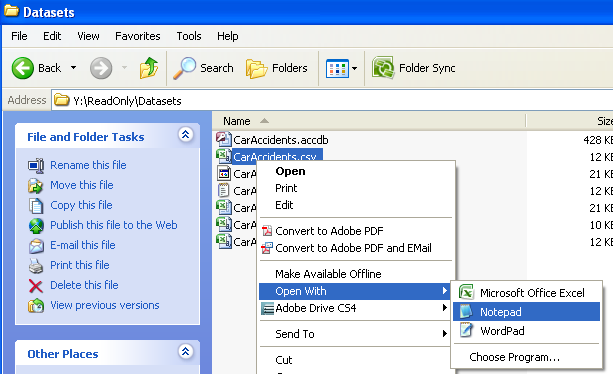

Excel: Reading in Standard Data
===============================

In this example, we’ll use the *CarAccidents* data set. The easiest way
to open a file in Excel is to simply double-click on the file name once
you’re in the appropriate directory. This works well when the file you
are opening is an Excel file.

|image0|

A portion of the dataset

|image1|

Reading in Comma Delimited Files (\*.csv)
-----------------------------------------

Excel has the ability to automatically read in comma delimited files;
thus, double-clicking on the CarAccidents.csv file will work (at least
most of the time). This is especially true when EXCEL is used to create
the comma delimited file.

|image2|

When Excel attempts to open the CarAccidents.csv file, I get the
following error:

|image3|

After clicking “Yes” I get the following error:

|image4|

.. admonition:: Questions: 

    Use Google to identify why this error is occurring and
    propose a solution in case Excel is unable to open the file in a
    different format.

    1. What is the problem?

    2. What is a possible a solution if Excel is unable to open the file?

    3. Verify that the CarAccidents.csv file can be opened successfully
       without this error (implement your solution if need be).

    4. Use an online resource such as Wikipedia to gain more information
       about \*.csv files. What does csv stand for? What is the main
       advantage of using \*.csv files?

Using Notepad++ to view data in its raw format
----------------------------------------------

|image5|

Here, we can see that the first row contains the column headers and the
remaining rows contain the raw data. Commas are used to separate the
variables in this file.

|image6|

Reading in Tab Delimited Files (\*.txt)
---------------------------------------

As we just discussed, variables in a comma delimited file are separated
by commas; likewise, variables in a tab delimited file are separated by
tabs.

|image7|

To read the tab delimited file (CarAccidents.txt) into Excel, launch
Excel and select File > Open. Be sure to tell Excel to search from “All
files” instead of “All Excel files” as shown below.

|image8|

Once you click on the \*.txt file and click through the SYLK errors, the
Text Import Wizard – Step 1 of 3 window should appear. Since this is a
delimited file, select Delimited and click Next >.

|image9|

In Step 2 of 3, specify the appropriate delimiter type. The bottom of
the window gives you insight into how the data will be read in.

|image10|

Additional specifications for the variables are possible in Step 3 of 3.
Click Finish to import the data.

|image11|

.. admonition:: Note: 

    You can also automatically invoke the Text Import Wizard
    from the Data tab in Excel. In the “Get External Data” section, you
    should see the following.

|image12|

Using the Fixed width option when reading in data
-------------------------------------------------

Open the CarAccidents.prn file in Notepad or another simple editor.

.. admonition:: Question: 

    What problem is preventing a successful import of this
    data using the methods discussed previously?

.. admonition:: Fix: 

    Read the data in using a fixed width format.

|image13|

Notice that starting in row 101, the ID and Gender column don’t
necessarily have a space between them. To fix this, simply move the
first vertical line over to separate these two columns. The first column
has width 3, so place the vertical line appropriately.

|image14|

After all vertical lines have been appropriately placed, click Next >
and/or Finish.

|image15|

Reading data in from Microsoft Access Files (\*.accdb)
------------------------------------------------------

Under the Data tab in the “Get External Data” section, select “From
Access.”

|image16|

Specify the location of the file and click Open. In the Import Data
window, specify that you want to read in a Table of data and the cell
location for where you want the data to be located. Click OK.

|image17|

The following contains a portion of the data set imported from Access.

|image18|

Exporting Data From Excel
-------------------------

To export data from Excel to either a \*.csv or \*.txt file, simply use
the “Save As” command. Select the file type you want from the “Save as
type” drop-down menu.

|image19|

.. |image1| image:: img/h1/media/image2.png
   :width: 4.03939in
   :height: 2.67708in
.. |image2| image:: img/h1/media/image3.png
   :width: 6.50000in
   :height: 1.80051in

.. |image6| image:: img/h1/media/image7.png
   :width: 5.61458in
   :height: 2.65625in
.. |image7| image:: img/h1/media/image8.png
   :width: 5.63542in
   :height: 1.50173in

.. |image9| image:: img/h1/media/image10.png
   :width: 5.18750in
   :height: 3.73500in
.. |image10| image:: img/h1/media/image11.png
   :width: 4.11458in
   :height: 2.96250in
.. |image11| image:: img/h1/media/image12.png
   :width: 3.57292in
   :height: 2.57250in

.. |image14| image:: img/h1/media/image15.png
   :width: 4.47917in
   :height: 3.22500in
.. |image15| image:: img/h1/media/image16.png
   :width: 4.32581in
   :height: 3.11458in

.. |image17| image:: img/h1/media/image17.png
   :width: 2.90625in
   :height: 2.28850in
.. |image18| image:: img/h1/media/image18.png
   :width: 4.24130in
   :height: 1.84375in

