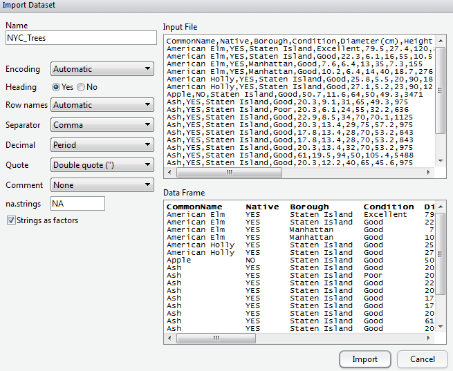
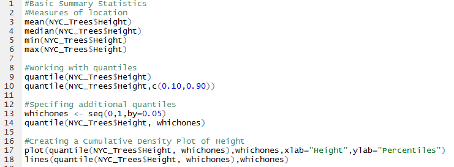
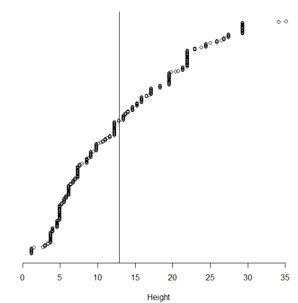
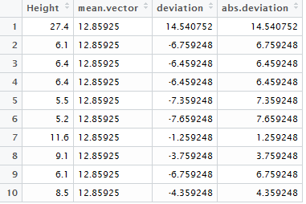

Summaries in R
==============

+----------------------------------------------------------------------------------------------------------------------------------------------------------------------------+------------+
| For this handout, we will consider a dataset on trees in New York City. This data is a subset of the entire tree census conducted every 10 years or so in New York City.   | |image0|   |
+----------------------------------------------------------------------------------------------------------------------------------------------------------------------------+------------+

The following contains the first few rows of the trees dataset. There
are 10 variables in this dataset.

|image1|

Create a new project in R for this handout. Download the NYC\_Trees.csv
dataset. Load this dataset into R using Import Data > From Text File.

|image2|

A view of the dataset after loading it into R.

|image3|

The variable/field names of the dataset can be obtained using the
names() function.

> names(NYC\_Trees)

[1] "CommonName" "Native" "Borough"

[4] "Condition" "Diameter.cm." "Height.m."

[7] "Age" "PercentFoliageDensity" "CanopyArea.msq."

[10] "CompensatoryValue"

Consider the variable name Diameter(cm). R does not allow for special
characters in the variable names and thus the ( ) were removed and
replaced with a period. The same is done for spaces in variable names.

You can easily change the variable name for the fifth variable as
follows.

> names(NYC\_Trees)[5]

[1] "Diameter.cm."

> names(NYC\_Trees)[5] <- "Diameter"

The new name for Diameter has taken effect and is reflected when viewing
the data.frame.

|image4|

The following is used to rename Height and CanopyArea.

> names(NYC\_Trees)[6] <- "Height"

> names(NYC\_Trees)[9] <- "CanopyArea"

***
***

***Basic Summaries in R - Location***

Before starting an analysis, you should gain an understanding of how R
is considering each variable. The variable types here are Factor, num,
and int.

> str(NYC\_Trees)

|image5|

*Questions:
*

1. What is the difference between a string and a factor in R?

2. Use the levels(NYC\_Trees$Native) command to determine the factor
   level settings for Native. Which level, “No” or “Yes”, is listed
   first?

The summary() command will provide basic summaries for an entire
data.frame.

> summary(NYC\_Trees)

|image6|

*Questions:
*

1. How many different Common Names exist in this dataset?

2. What is the breakdown of non-native versus native trees?

3. What is the value of the most expensive tree?

A wide variety of functions exist for basic summary statistics in R.
Consider the following functions.

|image7|

*Question:*

1. What are the following values for the NYC\_Trees dataset.

+----------------------------+---------+
| Quantity                   | Value   |
+============================+=========+
| Mean                       |         |
+----------------------------+---------+
| Median                     |         |
+----------------------------+---------+
| Min                        |         |
+----------------------------+---------+
| Max                        |         |
+----------------------------+---------+
| 10\ :sup:`th` Percentile   |         |
+----------------------------+---------+
| 90\ :sup:`th` Percentile   |         |
+----------------------------+---------+

Write the following code in the script window. This code is used to
create a cumulative density plot for Height.

|image8|

*Question:*

+--------------------------------------------------------------------+------------+
| 1. What information is gained by considering this plot? Discuss.   | |image9|   |
+--------------------------------------------------------------------+------------+

***Basic Summaries in R – Variation***

+-------------------------------------------------+---------------------------------------------------+
| Consider again the 319 data values for height   | Concept of variation = “distance to the middle”   |
|                                                 |                                                   |
| |image10|                                       | |image11|                                         |
+-------------------------------------------------+---------------------------------------------------+

The most common method of measuring variation (in statistics) is
standard deviation. Intuitively, this can be thought of as the average
distance to the mean.

.. math:: \text{Standard}\ \text{Deviation} = \ \sqrt{\frac{\sum_{}^{}\left( \text{data}\ \text{point} - \text{mean} \right)^{2}}{\#\ data\ points - 1}}

The range is a secondary measure of spread, but is not commonly used as
this measure only uses two data values, the maximum and minimum value,
and is adversely affected by outliers in data. Another common measure of
spread is the median (or mean) absolute deviation.

.. math:: \text{Median\ Absolue\ Deviation} = \ \ median\ \left\{ \left| \text{data\ point}_{1} - median \right|,\ \left| \text{data\ point}_{2} - median \right|,\ \ldots \right\}

Consider the following measures of spread. Obtain these values for the
Height variable from the NYC\_Trees data.frame.

|image12|

+-----------------------------+---------+
| Quantity                    | Value   |
+=============================+=========+
| Standard Deviation          |         |
+-----------------------------+---------+
| Range                       |         |
+-----------------------------+---------+
| Median Absolute Deviation   |         |
+-----------------------------+---------+

The mean absolute deviation is commonly used in predictive analytics
methods. The mean in predictive analytics is often obtained through some
function of the predictors. For the simple case here, *f(predictors) =
mean(height)* will suffice for illustrative purposes.

.. math:: \text{Mean\ Absolute\ Deviation} = \ \frac{\sum_{}^{}\left| data\ point - f(predictors) \right|}{\#\ \text{data\ points}}

A function does \*not\* exist in base R to calcualte this quantity. A
web search produces the following link.

Result from Mean Absolute Deviation web search:
http://www.inside-r.org/packages/cran/lsr/docs/aad

|image13|

The aad() function is found in the lsr package. In order to use this
function, the package must be downloaded onto your local machine. To do
so, click Intall, type in the package name, and click Install.

|image14|

The install simply puts the contents of this package onto your local
machine. The library(lsr) command will actually load the package into
your local environment so that its contents can be used.

|image15|

The mean absolute deviation can be computed easily with the use the of
the aad() function. The following lines of code will obtain the same
value returned from the aad() function.

> #Getting the mean absolute deviation via brute force

> mean.vector <- rep(mean(NYC\_Trees$Height),319)

> deviation <- NYC\_Trees$Height - mean.vector

> abs.deviation <- abs(deviation)

|image16|

> mean(abs.deviation)

[1] 6.8755

***
Comment***: Vector or data.frames may contain NA values (missing data).
In this case, mean(x, na.rm=TRUE) should be used. To remove all NA from
a data.frame, the function, na.omit() can be used.

*
Questions:*

1. Obtain the following summaries for the Compensatory Value.

+--------------------------------------------+---------------------------------------------+
| +----------------------------+---------+   | +-----------------------------+---------+   |
| | Quantity                   | Value   |   | | Quantity                    | Value   |   |
| +============================+=========+   | +=============================+=========+   |
| | Mean                       |         |   | | Standard Deviation          |         |   |
| +----------------------------+---------+   | +-----------------------------+---------+   |
| | Median                     |         |   | | Range                       |         |   |
| +----------------------------+---------+   | +-----------------------------+---------+   |
| | Min                        |         |   | | Median Absolute Deviation   |         |   |
| +----------------------------+---------+   | +-----------------------------+---------+   |
| | Max                        |         |   | | Mean Absolute Deviation     |         |   |
| +----------------------------+---------+   | +-----------------------------+---------+   |
| | 10\ :sup:`th` Percentile   |         |   |                                             |
| +----------------------------+---------+   |                                             |
| | 90\ :sup:`th` Percentile   |         |   |                                             |
| +----------------------------+---------+   |                                             |
+--------------------------------------------+---------------------------------------------+

1. Obtain a cumulative density plot (akin to the one provided on page 4)
   for Compensatory Value. What information does this plot provide about
   the distribution of Value? Discuss.

***Basic Summaries in R – Tables***

The table() function can be used to summarize categorical, i.e. factor,
variables. Consider the following command so summarize the tree
condition variable.

> table(NYC\_Trees$Condition)

Excellent Good Poor

34 254 31

>

> table(NYC\_Trees$Condition) / length(NYC\_Trees$Condition)

Excellent Good Poor

0.10658307 0.79623824 0.09717868

>

> 100 \* table(NYC\_Trees$Condition) / length(NYC\_Trees$Condition)

Excellent Good Poor

10.658307 79.623824 9.717868

>

> round(100 \* table(NYC\_Trees$Condition) /
length(NYC\_Trees$Condition),1)

Excellent Good Poor

10.7 79.6 9.7

The table() easily extends to two-dimensional tables as well. For
example, the following is used to understand the relationship between
whether or not the tree is native and its condition.

> table(NYC\_Trees$Native, NYC\_Trees$Condition)

Excellent Good Poor

NO 20 205 21

YES 14 49 10

This output can be passed directly into the plot() function to create a
mosaic plot.

> plot(table(NYC\_Trees$Native, NYC\_Trees$Condition))

|image17|

The table() function extends to higher dimensional tables in a
straight-forward manner.

> table(NYC\_Trees$Native, NYC\_Trees$Condition, NYC\_Trees$Borough)

, , = Bronx

Excellent Good Poor

NO 3 28 5

YES 8 4 2

, , = Manhattan

Excellent Good Poor

NO 4 43 6

YES 1 3 0

, , = Staten Island

Excellent Good Poor

NO 13 134 10

YES 5 42 8

Consider again the table created above that show the relationship
between Native and Condition. This table is being assigned to
native.condition.table.

> native.condition.table <- table(NYC\_Trees$Native,
NYC\_Trees$Condition)

Excellent Good Poor

NO 20 205 21

YES 14 49 10

The margin.table() function and prop.table() functions can be used to
obtain additional summaries for these tables.

+------------------+--------------------------------+------------------------+
| Function         | Outcome                        | Second argument        |
+==================+================================+========================+
| margin.table()   | Marginal counts are computed   | 1: Row totals          |
|                  |                                |                        |
|                  |                                | 2: Column totals       |
+------------------+--------------------------------+------------------------+
| prop.table()     | Proportions are computed       | 1: Row percentages     |
|                  |                                |                        |
|                  |                                | 2: Column percentage   |
+------------------+--------------------------------+------------------------+

> margin.table(native.condition.table,1)

NO YES

246 73

> margin.table(native.condition.table,2)

Excellent Good Poor

34 254 31

> prop.table(native.condition.table,1)

Excellent Good Poor

NO 0.08130081 0.83333333 0.08536585

YES 0.19178082 0.67123288 0.13698630

> prop.table(native.condition.table,2)

Excellent Good Poor

NO 0.5882353 0.8070866 0.6774194

YES 0.4117647 0.1929134 0.3225806

*Questions:
*

1. Create a mosaic plot to display the relationship between Condition
   and Borough. Does one Borough tend to have better trees than other?
   Discuss.

2. Use the prop.table() function to determine the proportions being
   displayed in the mosaic plot you created above.

***Basic Summaries in R – apply() and aggregate()***

Often it is necessary to obtain basic summary variables for several
variables at a time. This can be done in an insufficient way as follows.

>
mean(NYC\_Trees$Diameter);mean(NYC\_Trees$Height);mean(NYC\_Trees$Age);mean(NYC\_Trees$PercentFoliageDensity);mean(NYC\_Trees$CanopyArea);mean(NYC\_Trees$CompensatoryValue)

[1] 37.6116

[1] 12.85925

[1] 57.65517

[1] 56.94357

[1] 83.75987

[1] 3255.354

There exists a set of functions can will automate repeated summaries of
this type. The most common is the **apply()** function. The help window
for the apply function is provided here.

|image18|

+------------+-------------------------+-------------------------+-----------------------------------------+
| Function   | 1\ :sup:`st` Argument   | 2\ :sup:`nd` Argument   | 3\ :sup:`rd` Argument                   |
+============+=========================+=========================+=========================================+
| apply()    | Data Frame              | 1: Act on rows          | Function – inherent or custom written   |
|            |                         |                         |                                         |
|            |                         | 2: Act on columns       |                                         |
+------------+-------------------------+-------------------------+-----------------------------------------+

The apply() functions are \*not\* as forgiving as the summary()
function. For example, the following command will not work as the
NYC\_Trees data.frame contains several column for which the mean cannot
be computed, i.e. this data.frame as several factor variables.

> apply(NYC\_Trees,2,mean)

|image19|

The following code only passes the numeric columns of NYC\_Trees and
thus produces the desired outcomes.

> apply(NYC\_Trees[,5:10],2,mean)

Diameter Height Age PercentFoliageDensity

37.61160 12.85925 57.65517 56.94357

CanopyArea CompensatoryValue

83.75987 3255.35423

The colMeans() function performs similar the same actions.

> colMeans(NYC\_Trees[,5:10])

Diameter Height Age PercentFoliageDensity

37.61160 12.85925 57.65517 56.94357

CanopyArea CompensatoryValue

83.75987 3255.35423

The following syntax can be used when created a custom-built function.
This coefficient of variation function is the custom-built function
here.

CV Function Details:
https://en.wikipedia.org/wiki/Coefficient_of_variation

> apply(NYC\_Trees[,5:10], 2, function(x) { sd(x) / mean(x) } )

|image20|

Another commonly used function is the **aggregate()** function. This
function allows summaries to be computed on subsets of the data that you
specify. For example, this can be used to obtain the mean of all
numerical variables for Non-Native and Native tree separately.

|image21|

Getting the mean of all numeric columns for Non-Native trees separate
from the Native trees.

> aggregate(NYC\_Trees[,5:10], by=list(NYC\_Trees$Native), mean)

Group.1 Diameter Height Age PercentFoliageDensity CanopyArea
CompensatoryValue

1 NO 38.21382 12.81341 59.68293 55.69106 85.77561 3375.589

2 YES 35.58219 13.01370 50.82192 61.16438 76.96712 2850.178

Here, the NYC\_Trees data.frame is being split into 6 groups defined by
Native (2 levels) and Condition (3 levels).

>
aggregate(NYC\_Trees[,5:10],by=list(NYC\_Trees$Condition,NYC\_Trees$Native),mean)

|image22|

***Task***

For this task, open the Consider the Chicago\_Marthon dataset. This file
contains the results of over 37,000 runners who participated in the 2015
Bank of American Chicago Marathon.

|image23|

*Questions*

1. What is the average age of a runner in this dataset?

2. Does the average age of a male different much from the average age of
   a female?

3. Which Division has the most number of people?

4. Is the Division with the most runners the same across Gender?

5. USA is the most common country for runners. What is the second most
   common country?

6. The following command was used (instead of the table() function) to
   obtain the number of runners from the USA. What is R is doing with
   this command?

    > length(Chicago\_Marathon$Country[Chicago\_Marathon$Country ==
    "USA"])

.. |image0| image:: img/h14/media/image1.png
   :width: 3.17676in
   :height: 1.87313in
.. |image1| image:: img/h14/media/image2.png
   :width: 5.43284in
   :height: 1.08541in

.. |image3| image:: img/h14/media/image4.png
   :width: 5.56599in
   :height: 1.06716in
.. |image4| image:: img/h14/media/image5.png
   :width: 6.05573in
   :height: 1.08209in

.. |image6| image:: img/h14/media/image7.png
   :width: 6.45040in
   :height: 1.96269in

.. |image8| image:: img/h14/media/image9.png
   :width: 6.50000in
   :height: 0.92500in
.. |image9| image:: img/h14/media/image10.png
   :width: 2.94756in
   :height: 1.91407in

.. |image11| image:: img/h14/media/image12.png
   :width: 2.28696in
   :height: 2.27521in
.. |image12| image:: img/h14/media/image13.png
   :width: 2.46875in
   :height: 0.76042in
.. |image13| image:: img/h14/media/image14.png
   :width: 3.79130in
   :height: 2.37767in
.. |image14| image:: img/h14/media/image15.png
   :width: 3.97391in
   :height: 2.19202in
.. |image15| image:: img/h14/media/image16.png
   :width: 5.58333in
   :height: 0.46875in

.. |image17| image:: img/h14/media/image18.png
   :width: 2.74866in
   :height: 2.46087in
.. |image18| image:: img/h14/media/image19.png
   :width: 5.50327in
   :height: 2.01493in

.. |image21| image:: img/h14/media/image22.png
   :width: 5.85821in
   :height: 2.95289in
.. |image22| image:: img/h14/media/image23.png
   :width: 6.50000in
   :height: 0.82435in
.. |image23| image:: img/h14/media/image24.png
   :width: 3.88696in
   :height: 1.97047in
