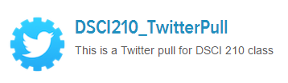

Twitter/Text Mining
===================

***Setting up an API, i.e. Twitter Side***

Twitter uses an Application Programming Interface (API) that allows
developers to pull Twitter data.

|image0|

To setup an API, go to http://apps.twitter.com, sign in using an
existing Twitter account.

|image1|

    Once logged in, select Create New App

|image2|

Next, specify the requested information to create a new application.

|image3|

DSCI210\_TwitterPull is the newly created application.

|image4|

After a successful application has been setup, the following information
is required to access Twitter’s data API from R.

-  Consumer Key

-  Consumer Secret

-  Access Token

-  Access Token Secret

These information can be obtained under the Keys and Access Tokens tab
on the Twitter site.

+------------+------------+
| |image5|   | |image6|   |
+------------+------------+

*Working with Twitter Pulls in R*

The following packages/libraries will be used to analyze Twitter data in
R.

    library(twitteR)

    library(RCurl)

    library(tm)

    library(wordcloud)

The following information is obtained from the DSCI210\_TwitterPull
application on Twitter side.

    #Specified from Twitter Account - DSCI\_210 is app name

    consumer\_key <- "*<consumer\_key>*"

    consumer\_secert <- "*<consumer\_secert>*"

    token\_key <- "*<token\_key>*"

    token\_secert <- "*<token\_secert>*"

Setting up the OAUTH connection in R.

    **Note**: OAUTH is an open protocol to allow secure authorization in
    a simple and standard method from web, mobile and desktop
    applications.

    #Setting up OAUTH in R

    setup\_twitter\_oauth(consumer\_key,consumer\_secert,token\_key,token\_secert)

|image7|

Getting a Twitter pull

    #Gettting a pull on recent Ecuador Earthquake

    pull <- searchTwitter("#EcuadorEarthquake", n=1000, lang="en")

The object returned by the searchTwitter() function is a list.

    #Checking to see if object is indeed a list

    is.list(pull)

This (somewhat unstructured) list can be converted a standard data.frame
using the following.

    #Converting list to dataframe

    df <- do.call("rbind", lapply(pull, as.data.frame))

    View(df)

|image8|

Writing data.frame to comma delimited file

    #The write.csv() function to write this data.frame into a \*.csv
    file

    write.csv(df,file=<director/filename>")

A summary of screenname

    Get # posts by screenName

    table(df$screenName)

    #Plotting results

    plot(table(df$screenName))

    #adding a horizontal line at 3

    abline(h=3)

|image9|

    #Idenitfy screenNames with more than 3 counts

    which(table(df$screenName)>3)

|image10|

Gain an understating the of the variable types in this data.frame.

    #Getting the structure of our data.frame

    str(df)

|image11|

    #Plotting twitter pull across days

    plot(table(as.Date(df$created)))

    |image12|

    #The following can be used to pull hour off created variable

    as.POSIXlt(df$created)$hour

    #Next, table/plot outcome

    plot(table(as.POSIXlt(df$created)$hour))

    |image13|

***Text Mining Procedures***

    #using the tm library for text mining

    myCorpus <- Corpus(VectorSource(df$text))

    #Clean up text using the tm\_map() function

    myCorpus <- tm\_map(myCorpus, tolower)

    myCorpus <- tm\_map(myCorpus, removePunctuation)

    myCorpus <- tm\_map(myCorpus, removeNumbers)

Necessary to get rid of common English words. The stopwords() function
can be used to accomplish this in R.

    #Getting rid of common english words

    myStopwords <- c(stopwords('english'))

    myCorpus <- tm\_map(myCorpus, removeWords, myStopwords)

The following is used to convert the Corpus object into a
TermDocumentMatrix which is then converted to a matrix, and eventually a
data.frame.

    myDtm <- TermDocumentMatrix(myCorpus, control = list(minWordLength =
    1))

    m <- as.matrix(myDtm)

    v <- sort(rowSums(m), decreasing=TRUE)

    myNames <- names(v)

    #Creating data.frame for wordcloud

    d <- data.frame(word=myNames, freq=v)

    wordcloud(d$word, d$freq, min.freq=3)

A Wordcloud of text from Twitter pull.

    |image14|

The wordcloud() function allows specification of a minimum frequency
when plotting. This can be used to identify the most common words.

    wordcloud(d$word, d$freq, min.freq=40)

    |image15|

***Task***

Obtain a Twitter pull on a topic of your choice. Complete the following
for your data.

1. Write the Twitter data into a CSV file.

2. Does the number of tweets vary much over day? If some days are more
   tweets than others, why might this be the case?

3. Doe the number of tweets vary much over time of day?

4. Create a reasonable workcloud for your twitter date. If necessary,
   remove any over-represented words by modifying the myStopwords line
   above in the code.

.. |image0| image:: img/h18/media/image1.png
   :width: 5.80974in
   :height: 3.36046in
.. |image1| image:: img/h18/media/image2.png
   :width: 4.96367in
   :height: 1.31622in
.. |image2| image:: img/h18/media/image3.png
   :width: 4.94186in
   :height: 1.04434in
.. |image3| image:: img/h18/media/image4.png
   :width: 2.38372in
   :height: 1.39763in

.. |image5| image:: img/h18/media/image6.png
   :width: 3.36201in
   :height: 1.33044in
.. |image6| image:: img/h18/media/image7.png
   :width: 3.19130in
   :height: 1.48570in
.. |image7| image:: img/h18/media/image8.png
   :width: 4.25581in
   :height: 0.97347in
.. |image8| image:: img/h18/media/image9.png
   :width: 6.50000in
   :height: 1.01875in
.. |image9| image:: img/h18/media/image10.png
   :width: 5.19767in
   :height: 2.81652in

.. |image13| image:: img/h18/media/image14.png
   :width: 4.60465in
   :height: 2.86610in
.. |image14| image:: img/h18/media/image15.png
   :width: 3.39535in
   :height: 3.32023in
.. |image15| image:: img/h18/media/image16.png
   :width: 3.16667in
   :height: 3.03954in
