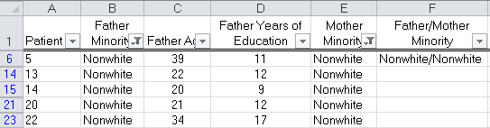
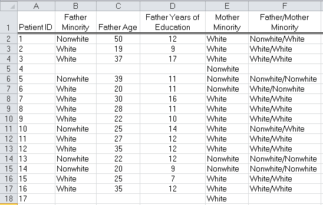
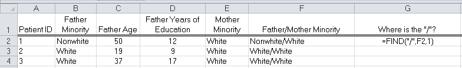
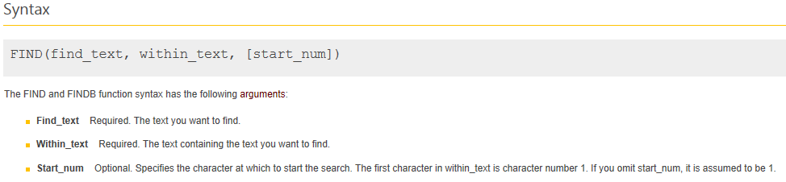
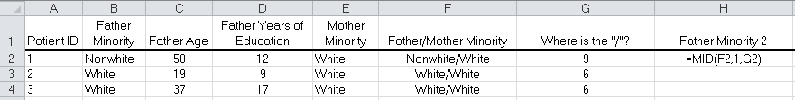
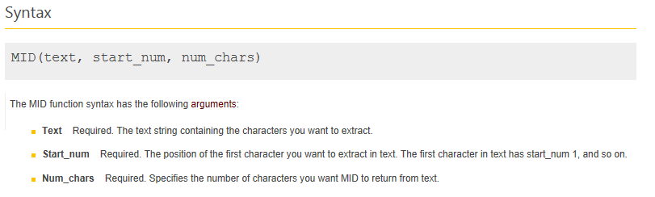
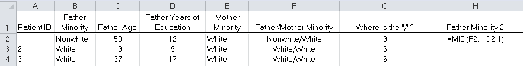
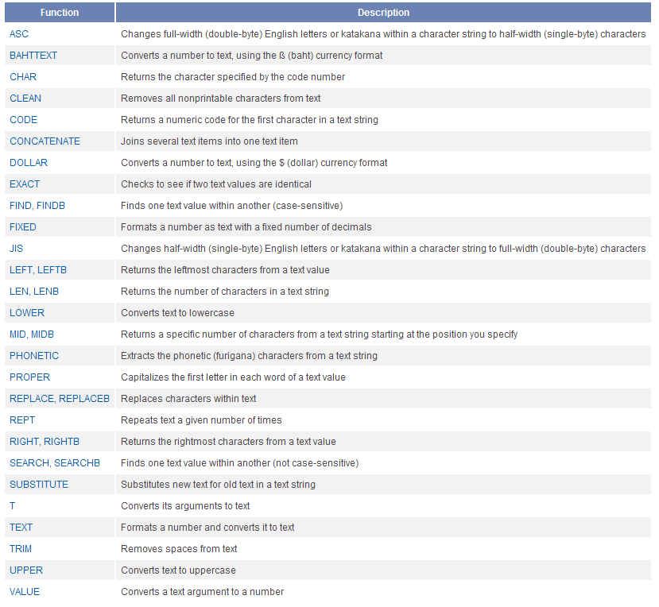
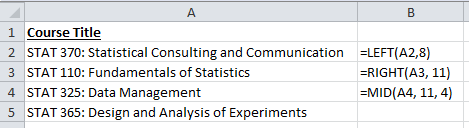

Basic String Functions
======================

Consider the NC Birth dataset once again.

Suppose our goal is to create a new variable that combines *Father
Minority* and *Mother Minority*. Note that there should be four possible
combinations – Nonwhite / Nonwhite, Nonwhite / White, White / Nonwhite,
and White / White.

One possible approach we could take is to filter on each variable and
then simply type in the value for the new variable in the first cell.
This cell could then be copied down to fill in the remaining cells for
this particular combination.

|image0|

Next, we could copy this down for all Nonwhite / Nonwhite cells.

|image1|

Similarly, we could do this for the Nonwhite/White and other
combinations.

|image2|

After completing all four combinations, it may appear as though we are
done; however, consider Patients 4 and 17.

|image3|

.. admonition:: 

    Why is the Father Minority / Mother Minority variable blank for these
    observations?

A second approach is to create the new variable using the
``=CONCATENATE()`` function. Consider the following use of the
CONCATENATE function. Copy this function down for all observations.

|image4|

.. admonition:: Note: 

    You can automatically fill the entire column by double
    clicking the lower-right corner of CELL F2.

.. admonition:: Question:

    What happens to Patients 4 and 17 when the ``CONCATENATE()`` function is
    used?

|image5|

Pulling a Variable Apart
------------------------

Suppose that we were given only the column *Father / Mother Minority*
and that we wanted to separate this into two variables: *Father
Minority* and *Mother Minority*. This task could be accomplished as
follows.

**Step 1: Find the “/”.**

|image6|

A description of the ``FIND`` function from the Excel help documentation:

|image7|

|image8|

.. admonition:: Question

    What value does the function entered in cell G2 return?
  
**Step 2: Get everything before the “/” for Father Minority.**

Note that we can use the ``=MID()`` function to do this.

|image9|

A description of the ``MID`` function from the Excel help documentation:

|image10|

|image11|

What is the problem with the formula as entered above in cell H2?

To remedy this, make the following modification:

|image12|

The result…

|image13|

.. admonition:: TASK: 

    Use a similar approach to get *Mother Minority* on its own in
    Column I. Below, write the formula you would use in cell I2 to
    accomplish this.

There are several other string functions available in Excel that are
worth noting. Read through each of the following function descriptions.
If you’re not sure how a function works, use the Excel help
documentation to learn more about and/or experiment with the function to
figure it out.

|image14|

.. admonition:: Questions: 

    1. What is the difference between the ``FIND`` and ``FINDB`` functions?
    2. What about the ``LEFT`` and ``LEFTB`` functions?

    Consider the following in Excel.

    |image15|

    3. What value would Excel return in cell B2?

    4. B3?

    5. B4?

    6. Devise at least two different ways to extract “Design and Analysis of
       Experiments” from cell A5.

.. |image1| image:: img/h3/media/image2.png
   :width: 5.79167in
   :height: 1.55208in
.. |image2| image:: img/h3/media/image3.png
   :width: 5.79167in
   :height: 1.55208in

.. |image4| image:: img/h3/media/image5.png
   :width: 6.32292in
   :height: 1.12500in
.. |image5| image:: img/h3/media/image6.png
   :width: 6.29167in
   :height: 3.65625in

.. |image7| image:: img/h3/media/image8.png
   :width: 6.50000in
   :height: 0.50208in

.. |image10| image:: img/h3/media/image11.png
   :width: 6.50000in
   :height: 0.63194in

.. |image13| image:: img/h3/media/image14.png
   :width: 6.50000in
   :height: 0.75278in

