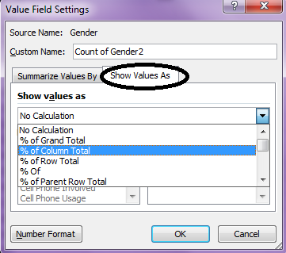
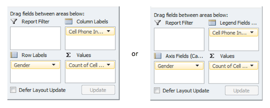

Excel: Pivot Tables in Excel
============================

|image0|

Getting Started…
----------------

To invoke the PivotTable wizard in Excel, first highlight the data that
you want to summarize. Select Insert > PivotTable or PivotChart. The
PivotChart will produce a table as well as a chart; whereas the
PivotTable will produce only a table.

|image1|

In the Create PivotTable window, you must specify the data that you want
to analyze and a location for the output (or report) to be placed.

|image2|

On the new sheet, you will see an output area for the table and the
chart; also, a PivotTable Field List is shown on the right-hand side of
the window. To create your table and chart, place your first variable of
interest in the Axis Fields box near the bottom right corner of the
window.

|image3|

For example, suppose the variable of interest is *Gender*. To create a pivot
table for *Gender*, first place *Gender* in the Axis Fields box. Next, you must
tell Excel what you want to do with *Gender*. Dragging *Gender* into the Values
box will create a Count of *Gender*.   

|image4|

To obtain a summary of the distribution of *Gender*, this variable
should be placed in the Axis Fields box and a Count of Gender should
appear in the Values box as is shown below.

|image5|

The table of counts and the chart are given here.

|image6|

Excel will often give a count of missing values. This dataset has no
missing values, thus, we can deselect this from the drop-down menu in
the Row Labels box.

|image7|

Computing percentages is not necessarily straight forward…
----------------------------------------------------------

First, consider computing the appropriate percentages in a generic table
in Excel (i.e., not within the pivot table framework). The appropriate
formulas are given below.

|image8|

Recall that Excel automatically updates the cell references in formulas
when they are copied down and/or across cells. This can save LOTS of
time in certain situations; however, it can also cause problems if
you’re not careful. For example, suppose you entered the formula for
Females and copied it down to obtain the percentage of Males.

|image9|

After this formula is entered and copied down, a #DIV/0! error is
produced. This happens because the denominator in our formula is cell
B5, which is empty (and Excel treats this as a “0”). Since you cannot
divide by 0, Excel returns the error.

**Formula View:**
|image10|

**Data View:** 
|image11|

As discussed earlier, absolute cell referencing can be used to prevent
this error from occurring. You can use the $ to force Excel to always
use cell B4 in the denominator as shown below.

|image12|

The final output…

|image13|

Unfortunately, obtaining the appropriate percentages with calculations
involving cells in the pivot table output is somewhat cumbersome because
Excel refers to these cells in very specific ways. For example, the
following “formula” is produced when you try to calculate a simple
percentage of 185/388 with the pivot table output:

|image14|

.. admonition:: Question: 

    Copy this formula down to obtain the percentage of Males in this dataset. What
    happened? How do we fix the formula to obtain the correct percentage for Males?

Computing Percentages with the PivotTable
-----------------------------------------

The PivotTable does have the ability to compute percentages
automatically. The instructions below will result in a table containing
both counts and their corresponding percentages.

When constructing the PivotTable, place *Gender* in the Values box
*twice*.

|image15|

Your table should now contain two columns, as is shown here. Right-click
on the column header for which you want to compute percentages and
select “Value Field Settings…”

|image16|

Under the Show values as tab, select **% of Column Total** from the
drop-down list. Click OK.

|image17|

The following table contains the desired outcomes.

+--------------+-------------+------------------+
| **Gender**   | **Count**   | **Percentage**   |
+==============+=============+==================+
| Female       | 185         | 47.68%           |
+--------------+-------------+------------------+
| Male         | 203         | 52.32%           |
+--------------+-------------+------------------+
| **Total**    | **388**     | **100.00%**      |
+--------------+-------------+------------------+

Working with Two or More Variables…
-----------------------------------

Suppose the goal is to understand the relationship between *Gender* and
*Cell Phone Involved*. To create this pivot table, click on the space
set aside for the pivot table and place *Gender* in the Column Labels
box and *Cell Phone Involved* in the Row Labels box (note that if you
click on the space set aside for the chart, you should place *Gender* in
the Axis Field box and *Cell Phone Involved* in the Legend Fields box).
Then, place either one of the variables in the Values box. Excel will
calculate the counts by default.

|image32|

The following table and graphic is produced. Again, the “Blank” category
has been deselected since there are no missing values in our dataset.

|image18|

You can change the Chart Type to a more traditional 100% Stacked Bar
chart, which is similar to a mosaic plot.

|image19|

.. admonition:: Task: 

    Spend a few minutes to ‘clean up’ your 100% stacked bar
    chart to make it look like the one below.

|image20|

Pivot tables can be used for as many variables as you’d like. However,
you can easily become overwhelmed with too much information.

|image21|

Pivot Tables with Numerical Data
--------------------------------

Next, open the **NC\_Birth.xlsx** dataset. Suppose interest lies in the
relationship between Mother Minority status and the age of a Mother at
the time of birth. For example, do the data indicate that Nonwhite
mothers tend to be of a younger age?

To investigate this, start by creating a pivot table with the following
arguments.

|image22|

Next, change the Value Field Settings on *Mother Age* so that Excel
calculates the average age for each group.

|image23|

The results are shown below.

|image24|

Filtering with Pivot Tables
---------------------------

Consider the previous example. Suppose you also wanted to consider a
third variable, *Marital Status.* You can add marital status to the
Report Filter box:

|image25|

Now, you can click the drop-down arrow next to *Marital Status* in
order to filter the results based on this variable.

**For All:**
|image26|

**For only the Married women:**
|image27|

**For only the Unmarried women:**
|image28|

.. admonition:: Tasks:

    1. Create the following PivotTable in Excel.

    2. Create the table shown below using the output from your PivotTable.

        Hints/functions used to create the table

    -  ``Round()``

    -  ``Concatenate()``

    -  ``ISNUMBER()``

    -  ``IF()``

+-------------+-------------+
| |image29|   | |image30|   |
+-------------+-------------+

.. |image1| image:: img/h4/media/image2.png
   :width: 3.90011in
   :height: 3.26042in

.. |image3| image:: img/h4/media/image4.png
   :width: 5.15625in
   :height: 2.97352in
.. |image4| image:: img/h4/media/image6.png
   :width: 3.58in
   :height: 4.24in
.. |image5| image:: img/h4/media/image7.png
   :width: 2.51917in
   :height: 1.71875in

.. |image7| image:: img/h4/media/image9.png
   :width: 4.85417in
   :height: 2.60389in

.. |image9| image:: img/h4/media/image11.png
   :width: 6.44792in
   :height: 1.19792in
.. |image10| image:: img/h4/media/image12.png
   :width: 6.50000in
   :height: 0.89583in
.. |image11| image:: img/h4/media/image13.png
   :width: 6.37500in
   :height: 1.06250in
.. |image12| image:: img/h4/media/image14.png
   :width: 6.50000in
   :height: 0.83403in
.. |image13| image:: img/h4/media/image15.png
   :width: 6.50000in
   :height: 0.83681in

.. |image16| image:: img/h4/media/image18.png
   :width: 3.04167in
   :height: 1.64360in

.. |image19| image:: img/h4/media/image23.png
   :width: 3.05643in
   :height: 3.52083in
.. |image20| image:: img/h4/media/image24.png
   :width: 3.46098in
   :height: 2.60417in
.. |image21| image:: img/h4/media/image25.png
   :width: 6.50000in
   :height: 3.74628in
.. |image22| image:: img/h4/media/image26.png
   :width: 2.53125in
   :height: 2.17708in
.. |image23| image:: img/h4/media/image27.png
   :width: 2.69792in
   :height: 2.44642in

