Appending with the OFFSET() Function
====================================

Climate change affects the environment is many ways. This past winter
produced little snow in California which is likely to compound their
drought. The lack of snow also negatively impacts the $12 billion winter
sports economy in the United States.

|image0|

The National Oceanic and Atmospheric Administration (NOAA) provides a
lot of data that is freely available. Several regional weather offices
also publish data. Data from the Western Regional Climate Center
(Website: http://www.wrcc.dri.edu/) is used in this handout.

The following graphs of Colorado snowfall were computed from a dataset
that required a substantial amount of data management before summaries
could be constructed.

|image1|

The data from this handout is from the Western Regional Climate Center.
This data was provided in two files. One file contained typical snowfall
amounts for each month of the year. A second file contained relevant
auxiliary information about the weather station for which snow
measurements were obtained.

Before working with these larger datasets, let’s begin by working with a
very small subset of the original dataset. Enter the following data into
Excel. This is a small subset of the snowfall dataset and will be used
to understand how to append columns in Excel.

Enter the following data into Excel

|image5|

The task here is to create a stacked version of the data by appending
the Jan, Feb, and Mar columns

|image6|

Replicating Row Content
-----------------------

The first step to appending columns is to create replicates of the
information not being stacked. For our example, station and elevation
need to be replicated twice in our example.

# Replicates required = # Columns to be stacked – 1

|image7|

Insert a new column to the left of Station. Label this column RowID.
Starting with 0, create a sequence from 0 to 14. This data has 5 rows
and 3 columns are to be stacked. The number of rows needed for a stacked
version of the dataset is 15.

.. math:: (5\ rows*\ 3\ columns\ to\ stacked) = 15

Modular arithmetic will be used and starting the sequence with 0 will
prove to be easier than starting the sequence at 1.

Next, insert a column between RowID and Station. Label this new column
Row Reference. This column will identify which row of the original
dataset is being referenced. Enter the following into cell B2 and copy
down for all cells.

Cell B2: ``=MOD(A2,5)``

+----------------------------------------------------+-----------------------------------------------------------------------+
| Enter ``MOD`` formula into cell B2 as shown here   | The Row Reference provides the needed reference for the replicates.   |
|                                                    |                                                                       |
| |image8|                                           | |image9|                                                              |
+----------------------------------------------------+-----------------------------------------------------------------------+

The ``=OFFSET()`` function in Excel will be used to replicate the necessary
contents for each row. This function returns the contents of another
cell. The contents being returned is determined by the number of cells
down and to the right from a reference cell.

+-----------------------------------------------------------------------------------------------------------------------------------------------------------------------------------+----------------------------------------------------------------------------------+
| =OFFSET() requires the specification of a reference cell, i.e. cell C2 here. The row reference is specified by B7 and the column reference should be set to 0.                    | Cell C7: =OFFSET($C$2,B7,0)                                                      |
|                                                                                                                                                                                   |                                                                                  |
| |image10|                                                                                                                                                                         | Copy this down for remaining cell. The Station names are replicated as needed.   |
|                                                                                                                                                                                   |                                                                                  |
| Cell B7 contains 0, thus in this instance =OFFSET() will shift 0 rows down and 0 rows to the right to obtain the contents. Here =OFFSET() places BOULDER in cell C7 as desired.   | |image12|                                                                        |
|                                                                                                                                                                                   |                                                                                  |
| |image11|                                                                                                                                                                         |                                                                                  |
+-----------------------------------------------------------------------------------------------------------------------------------------------------------------------------------+----------------------------------------------------------------------------------+

A similar process can be used to replicate the Elevation values.

+-------------------------------------------------------------------------------+----------------------------------------------------+
| Put the following formula in cell D7 and copy down for the remaining cells.   | Elevation should now be replicated as shown here   |
|                                                                               | |image14|                                          |
| Cell D7: =OFFSET($C$2,B7,1)                                                   |                                                    |
|                                                                               |                                                    |
| |image13|                                                                     |                                                    |
+-------------------------------------------------------------------------------+----------------------------------------------------+

Appending Columns
-----------------

The process needed for the columns to be appended is slightly different
than above. The ``=OFFSET()`` function must automatically shift to the right
for each replicate.

+----------------------------------------------+--------------------------------------------------------------------------------------------------------------------------------+
| Cell F2 will be used as the reference cell   | For RowIDs 5 through 9, the column index should be set to 1; however, the column index should be 2 for RowIDs 10 through 14.   |
|                                              |                                                                                                                                |
| |image15|                                    | |image16|                                                                                                                      |
+----------------------------------------------+--------------------------------------------------------------------------------------------------------------------------------+

Insert another column for the Column Reference. Enter the following
formula into Cell C2.

Cell C2: ``=INT(A2 / 5)``

|image17|

The ``=INT()`` function is equivalent to the floor function and simply
returns the integer part of a number.

+-------------------------------------------------------------------------------------------+------------------------------------------------------------------------------------------+
| .. math:: \left\lfloor \frac{1}{5} \right\rfloor = \left\lfloor 0.2 \right\rfloor = \ 0   | .. math:: \left\lfloor \frac{6}{5} \right\rfloor = \left\lfloor 1.2 \right\rfloor = 1    |
+===========================================================================================+==========================================================================================+
| .. math:: \left\lfloor \frac{4}{5} \right\rfloor = \left\lfloor 0.8 \right\rfloor = 0     | .. math:: \left\lfloor \frac{14}{5} \right\rfloor = \left\lfloor 2.8 \right\rfloor = 2   |
+-------------------------------------------------------------------------------------------+------------------------------------------------------------------------------------------+

After creating the Column Reference column, type the following into cell
F7. $F$2 will be used as the reference cell. This function also makes
use of the row and column references. Copy this formula down for all
remaining cells.

Cell F7: ``=OFFSET($F$2, B7, C7)``

|image18|

The snowfall amounts should now be stacked.

|image19|

The last step is to identify the month for each row. Click on column F,
right click and select Insert. Name this new column Month. Enter the
following into cell F2.

Cell F2: ``=OFFSET($G$1, 0, C2)``

|image20|

A final version of the stacked dataset is shown here. Unfortunately, the
contents in many of these cells rely on the contents of other cells. You
may find it beneficial to create a second version of the data that does
not contain such dependencies. When making the second copy, select Paste
Values to remove the dependencies.

|image21|

Working with Complete Dataset
-----------------------------

|image22|

`Link to data <http://www.wrcc.dri.edu/htmlfiles/co/co.sno.html>`_

`Link for station information: <http://www.wrcc.dri.edu/inventory/sodco.html>`_

Often data downloaded from the internet must be cleaned before importing
into Excel or other software packages. For example, the header content
on this file should be removed before importing. The files provided on
the workshop website have the unwanted header information removed.

|image23|

Import the monthly snowfall data into Excel. Select Data > From Text,
specify Fixed width in Step 1 of the import wizard. Continue through the
remaining steps of the import wizard. You should delete Columns B, C, D,
and Q as these columns will not be used here.

|image24|

The following snippet show the data that needs to be stacked.

|image25|

Similar to the example discussed above, the goal here is to stack the
Month columns. There are a total of 326 rows in this dataset and 12
columns are to be stacked.

.. math:: (326\ rows*\ 12\ columns) = 3912

Insert a RowID column. Again, starting with 0, create a sequence from 0
to 3911 with increments of size 1.

|image26|

Next, insert two columns which will be used for the row and column
reference. Type the following equations into cells B2 and C2. Copy these
formulas down for all rows.

Cell B2: ``=MOD(A2, 326)``

Cell C2: ``=INT(A2 / 326)``

Before starting with the ``=OFFSET()`` function, verify these formulas have
produced the desired outcomes.

|image27|

If the row and column references have been correctly specified, then we
can proceed with the ``=OFFSET()`` function. Akin to the example above, the
Station ID column must be replicated several times. A 0 is used for the
column reference when stacking the Station IDs. However, a column
reference is needed for the column to be stacked. This reference is
contained in Column C.

Cell D328:``=OFFSET( $D$2,B238 , 0 )``

Cell E328: ``=OFFSET( $E$2 , B328 , C328 )``

|image28|

.. admonition:: Question

    How would the formula for the ``=OFFSET()`` function in column E be
    written if $D$2 is used as the reference cell?

Finally, insert a column to the left of Jan and name this column Month.
Copy this formula down for all cell.

Cell E2: ``=OFFSET( $F$1 , 0 , C2 )``

|image29|

Verify that all columns have been properly stacked and the content of
all rows has been correctly specified. Obtain a copy of the this data
using Paste Values to remove all cell dependencies. A snippet of the
final dataset is provided here for reference.

|image30|

Getting Summaries Stacked vs. Unstacked
---------------------------------------

The efficient use of PivotTables requires the data be in a stacked
structure.

**Stacked data: getting averages by Month**

|image31|

**Unstacked data: getting averages by Month**

|image32|

The PivotTable output and its associated visualization using the stacked
version of the data.

|image33|

.. admonition:: Questions

    1. Which month has the highest average snowfall?

    2. It is true that it has snowed in every month at some point in
       Colorado’s history. Explain how this data supports this statement.

.. |image0| image:: img/h5/media/image1.png
   :width: 4.00in
   :height: 1.90in
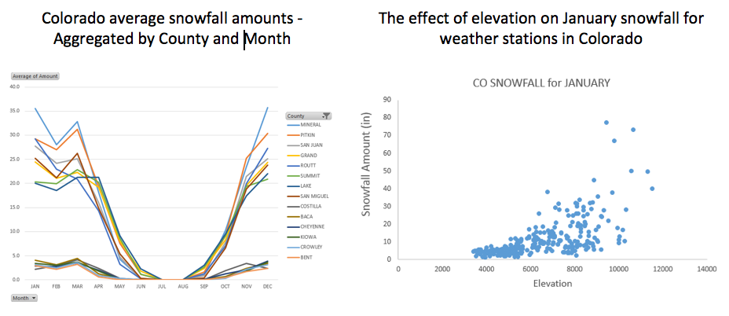
.. |http://www.theodora.com/wfb/photos/canada/big\_white\_ski\_resort\_village\_kelowna\_british\_columbia\_canada\_photo\_tourism\_bc-don\_weixl.jpg| image:: img/h5/media/image3.jpeg
   :width: 2.44776in
   :height: 1.63166in
.. |image3| image:: img/h5/media/image4.png
   :width: 2.88060in
   :height: 2.03304in
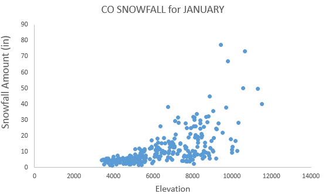
.. |image5| image:: img/h5/media/image6.png
   :width: 2.78358in
   :height: 1.04646in
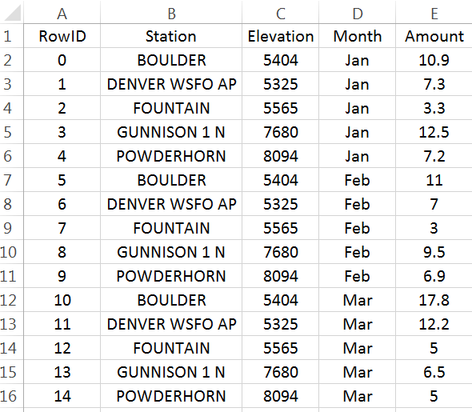
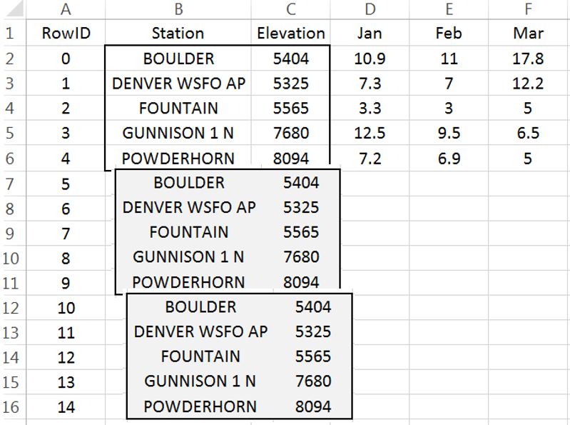
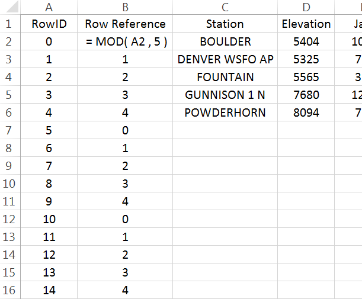
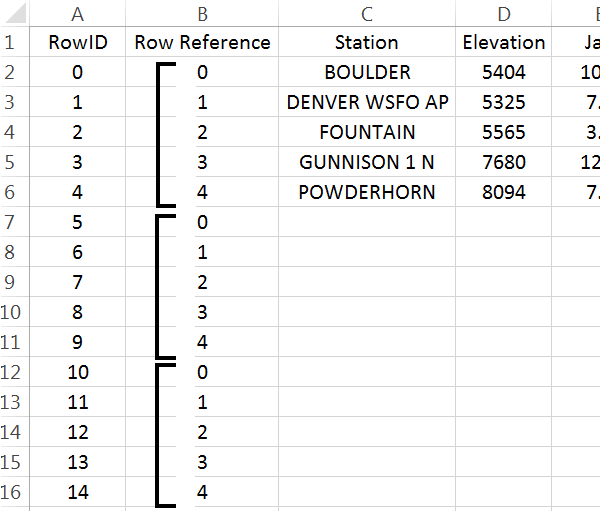
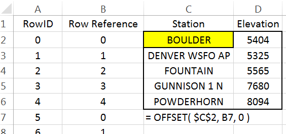
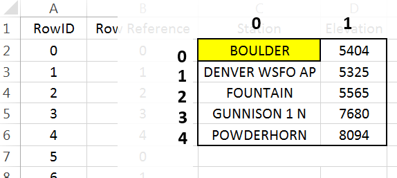
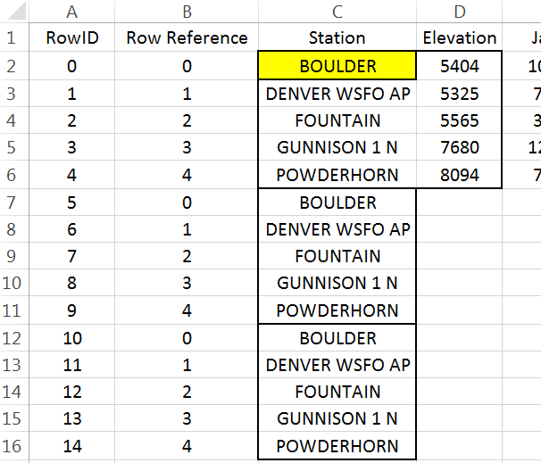
.. |image13| image:: img/h5/media/image14.png
   :width: 2.68432in
   :height: 1.02985in
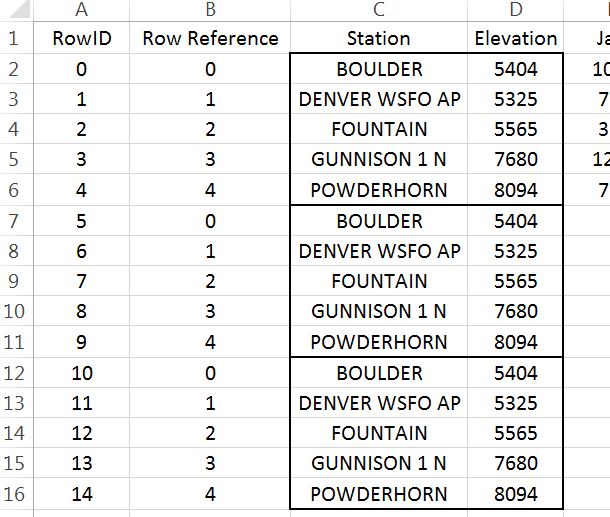
.. |image15| image:: img/h5/media/image16.png
   :width: 2.89568in
   :height: 1.76866in
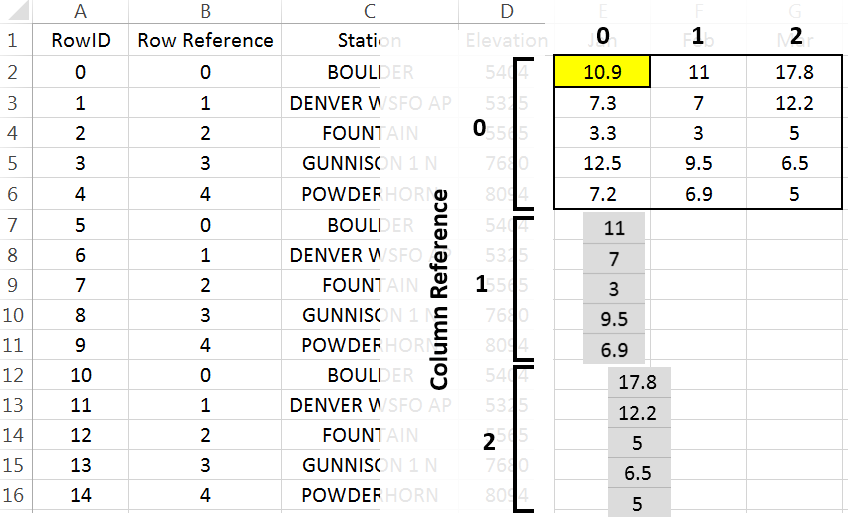
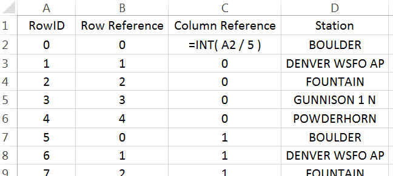
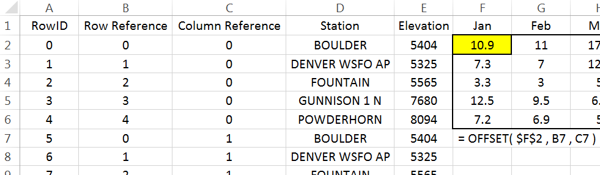
.. |image19| image:: img/h5/media/image20.png
   :width: 5.17910in
   :height: 2.59453in
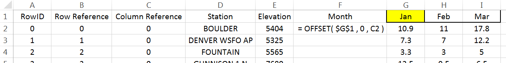

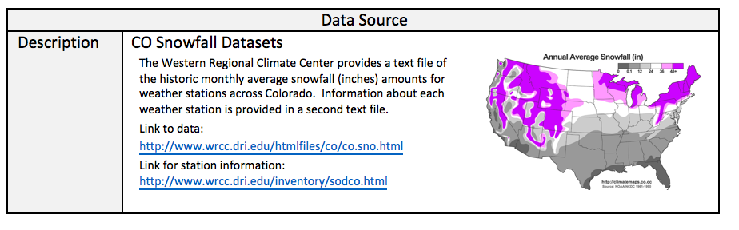
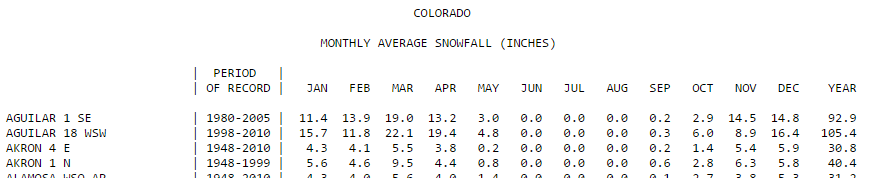
.. |image24| image:: img/h5/media/image24.png
   :width: 6.50000in
   :height: 1.05764in
.. |image25| image:: img/h5/media/image25.png
   :width: 6.50000in
   :height: 1.20486in
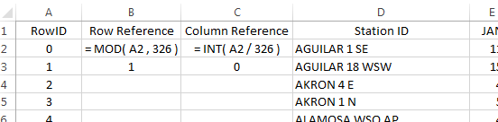
.. |image27| image:: img/h5/media/image27.png
   :width: 3.26119in
   :height: 1.85218in
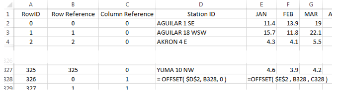
.. |image29| image:: img/h5/media/image29.png
   :width: 5.79105in
   :height: 0.70223in
.. |image30| image:: img/h5/media/image30.png
   :width: 2.34328in
   :height: 2.16841in
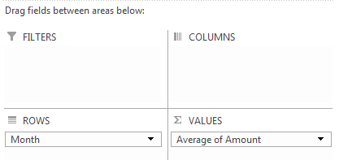
.. |image32| image:: img/h5/media/image32.png
   :width: 4.18in
   :height: 2.95in
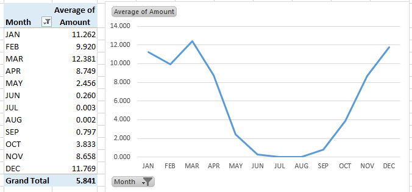
