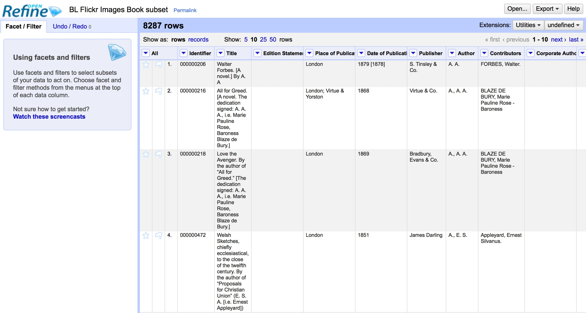
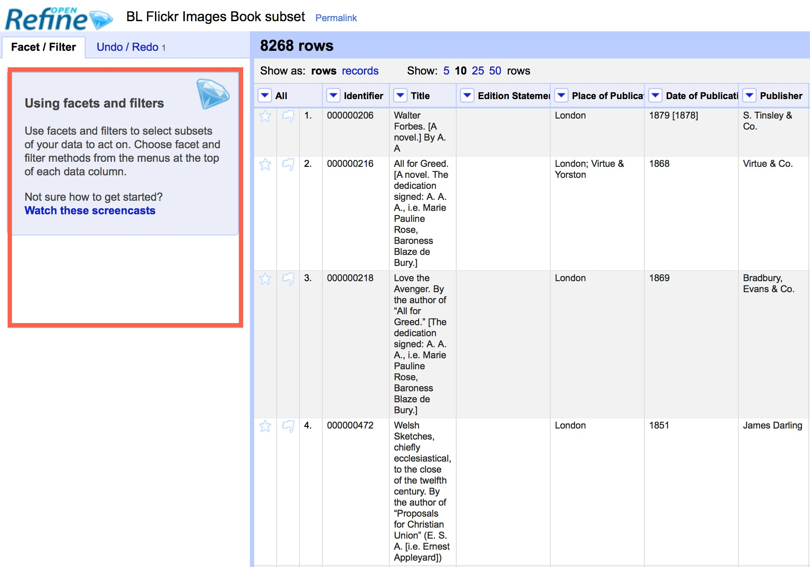
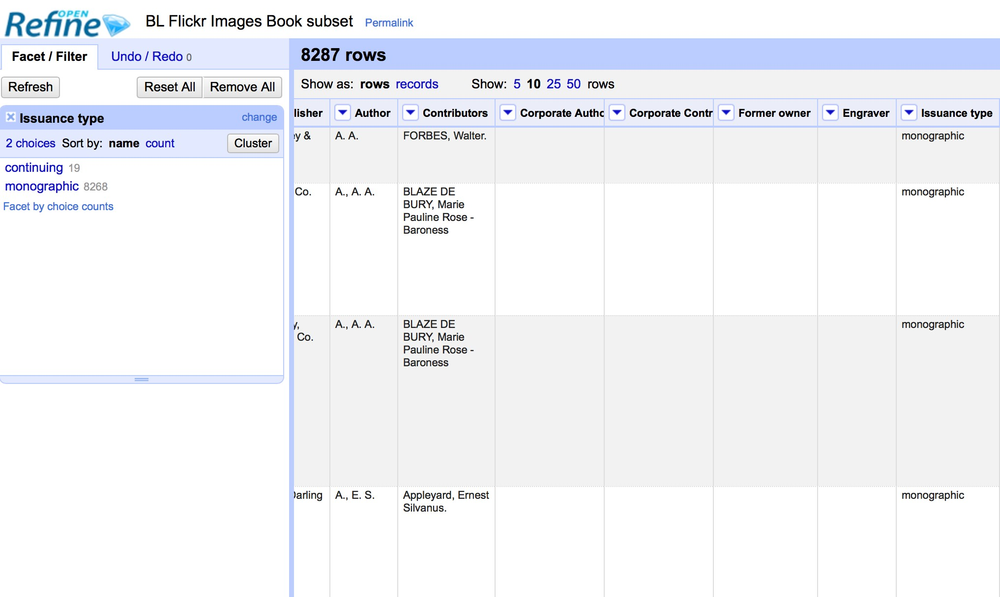
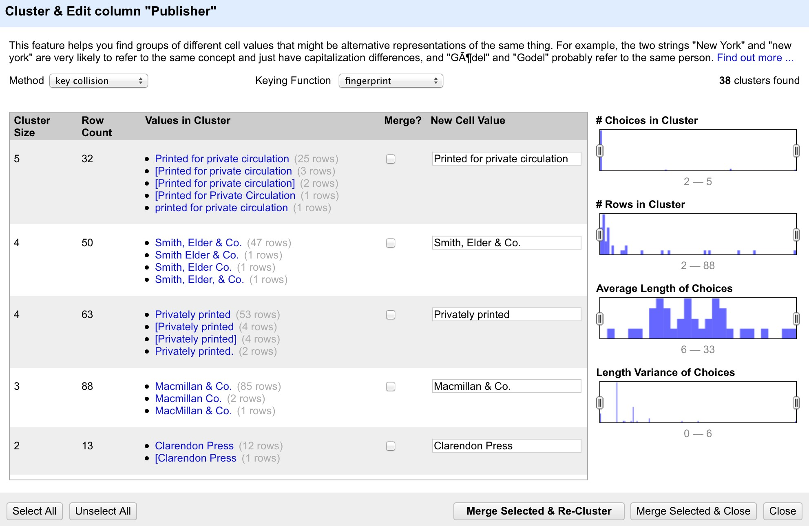
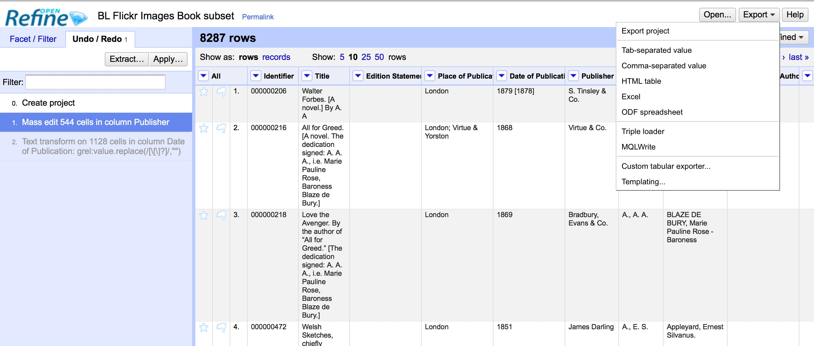

Introduction to OpenRefine
::::::::::::::::::::::::::

This Introduction to OpenRefine was developed by Owen Stephens
(*owen@ostephens.com*) on behalf of the British Library in July
2014.

This work is licensed under a Creative Commons Attribution 4.0
International License
`http://creativecommons.org/licenses/by/4.0/. <http://creativecommons.org/licenses/by/4.0/>`__

It is suggested when crediting this work, you include the phrase
**Developed by Owen Stephens on behalf of the British Library**

Getting Started
===============

What is OpenRefine?
-------------------

OpenRefine is described as a tool for working with *messy* data -
but what does this mean? It is probably easiest to describe the
kinds of data OpenRefine is good at working with and the sorts of
problems it can help you solve.

OpenRefine is most useful where you have data in a simple tabular
format but with internal inconsistencies either in data formats, or
where data appears, or in terminology used. It can help you:

*  Get an overview of a data set

*  Resolve inconsistencies in a data set

*  Help you split data up into more granular parts

*  Match local data up to other data sets

*  Enhance a data set with data from other sources 
  
Some common scenarios might be:

1. Where you want to know how many times a particular value appears in a
   column in your data

2. Where you want to know how values are distributed across your whole
   data set

3. Where you have a list of dates which are formatted in different ways,
   and want to change all the dates in the list to a single common date
   format:

|image19|

4. Where you have a list of names or terms that differ from each other
   but refer to the same people, places or concepts:

|image20|

5. Where you have several bits of data combined together in a single
   column, and you want to separate them out into individual bits of
   data with one column for each bit of the data:

|image21|

6. Where you want to add to your data from an external data source:

|image22|

Downloading OpenRefine
----------------------

You can download OpenRefine from `http://openrefine.org/download.html <http://openrefine.org/download.html>`__

While the current (as of 10th July 2014) official *stable* version
is called *Google Refine 2.5*, generally the **OpenRefine 2.6 -
Development version** is recommended over this and although labelled
*beta* has been stable for some time.

There are versions for Windows, Mac OS X and Linux.

Installing and Running OpenRefine
---------------------------------

When you download OpenRefine for Windows or Linux from the address
above, you are downloading a zip file. To install OpenRefine you
simply unzip the downloaded file wherever you want to install the
program. This can be to a personal directory or to an applications
or software directory - OpenRefine should run wherever you put the
unzipped folder.

If you are downloading OpenRefine for Mac, you a re downloading a
*dmg* (disk image) file which you can open, and then drag the
OpenRefine application to an appropriate folder on you computer.

OpenRefine is a java application, and you need to have a *java
runtime environment* (JRE) installed on your computer to run
OpenRefine. If you don*t already have one installed then you can
download and install from `http://java.com <http://java.com/>`__
by going to the site and clicking *Free Java Download*.

To run Refine:

-  **On Windows:** Navigate to the folder where you*ve installed OpenRefine and either double-click **google-refine.exe** (for Google Refine 2.5), **openrefine.exe** (for OpenRefine 2.6) or **refine.bat** (for either)

-  **On Linux:** Navigate to the folder where you*ve installed
   OpenRefine in a terminal window and type ``./refine``

-  **On Mac:** Navigate to where you installed OpenRefine and click the
   OpenRefine icon

The interface to OpenRefine is accessed via a web browser. When you
run Refine normally this should open a window in your default web
browser pointing at the address *http://127.0.0.1:3333*. If this
doesn*t happen automatically you can open a web browser and type in
this address.

|image0|

Getting Help
------------

You can find support, documentation and tutorials on using
OpenRefine in various places online including:

-  The `OpenRefine Wiki <https://github.com/OpenRefine/OpenRefine/wiki>`_

-  The `Free your metadata <http://freeyourmetadata.org/>`_ site 

-  The OpenRefine `mailing list and forum <http://groups.google.com/d/forum/openrefine>`__

.. admonition:: Exercise 1: Create your first Open Refine project (using provided data)

    There are several options for getting your data set into OpenRefine.
    You can upload or import files in a variety of formats including:

    -  TSV (tab-separated values)

    -  CSV (comma-separated values)

    -  Excel

    -  JSON (javascript object notation)

    -  XML

    -  Google Spreadsheet

    To import the data for the exercises below, run OpenRefine and:

    -  Click *Create Project*

    -  Choose *Get Data from this Computer*

    -  Click *Choose Files*

    -  Locate the file called *BL-Flickr-Images-Book-subset.csv* (this can
       be downloaded from 
       `this link <http://www.google.com/url?q=http%3A%2F%2Fwww.meanboyfriend.com%2Foverdue_ideas%2Fwp-content%2Fuploads%2F2015%2F02%2FBL-Flickr-Images-Book-subset.csv&sa=D&sntz=1&usg=AFQjCNGfYuz-USkcuALufjWZ1rGSKEz4vQ>`_

    -  Click *Next*

    You should see a screen as follows:

    |image1|

    This screen gives you some options to ensure that the data gets
    imported into OpenRefine correctly. The options vary depending on
    the type of data you are importing.

    In this case you need to:

    -  Set the *Character encoding* to *UTF-8*

    -  Ensure the first row is used to create the column headings

    -  Make sure OpenRefine doesn*t try to automatically detect numbers and
       dates Once you are happy click *Create Project >>*

    This will create the project and open it for you. Projects are saved
    as you work on them, there is no need to save copies as you go
    along.

To open an existing project in OpenRefine you can click *Open
Project* from the main OpenRefine screen (in the lefthand menu).
When you click this, you will see a list of the existing projects
and can click on a project*s name to open it.

Basic OpenRefine Functions
==========================

The layout of OpenRefine
------------------------

|image2| 

OpenRefine displays data in a tabular format. Each row
will usually represent a *record* in the data, while each column
represents a type of information. This is very similar to how you
might view data in a spreadsheet or database.

Reordering and renaming columns
-------------------------------

Many operations in OpenRefine are accessed from the drop down menus
at the top of each column. You can re-order the columns by clicking
the drop down menu at the top of the first column (labelled *All*),
and choosing **Edit columns > Re-order / remove columns …**

|image3|

You can then drag and drop column names to re-order the columns, or
remove columns completely if they are not required:

|image4|

Sorting data
------------

You can sort data in OpenRefine by clicking on the drop down menu
for the column you want to sort on, and choosing *Sort*

|image5|

Once you have sorted the data a new *Sort* drop down menu will be
displayed:

|image6|

.. note:: 

    Unlike Excel *Sorts* in OpenRefine are temporary - that is, if you
    remove the *Sort*, the data will go back to it*s original
    *unordered* state. The *Sort* drop down menu lets you amend the
    existing sort (e.g. reverse the sort order), remove existing sorts,
    and make sorts permanent.

You can sort on multiple columns at the same time.

.. admonition:: Exercise 2: Re-order columns and sort data

    -  Find the *Date of Publication* column and sort the information by
       date of publication

    -  Move the title column to be the second column in the project (after
       the **Identifier** column)

Facets
------

**Facets** are one of the most useful features of OpenRefine and can
help both get an overview of the data in a project as well as
helping you bring more consistency to the data.

A *Facet* groups all the values that appear in a column, and then
allow you to filter the data by these values and edit values across
many records at the same time.

The simplest type of Facet is called a *Text facet*. This simply
groups all the text values in a column and lists each value with the
number of records it appears in. The facet information always
appears in the left hand panel in the OpenRefine interface.

|image7|

To create a Text Facet for a column, click on the drop down menu at
the top of the column and choose Facet -> Text Facet. The facet will
then appear in the left hand panel.

|image8| 

The screenshot below shows a Text Facet on the *Issuance Type* column. You can
see this contains two values *continuing* and *monographic*. You can filter the
data displayed by clicking on one of these headings.

You can include multiple values from the facet in a filter at one
time by using the *Include* option which appears when you put your
mouse over a value in the Facet.

You can also *invert* the filter to show all records which do not
match your selected values. This option appears at the top of the
Facet panel when you select a value from the facet to apply as a
filter.

Filters
-------

As well as using Facets to filter the data displayed in OpenRefine
you can also apply *Text Filters* which looks for a particular piece
of text appearing in a column. Text filters are applied by clicking
the drop down menu at the top of the column you want to apply the
filter to and choosing *Text filter*.

As with Facets, the Filter options appear in the left hand panel in
OpenRefine. Simply type in the text you want to use in the Filter to
display only rows which contain that text in the relevant column.

|image9|

Working with filtered data
--------------------------

It is very important to note that when you have filtered the data
displayed in OpenRefine, any operations you carry out will apply
only to the rows that match the filter - that is the data currently
being displayed.

In particular if you wish to remove rows that match a filter, you
can do this as follows:

-  Filter the data using Facets or Filters

-  Clicking on the drop down menu under the *All* column heading (this
   is always the first column in an OpenRefine project)

-  Choose **Edit rows > Remove all matching rows**

This will remove all rows that were displayed by the filter:

|image10|

.. admonition:: Exercise 3: Remove all *continuing* publications from this data set

    -  Create a facet for the *Issuance Type* column

    -  Filter the data to only show those rows which represent *continuing*
       publications

    -  Remove these rows from the data set

More on Facets
--------------

As well as *Text facets* Refine also supports a range of other types
of facet. These include:

-  Numeric facets

-  Timeline facets (for dates)

-  Custom facets

-  Scatterplot facets

**Numeric and Timeline facets** display graphs instead of lists of
values. The graph includes *drag and drop* controls you can use to
set a start and end range to filter the data displayed.

|image11|

**Scatterplot facets** are commonly used in statistics.  One example can be
found in the following `OpenRefine Tutorial <http://enipedia.tudelft.nl/wiki/OpenRefine_Tutorial#Exploring_the_data_with_scatter_plots>`__

Custom facets are a range of different types of facets, and also
allow you write your own custom facets. Some of the default custom
facets are:

-  **Word facet** - this breaks down text into words and counts the number
   of records each word appears in

-  **Duplicates facet** - this results in a binary facet of *true* or
   *false*. Rows appear in the *true* facet if the value in the selected
   column is an exact match for a value in the same column in another
   row

-  **Text length facet** - creates a numeric facet based on the length
   (number of characters) of the text in each row for the selected
   column. This can be useful for spotting incorrect or unusual data in
   a field where specific lengths are expected (e.g. if the values are
   expected to be years, any row with a text length more than 4 for that
   column is likely to be incorrect)

-  **Facet by blank** - a binary facet of *true* or *false*. Rows appear in
   the *true* facet if they have no data present in that column. This is
   useful when looking for rows missing key data.

Facets are intended to group together common values and OpenRefine
limits the number of values allowed in a single facet to ensure the
software does not perform slowly or run out of memory. If you create
a facet where there are many unique values (for example, a facet on
a *book title* column in a data set that has one row per book) the
facet created will be very large and may either slow down the
application, or OpenRefine will not create the facet.

.. admonition:: Exercise 4: Find all publications without a date of publication

    -  Use the *Facet by blank* function to find all publications in this
       data set without a date of publication

    -  Filter the data to only those without a date of publication - do you
       notice anything about these records? [Hint: look at the **Place of
       Publication** column]

Amending data through facets
----------------------------

If you create a text facet you can edit the values in the facet to
change the value for several records at the same time. To do this,
simply mouse-over the value you want to edit and click the *edit*
option that appears:

|image12|

This approach is useful in relatively small facets where you might
have small variations through punctuation or typing errors etc. For
example, a column that should contain only terms from a small
restricted list such as days of the week or months of the year.

The list of values in the facet will update as you make edits.

.. admonition:: Exercise 5: Edit edition statements via a text facet

    -  Create a text facet for the Edition column

    -  Sort the facet by *count* to see the most common values

    -  Pick the facets that refer to a *second edition* and edit them using
       a consistent wording

Using Clustering to find similar values
---------------------------------------

Another function that is provided with facets is the *Cluster*
function. The Cluster function looks for similar values across the
facet and enables you to merge together several facets to a single
value.

This is very effective where you have data where there can be minor
variations in data values that are likely such as names of people,
organisations and places.

To use the the *Cluster* function, create a Facet on the relevant
column and click the *Cluster* button. This will bring up a new
window where you can see the *Clusters* that have been detected and
work with them:

|image13|

The *Clusters* are created automatically according to an algorithm.
There are a number of different algorithms supported by OpenRefine -
some experimentation maybe required to see which clustering
algorithm works best with any particular set of data, and you may
find that using different algorithms highlights different clusters.

For more information on the methods used to create Clusters see the 
`OpenRefine wiki <https://github.com/OpenRefine/OpenRefine/wiki/Clustering-In-Depth>`_

For each cluster you have the option of *merging* the values
together - that is replace with a single consistent value. By
default OpenRefine uses the most common value in the cluster as the
new value, but you can select one of the other values by clicking
the value itself, or you can simply type the desired value into the
*New Cell Value* box.

The Clustering function can also be accessed via the drop down menu
at the top of a column by selecting **Edit cells > Cluster and edit …**

.. admonition:: Exercise 6: Use Clustering to clean up publisher data

    -  Create a Text Facet for the **Publisher** column

    -  Click *Cluster*

    -  Using the *key collision* method with the *fingerprint* Keying
       Function work through the clusters of values, merging them to a
       single value where appropriate

Introducing Transformations
===========================

Through facets, filters and clusters OpenRefine offers relatively
straightforward ways of getting an overview of your data, and making
changes where you want to standardise terms used to a common set of
values.

However, sometimes there will be changes you want to make to the
data that cannot be achieved in this way. Such types of changes
include:

-  Splitting data that is in a single column into multiple columns (e.g.
   splitting an address into multiple parts)

-  Standardising the format of data in a column without changing the
   values (e.g. removing punctuation or standardising a date format)

-  Extracting a particular type of data from a longer text string (e.g.
   finding ISBNs in a bibliographic citation)

To support this type of activity OpenRefine supports
*Transformations* which are ways of manipulating data in columns.
Transformations are normally written in a special language called
*GREL* (Google Refine Expression Language). To some extent GREL
expressions are similar to Excel Forumla, although they tend to
focus on text manipulations rather than numeric functions.

Full documentation for the GREL is available at 
`Google-refine-expression-language <https://github.com/OpenRefine/OpenRefine/wiki/>`_. 
This tutorial covers only a small subset of the commands available.

To start writing transformations, select the column on which you
wish to perform a transformation and choose **Edit cells > Transform…** 
to see the following screen:

|image14|

In this screen you have a place to write a transformation (the
*Expression* box) and then the ability to Preview the effect the
transformation would have on the first 10 rows of your data.

The transformation you type into the *Expression* box has to be a
valid GREL expression. The simplest expression is simply the word
*value* by itself - which simply means *the value that is currently
in the column* - that is, **make no change**.

GREL functions are written by giving a value of some kind (a text
string, a date, a number etc.) to a GREL function. Some GREL
functions take additional parameters or options which control how
the function works. GREL supports two syntaxes: 
``value.function(options)`` or ``function(value, options)`` 

Either is valid, and which is used is completely down to personal
preference. Next to the *Preview* option are options to view:

-  History - a list of transformations you*ve previously used with the
   option to reuse them immediately or to *star* them for easy access

-  Starred - a list of transformations you*ve *starred* via the
   *History* view

-  Help - a list of all the GREL functions and brief information on how
   to use them

Some simple transformations
---------------------------

|image23|

.. admonition:: Exercise 7: Cleaning up Date of Publication using simple transformations

    -  Create a facet based on the Date of Publication column

    -  Sort the facet by *name*

    -  What are common issues with the values in this list?

    -  Use the *replace* GREL expression to remove the characters [, ] and ?
       from the Date of Publication column

    - What other issues can you see with the data of publication column?

    - What approaches might you use to overcome these issues?

    - Do you think it is possible to achieve a single coumn with a four digit
      data in it to represent data of publication?

Undo and Redo
-------------

OpenRefine lets you undo, and redo, any number of steps you have
taken in cleaning the data. This means you can always try out
transformations and *undo* if you need to. The way OpenRefine
records the steps you have taken even allows you to take the steps
you*ve carried out on one data set, and apply it to another data set
by a simple copy and paste operation.

The *Undo* and *Redo* options are accessed via the lefthand panel.

|image15|

The Undo/Redo panel lists all the steps you*ve taken so far. To undo
steps, simply click on the last step you want to preserve in the
list and this will automatically undo all the changes made since
that step.

The remaining steps will continue to show in the list but greyed
out, and you can reapply them by simply clicking on the last step
you want to apply.

However, if you *undo* a set of steps and then start doing new
transformations, the greyed out steps will disappear and you will no
longer have the option to *redo* these steps.

If you wish to save a set of steps to be re-applied later, or to a
different project, you can click the *Extract* button. This gives
you the option to select the steps you want to save, and to copy the
transformations included in the selected steps in a format called
*JSON*

To apply a set of steps you have copied or saved in this *JSON*
format use the *Apply* button and paste in the JSON. In this way you
can share transformations between projects and each other.

Undo/Redo data is stored with the Project and is saved automatically
as you work, so next time you open the project, you can access your
full history of steps you have carried out and undo/redo in exactly
the same way.

Exporting data
--------------

Once you have finished working with a data set in OpenRefine you may
wish to export it. The export options are accessed through the
*Export* button at the top right of the OpenRefine interface

|image16|

Export formats support include HTML, Excel and comma- and
tab-separated value (csv and tsv). You can also write a custom
export, selecting to export specific fields, adding a header or
footer and specifying the exact format.

Data types and Regular Expressions
----------------------------------

Understanding data types and regular expressions will help you write
more complex transformations using GREL.

Data types in OpenRefine
------------------------

Every piece of data in OpenRefine is has a *type*. The most common
*type* is a *string* - that is a piece of text. However there are
other data types available and transformations let you convert data
from one type to another where appropriate. The data types supported
are:

-  String

-  Number

-  Date

-  Boolean

-  Array

The first three are hopefully self-explanatory, but the latter two
may require slightly more explanation.

A **Boolean** is a binary value that can either be *true* or
*false*. Boolean values can be used directly in OpenRefine cell, but
is more often used in transformations as part of a GREL expression.
For example: ``value.contains("test")``

Generates a boolean value of either *true* or *false* depending on
whether the current value in the cell contains the text *test*
anywhere. Such tests can be combined with other GREL expressions to
create more complex transformations.

An **Array** is a list of values, represented in Refine by the use
of square brackets containing a list of values surrounded by
inverted commas and separated by commas. For example an array
listing the days of the week would look like:
``["Monday","Tuesday","Wednesday","Thursday","Friday","Saturday","Sunday"]``

Arrays can be sorted, de-duplicated, and manipulated in other ways
in GREL expressions, but cannot appear directly in an OpenRefine
cell. Arrays in OpenRefine are usually the result of a
transformation. For example the *split* function takes a string, and
changes it into an array based on a *separator*. For example if a
cell has the value:

``"Monday,Tuesday,Wednesday,Thursday,Friday,Saturday,Sunday"``

This can be transformed into an array using the *split* function:
``value.split(",")``

This would create the array containing the days of the week:
``["Monday","Tuesday","Wednesday","Thursday","Friday","Saturday","Sunday"]``

This can be combined with array operations like *sort*. For example,
assuming the cell contains the same value as above, then the
function:

``value.split(,).sort()``

Would result in an array containing the days of the week sorted in
alphabetical order:
``["Friday","Monday","Saturday","Sunday","Thursday","Tuesday","Wednesday"]``

To output a value from an array you can either select a specific
value depending on its position in the list (with the first position
treated as *zero*). For example:

``value.split(",")[0]``

Would extract the first value from the array created by the *split*
function. In the above example this would be ``"Monday"``

You can also join arrays together to make a *String*. The GREL
expression would look like: 

``value.split(",").sort().join(",")``

Taking the above example again, this would result in a string with
the days of the week in alphabetical order, listed with commas
between each day.

.. admonition:: Exercise 8: Splitting up the shelfmarks data

    - Note that the shelfmark data is of the form ``library code location`` 
      (e.g. ``British Library HMNTS 12641.b.30.``).  Make three new columns that contains each piece of information.  Be sure to join the libary information back together.
    - Did anything go wrong?  How did you check?  If there were problems, how
      might you fix them?

Regular Expressions
===================

A *regular expression* (sometimes called a *regex*) is a way of
representing patterns in text strings. These can be used to search
for text that matches the pattern represented by the regular
expression. Regular expressions typically surrounded by ``/``
characters.

To write a regular expression you need to know the special syntax
used to represent different types of characters that can occur in a
text string. The table below introduces some of these:

|image24|

These special characters can be combined with any normal characters
to form a regular expression. So to find both the ``s`` and ``z``
spellings of *organize/organise*) could be:

``/organi.e/``

Here the ``.`` character can represent any character and so this would
match both *organise* and *organize*. Because ``.`` can represent any
character this could also catch other patterns that might occur. To
be more specific you could use:

``/organi[sz]e/``

These (and other) character matches can be combined with
*repetition* operators, which allow you to say how many times a
character or pattern is repeated. Repetition operators apply to the
character or expression immediately preceding the operator. The
repetition operations are:

|image25|

In addition you can specify exact numbers of repetitions, or a
maximum/minimum number of repetitions using curly brackets
containing one or two numbers:

``/a{2}/``

Matches the letter ``a`` appearing twice (i.e. matches ``aa``)

``/a{2,4}/``

Matches the letter *a* appearing a minimum of two times or a maximum
of four times (i.e. matches any of ``aa``, ``aaa``, ``aaaa``)

There are many online resources which provide tutorials on using
Regular Expressions, including:

-  `Cheat Sheet <http://arcadiafalcone.net/GoogleRefineCheatSheets.pdf>`_
-  `http://www.regular-expressions.info <http://www.regular-expressions.info/>`__

-  `http://software-carpentry.org/v4/regexp/index.html <http://software-carpentry.org/v4/regexp/index.html>`__

-  `http://www.codeproject.com/Articles/939/An-Introduction-to-Regular-Expressions <http://www.codeproject.com/Articles/939/An-Introduction-to-Regular-Expressions>`__

-  `http://regex.bastardsbook.com <http://regex.bastardsbook.com/>`__

Using the ``match`` transformation with Regular Expressions
-----------------------------------------------------------

Another feature of Regular Expressions is that you can *capture*
parts of the matched string to do some further work with. In
OpenRefine, this is particularly used with the *match* function. The
*match* function allows you to extract particular parts of a string
by using a regular expression which captures parts of the matching
string. To tell the *match* function which bits of the matched
string you want to capture, you simply surround those parts of the
regular expression with brackets ``()``.

For example, if you have strings like: 

``pp. 40. G. Bryan & Co: Oxford`` 

``pp. 64. W. Cann: Plymouth`` 

``pp. 92. Heath Cranton: London`` 

(representing number of pages, publisher and place of publication).

.. admonition:: Question

    Suppose that we want to match "pp. " including the space (and nothing
    else).  What is wrong with using the regular expression ``/pp. /``?

The problem is matching the period!  The regular expression ``/pp. /`` would not
only match ``"pp. "``, but also strings like ``"ppa "`` and ``"ppz "``.  Since
``.`` has a special meaning in a regular expression (an character), we need to
*escape* this character to just match a period.  That is, you use ``\.`` to
match a period, where putting the forward slash in front of the period is
referred to as escaping the character.  

You could use the ``match`` function as follows

``value.match(/pp\. (d*)\..*/)``

This would find the number following ``pp`` in each row and put it
into an OpenRefine Array - so for the rows above you would get:

``[40]``

``[64]``

``[92]``

In the ``match`` function the regular expression used has to match the full
string, but only the parts of the regular expression in brackets are put into
the array. A more complex example with the same example strings might be:

``value.match(/pp\. (\d*)\. (.*):\s*(.*)/)``

This has three capture groups - the page number, the publisher and
the place of publication - getting the output:

``["40", "G. Bryan & Co", "Oxford"]``

``[ "64", "W. Cann", "Plymouth"]``

``[ "95", "Erskine Macdonald", "London"]``

.. admonition:: Task - Find the offending rows

    There are a number of rows that have information like that found in the above
    examples, all stored in the *Place of Publication* column. 

    - Place a text filter on the *Place of Publication* column and search for
      ``pp.``.
    - What information is stored in this field (in addition to the place of
      publication).  Notice that this information is missing from the respective
      columns.

The last exercise illustrates a common problem when working with data that has
been merged from many sources: at least one of the sources has multiple
variables stored in one column.  This is a clear violation of our golden rule of
storing data (one column per variable).  Let's clean this up.

.. admonition:: Task - Make a regular expression to capture the information

    Make a regular expression that captures all of the following pieces of
    information.

    - The number that follows the ``pp.``
    - The publisher
    - The place of publication
    - The date  of publication

Column References
-----------------

To make use of this information, we will need to reference the *Place of
Publication* column in expression for other cells (like *Publisher*).
This will require us to use a **column reference**.  So far, all of our
transformations have started with ``value``, which is reference to the current
value of each respective cell.  

GREL also allows us to reference a cell using ``cell[col_name].value``, where
``col_name`` is the name of a column in quotes.  For example,
``cells["Publisher"].value`` refers to the value stored in the *Publisher*
column of each respective cell.  

.. note::

    More information about how to reference various values in GREL expression can be
    found in the
    `Variable documentation <https://github.com/OpenRefine/OpenRefine/wiki/Variables>`_.

We can use these references to pull data from one column into another column,
which we illustrate in the following task.

.. admonition:: Task - Pull the publisher information from the Place of Publication column.

    Let's add the missing publisher information that we identified in the following
    task.  To do this, perform that following steps.

    - Make sure that you still have the ``pp.`` text filter in place
    - Add a cell transformation to the *Publisher* column.
    - Use ``cells["Place of Publication].value`` to reference the *Place of Publication*
      column.
    - Use ``match``, the earlier regular expression (e.g. ``/pp. ([xv]i*\. )?(\d*)\.
      (.*): (.*), \[?(\d*)\??\.?]?/``), and indexing to pull out the publisher.

Now you should complete what we have started by following the steps in the next
exercise.

.. admonition:: Exercise 8: Pull out the other publication information from the above example.

    - Use a similar transformation to fill in the date of publication.
    - Finally, transform the *Place of Publication* to exclude the earlier
      information.
    - When you apply the last transformation, all the rows disappear.  Why?
    - One of the offending rows was the 8th row.  Verify that all of the
      transformations worked.
    - Note that the order of our transformations was essential.  Why?

Next, use regular expressions to extract the shelfmark code from the *Shelfmark*
columns.

.. admonition:: Exercise 9: Extract the shelfmark

    Notice that the first few columns of the *Shelfmark* column have the form
    ``British Library HMNTS 12641.b.30.``
    - Verify that all lines start with ``British Library HMNTS`` using a text filter
      with a regular expression.
    - Use ``match`` to create a new column called *Shelfmark Code* that contains the
      code (e.g. ``12641.b.30``)
    - Use ``match`` to create a new column called *Shelfmark Code 1* that contains the first part of 
      code (e.g. ``12641``)
    - Use ``match`` to create a new column called *Shelfmark Code 1* that contains the second part of 
      code (e.g. ``b``)
    - Use ``match`` to create a new column called *Shelfmark Code 1* that contains the last part of 
      code (e.g. ``30``)

Advanced Refine
===============

Looking up data from a URL
--------------------------

OpenRefine can retrieve data from URLs. This can be used in various
ways, including looking up additional information from a remote
service, based on information in your OpenRefine data.

As an example, you can look up names against the Virtual
International Authority File (VIAF), and retrieve additional
information such as dates of birth/death and identifiers.

Typically this is a two step process - firstly a step to retrieve
data from a remote service, and secondly to extract the relevant
information from the data you have retrieved.

To retrieve data from an external source, from the drop down menu at
a column heading use the option *Edit column* -> *Add column by
fetching URLs*.

This will prompt you for a GREL expression to create a URL. Often
this would be a URL that uses existing values in your data to build
a query.

|image17|

For example if you have a list of Author names, and wish to retrieve
information from VIAF you can build a URL by appending the name to
the end of a general VIAF URL as follows:

`"h <http://viaf.org/viaf/AutoSuggest?query>`__\ t\ `tp://viaf.org/viaf/AutoSuggest?query="+ <http://viaf.org/viaf/AutoSuggest?query>`__
escape(value, 'url')

(assuming that the column you are working from contains names the
*value* variable will contain the value from the current cell)

This VIAF service returns a list of possible matches in a format
called *JSON*. There is GREL function to extract data from JSON
formatted data called *parseJSON*. This can be used to extract
values from the JSON retrieved from VIAF. For example the following
expression will extract the first name with a VIAF ID.

forEach(value.parseJson().result, v, v.term + ' \| ' + v.viafid)[0]

The process of retrieving data from external services in this way
can be very slow, and is best used on small data sets

Exercise 9: Retrieving VIAF IDs for Authors
-------------------------------------------

-  Use the drop down menu at the top of the Date of Publication column
   and select *Text Filter*

-  Type *1800* into the Date of Publication text filter - this should
   reduce the number of records you are working with to about 26

-  Use the drop down menu at the top of the Author column and select
   *Edit column* -> *Add column by fetching URLs*

-  In the *New column name* box type **VIAF JSON**

-  In the *Expression* box, type the expression:

   -  `"h <http://viaf.org/viaf/AutoSuggest?query>`__\ t\ `tp://viaf.org/viaf/AutoSuggest?query="+ <http://viaf.org/viaf/AutoSuggest?query>`__
      escape(value, 'url')

-  Click *OK*

-  Wait for OpenRefine to retrieve the data from VIAF - this may take a
   few minutes

-  Use the drop down menu at the top of the new **VIAF JSON** column and
   select **

-  In the *Expression* box, type the expression:

   -  forEach(value.parseJson().result, v, v.term + ' \| ' +
      v.viafid)[0]

This should leave some of the boxes in the column populated with
author names and IDs from VIAF.

Reconciliation services
-----------------------

Reconciliation services allow you to lookup terms from your data in
OpenRefine against external services, and use values from the
external services in your data.

Reconciliation services can be more sophisticated and quicker than
using the method described above to retrieve data from a URL.
However, to use the *Reconciliation* function in OpenRefine requires
the external resource to support the necessary service for
OpenRefine to work with, which means unless the service you wish to
use supports such a service you cannot use the *Reconciliation*
approach.

Extensions
----------

The functionality in OpenRefine can be enhanced by *extensions*
which can be downloaded and installed to add functionality to your
OpenRefine installation.

A list of Extensions is given at
*https://github.com/OpenRefine/OpenRefine/wiki/Extensions*

One of these extensions tries to work around the limitation of
Reconciliation services described above, by making it possible to
use a reconciliation service against *linked data*1 sources which
have SPARQL endpoints2. For more information on this see the *RDF
Extension* at *http://* *refine.deri.ie*. An example of how this
works is given in more detail at http://refine.deri.ie/ showcases.

Records and Rows
----------------

All the examples above use OpenRefine in *Row* mode, where it is
assumed that each row in the table represents a *record*.

1 Linked Data is a specific data format that is seeing increased
usage in the library and cultural heritage sector
Introduction to OpenRefine

2 SPARQL is a language used to query *Linked Data* and a **SPARQL
Endpoint** is the URL to which such queries can be sent

However, OpenRefine supports a more complex model of *Records* which
allows you to have multiple values for a single column in a single
record. For example, it is not unusual for a book to have multiple
people (or *contributors*) involved in the creation of the book.

In the screenshot below you can see the options to select a to *Show
as* rows or records, and also see how row 11 has tow contributors
listed.

|image18|

The **records** approach is occasionally useful and can be used when
you have two rows in the original data set that represent the same
*thing* (book/person/place/etc.) and wish to merge the two rows into
a single row, preserving information from both original rows.

For more information on how you can create Records in OpenRefine see
*http://googlerefine.blogspot.co.uk/2012/06/create-records-in-google-refine.html*

Using the *cross* function to lookup data in other OpenRefine projects
----------------------------------------------------------------------

As well as looking up data in external systems using the methods
described above, it is also

possible to look up data in other OpenRefine projects on the same
computer. This is done using the *cross* function.

The *cross* function takes a value from the OpenRefine project you
are working on, and looks for that value in a column in another
OpenRefine project. If it finds one or more matching rows in the
second OpenRefine project, it returns an array containing the rows
that it has matched.

As it returns the whole row for each match, you can use a
transformation to extract the values from any of the columns in the

You can use to compare the contents of two OpenRefine projects, or
to use data between the two projects.

.. |image0| image:: img/open_refine/media/image1.jpeg
   :width: 6.75271in
   :height: 3.47260in
.. |image1| image:: img/open_refine/media/image2.jpeg
   :width: 6.77625in
   :height: 3.82417in

.. |image4| image:: img/open_refine/media/image5.png
   :width: 3.23297in
   :height: 2.91687in
.. |image5| image:: img/open_refine/media/image6.png
   :width: 1.25355in
   :height: 2.23031in
.. |image6| image:: img/open_refine/media/image7.jpeg
   :width: 5.54842in
   :height: 2.44062in

.. |image9| image:: img/open_refine/media/image10.jpeg
   :width: 6.75936in
   :height: 4.27510in
.. |image10| image:: img/open_refine/media/image11.jpeg
   :width: 6.73077in
   :height: 4.37937in
.. |image11| image:: img/open_refine/media/image12.jpeg
   :width: 6.67500in
   :height: 4.69500in
.. |image12| image:: img/open_refine/media/image13.png
   :width: 2.10837in
   :height: 2.79083in

.. |image14| image:: img/open_refine/media/image15.png
   :width: 4.20350in
   :height: 3.22250in
.. |image15| image:: img/open_refine/media/image16.jpeg
   :width: 6.75474in
   :height: 5.17229in

.. |image18| image:: img/open_refine/media/image19.jpeg
   :width: 6.70159in
   :height: 4.26937in
.. |image19| image:: img/open_refine/media/table1.png
   :width: 3.57in
   :height: 2.14in

.. |image21| image:: img/open_refine/media/table3.png
   :width: 8.44in
   :height: 5.90in

.. |image24| image:: img/open_refine/media/reg_exp.png
   :width: 7.61in
   :height: 7.12in
.. |image25| image:: img/open_refine/media/reg_exp_repeat.png
   :width: 7.44in
   :height: 4.49in
