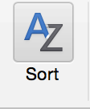

Quality Control
===============

Authors:\ **Christie Bahlai**, **Aleksandra Pawlik**\ 
`Original Source <http://www.datacarpentry.org/spreadsheet-ecology-lesson/>`_

When you have a well-structured data table, you can use several simple
techniques within your spreadsheet to ensure the data you enter is free
of errors. These approaches include techniques that are implemented
prior to entering data (quality assurance) and techniques that are used
after entering data to check for errors (quality control).

Quality Assurance
-----------------

Quality assurance stops bad data from ever being entered by checking to
see if values are valid during data entry. For example, if research is
being conducted at sites A, B, and C, then the value V (which is right
next to B on the keyboard) should never be entered. Likewise if one of
the kinds of data being collected is a count, only integers greater than
or equal to zero should be allowed.

To control the kind of data entered into a a spreadsheet we use Data
Validation (Excel) or Validity (Libre Office Calc), to set the values
that can be entered in each data column.

1. Select the cells or column you want to validate

2. On the ``Data`` tab select ``Data Validation``

.. figure:: ../fig/data_validation.png
   :alt: Image of Data Validation button on Data tab

   Image of Data Validation button on Data tab

3. In the ``Allow`` box select the kind of data that should be in the
column. Options include whole numbers, decimals, lists of items, dates,
and other values.

.. figure:: ../fig/data_validation_window.png
   :alt: Image of Data Validation window

   Image of Data Validation window

4. After selecting an item enter any additional details. For example, if
you've chosen a list of values, enter a comma-delimited list of
allowable values in the ``Source`` box.

Let's try this out by setting the plot column in our spreadsheet to only
allow plot values that are integers between 1 and 24.

1. Select the ``plot_id`` column
2. On the ``Data`` tab select ``Data Validation``
3. In the ``Allow`` box select ``Whole number``
4. Set the minimum and maximum values to 1 and 24.

.. figure:: ../fig/plot_validation.png
   :alt: Image of Data Validation window for validating plot values

   Image of Data Validation window for validating plot values

Now let's try entering a new value in the plot column that isn't a valid
plot. The spreadsheet stops us from entering the wrong value and asks us
if we would like to try again.

.. figure:: ../fig/invalid_value.png
   :alt: Image of error when trying to enter invalid data

   Image of error when trying to enter invalid data

You can also customize the resulting message to be more informative by
entering your own message in the ``Input Message`` tab

.. figure:: ../fig/input_message.png
   :alt: Image of Input Message tab

   Image of Input Message tab

or allow invalid data to result in a warning rather than an error by
modifying the ``Style`` option on the ``Error Alert`` tab.

.. figure:: ../fig/error_alert.png
   :alt: Image of Error Alert tab

   Image of Error Alert tab

Quality assurance can make data entry easier as well as more robust. For
example, if you use a list of options to restrict data entry, the
spreadsheet will provide you with a drop-downlist of the available
items. So, instead of trying to remember how to spell *Dipodomys
spectabilis*, you can select the right option from the list.

.. figure:: ../fig/drop_down_list.png
   :alt: Image of drop-down menu

   Image of drop-down menu

Quality Control
---------------

Tip: *Before doing any quality control operations, save your original
file with the formulas and a name indicating it is the original data.
Create a separate file with appropriate naming and versioning, and
ensure your data is stored as values and not as formulas. Because
formulas refer to other cells, and you may be moving cells around, you
may compromise the integrity of your data if you do not take this step!*

readMe (README) files: As you start manipulating your data files, create
a readMe document / text file to keep track of your files and document
your manipulations so that they may be easily understood and replicated,
either by your future self or by an independent researcher. Your readMe
file should document all of the files in your data set (including
documentation), describe their content and format, and lay out the
organizing principles of folders and subfolders. For each of the
separate files listed, it is a good idea to document the manipulations
or analyses that were carried out on those data. `Cornell University's
Research Data Management Service
Group <https://data.research.cornell.edu/content/readme>`__ provides
detailed guidelines for how to write a good readMe file, along with an
adaptable template.

Sorting
-------

Bad values often sort to the bottom or top of the column. For example,
if your data should be numeric, then alphabetical and null data will
group at the ends of the sorted data. Sort your data by each field, one
at a time. Scan through each column, but pay the most attention to the
top and the bottom of a column. If your dataset is well-structured and
does not contain formulas, sorting should never affect the integrity of
your dataset.

**Remember** to expand your sort in order to prevent data corruption.
Expanding your sort ensures that the all the data in one row move
together instead of only sorting a single column in isolation. Sorting
by only a single column will scramble your data - a single row will no
longer represent an individual observation.

.. admonition:: Exercise

    We've combined all of the tables from the messy data into a single
    table in a single tab. Download this semi-cleaned data file to your
    computer:
    `survey\_sorting\_exercise <https://figshare.com/articles/survey_data_messy_quality_control/4830016>`__

    Once downloaded, sort the ``Weight_grams`` column in your
    spreadsheet program from ``Largest to Smallest``.

    What do you notice?

..         .. rubric:: Solution
..            :name: solution
.. 
..         Click the Sort button on the data tab in Excel. A pop-up will
..         appear. Make sure you select ``Expand the selection``.
.. 
..         |quality\_control0, exercise1| {: .output}
.. 
..         The following window will display, choose the column you want to
..         sort as well as the sort order.
.. 
..         |quality\_control1, exercise1| {: .output}
.. 
..         **Note** how the odd values sort to the top and bottom of the
..         tabular data. The cells containing no data values sort to the
..         bottom of the tabular data, while the cells where the letter "g"
..         was included can be found towards the top. This is a powerful
..         way to check your data for outliers and odd values.
.. 
..         |quality\_control2, exercise1| {: .output}
.. 
..         |quality\_control3, exercise1| {: .output}
.. 
..         {: .solution} {: .challenge}
.. 
Conditional formatting
----------------------

Conditional formatting basically can do something like color code your
values by some criteria or lowest to highest. This makes it easy to scan
your data for outliers.

Conditional formatting should be used with caution, but it can be a
great way to flag inconsistent values when entering data.

.. admonition:: Exercise

    1. In the main Excel menu bar, click ``Format`` >
       ``Conditional Formating...`` Click the ``+`` to add a formatting
       rule.
    2. Apply a ``2-Color Scale`` formatting rule with the lowest values
       set to orange and the highest values set to yellow.
    3. Now we can scan through and different colors will stand out. Do
       you notice any strange values?

..         .. rubric:: Solution
..            :name: solution-1
.. 
..         Cells that contain non-numerical values are not colored. This
..         includes both the cells where the letter "g" was included and
..         the empty cells. |quality\_control4, exercise2| {: .output}
.. 
..         {: .solution} {: .challenge}

It is nice to do be able to do these scans in spreadsheets, but we also
can do these checks in a programming language like R, or in OpenRefine
or SQL.

.. |quality\_control1, exercise1| image:: ../fig/sorting_example.png
.. |quality\_control2, exercise1| image:: ../fig/sorting_solution_1.png
.. |quality\_control3, exercise1| image:: ../fig/sorting_solution_2.png
.. |quality\_control4, exercise2| image:: ../fig/conditional_formating.png

