R: Introduction to R
====================

| To begin, download R from the R-Project web site
  (`www.r-project.org <http://www.r-project.org>`__). R is different
  from most statistical packages in that it contains a very primitive
  interface (though this is continually improving) and as a result has a
  more hands-on or programming feel than other statistical software
  packages.

The standard installation of R utilizes a default user interface. In
this course, we will instead use RStudio which provides a richer
interface. Once you have installed the R base package, download RStudio
from the following website: http://www.rstudio.com/.

R is an open source package. This has both advantages and disadvantages.
Because it is open source, there is no “software support” you can
directly access; however, there are literally *thousands* of documents
on the web that can help you use R efficiently (some are much better
than others). The following links give some of the most popular webpages
for R support.

-  http://cran.r-project.org/other-docs.html

-  http://cran.r-project.org/manuals.html

-  http://cran.r-project.org/doc/manuals/R-intro.html

R’s base package contains many basic functions used in statistics. In
addition to the base package, many individuals have created other
packages that can be downloaded that will aid in various analyses.

The following provides a snapshot of the R Studio interface that is
commonly used when using R.

|image0|

*Organizational Structure*

The organization structure in R is best managed through what is called
Projects. To create a new Project, select File > New Project …

|image1|

+--------------------------------+--------------------------------------------------+
| First, specify New Directory   | Next, to begin we will create an Empty Project   |
|                                |                                                  |
| |image2|                       | |image3|                                         |
+--------------------------------+--------------------------------------------------+

Specify the name and location for the new directory that will contain
this new project.

+-------------------------------------------------------------+-------------------------------------------------------------+
| Next, specify the name and location fo this new directory   | Verify that the new direcory and project has been created   |
|                                                             |                                                             |
| |image4|                                                    | |image5|                                                    |
+-------------------------------------------------------------+-------------------------------------------------------------+

The frame in the upper-left is your script window and the frame on the
lower-left is the R console window. You can enter command directly into
the R console; however, I’d encourage you to get accustomed to using the
script window. The following can be used to obtain an R script window.

|image6|

***Reading Data Files into R Studio***

Citibike is a bike rental company that operates in New York City.
Citibike bike rental data is publically available.

-  Citibike: https://www.citibikenyc.com/

-  System Data: https://www.citibikenyc.com/system-data

-  Amazon data download: https://s3.amazonaws.com/tripdata/index.html

+------------+----------------------------------------------------------------------------------------------------+
| |image7|   | |http://inhabitat.com/wp-content/blogs.dir/2/files/2013/04/citi-bike-share-1-e1366036215458.jpg|   |
+------------+----------------------------------------------------------------------------------------------------+

Scroll down and save a copy of the most recent dataset onto your local
machine.

|image9|

Unzip the file that you’ve downloaded from this website. A comma
delimited text file is produced.

|image10|

The Citibike dataset is highly structured. The first row contains the
variable or field names. Each row represents a single instance of a bike
rental.

|image11|

To open a text file in RStudio, select **Import Dataset** in the window
shown in the upper-right. Choose to import data from a Text File.

|image12|

Select the text file to be read in. The Citibike bike rental dataset is
being read in here. Give a name to the dataset in the Name box. Options
may need to be specified, the default setting suffice for this dataset.

|image13|

***Understanding Data Objects***

Click Import, and the data set will be added to your workspace. If you
click on the data set name in your workspace, the data set will appear
in the upper-left window.

|image14|

R is an object oriented language and there are a few basic objects used
to store data. In an effort to keep things simple, consider the
following explanations.

-  vector: the contents of a single column

-  data.frame: a collection of vectors – restricted to each having same
   length

-  list: a collection of vectors

R stores the imported data in an object known as a data frame. The type
of object can be identified using the class() function.

> class(Bikedata)

[1] "data.frame"

The str() function can be used to provide additional details regarding
an object.

> str(Bikedata)

|image15|

*Questions*:

1. How many observations, i.e. rows, does Bikedata contain?

2. How many variables, i.e. columns, doe the Bikedata contain?

A data.frame may contains a mix of data types. From the above output, we
can see that tripduration is an integer, start.station.latitude is a
number, and strings are identified as factors. A factor variable has
levels inherently defined – which is beneficial when summarizing data.

The summary() function is a generic function that produces summaries
that are relevant to the object being passed into the function.

> summary(Bikedata)

|image16|

Consider the following summaries provided above.

+------------------------------------+--------------------------+
| Summaries for a numeric variable   | Summaries for a factor   |
|                                    |                          |
| |image17|                          | |image18|                |
|                                    |                          |
| Measurement Units: Seconds         |                          |
+------------------------------------+--------------------------+

*Questions*:

1. Provide a brief description of the summary statistics for
   tripduration. What information about bike rentals in NYC do these
   summaries provide?

2. Provide a brief description of the summary statistics for usertype.
   What information about bike rentals in NYC do these summaries
   provide?

***Creating New Objects***

R allows one to easily work with individual variables within a
data.frame.

|image19|

For example, the str() and summary() function can be applied only the
tripduration variable

> str(Bikedata$tripduration)

int [1:919921] 1491 1044 714 329 1871 859 538 1255 1216 280 ...

>

> summary(Bikedata$tripduration)

Min. 1st Qu. Median Mean 3rd Qu. Max.

61 364 593 1020 1001 2826000

R allows us to easily create a new variable. The “<-“ is the assignment
operator and is used to assign output to an object. R attempts to
identify the most appropriate object type when assignments are made. The
following will convert the trip duration to minutes. The outcome will be
placed into an object called trip.minutes.

> trip.minutes <- Bikedata$tripduration / 60

Notice that a new (vector) object is created.

|image20|

Once again, the structure of this object can be identified using str().
A summary of this newly created vector is provided here as well.

> str(trip.minutes)

num [1:919921] 24.85 17.4 11.9 5.48 31.18 ...

| >
| > summary(trip.minutes)

Min. 1st Qu. Median Mean 3rd Qu. Max.

1.02 6.07 9.88 17.00 16.68 47100.00

A new object can be assigned to directly to an existing data.frame as
follows.

> Bikedata$trip.minutes <- Bikedata$tripduration / 60

The number of variables in the Bikedata data.frame *before* creating
this new variable.

|image21|

The number of variables in the Bikedata data.frame *after* creating this
new variable.

|image22|

***Referring to Elements of Objects - Vectors***

As seen above, R allows us to create a new variable from an existing
column within a data.frame. R also allows us to obtain certain segments
(or subsets) of data objects as well.

+-----------------------------------------------+---------------------------+
| trip.minutes is stored as a vector within R   | | Prettified version of   |
|                                               | | trip.minutes            |
| |image23|                                     |                           |
|                                               | |image24|                 |
+-----------------------------------------------+---------------------------+

The bracket syntax, i.e. [ ], is used to refer to particular segments of
data objects. For example, the get the 1\ :sup:`st` element of the
trip.minutes vector, trip.minutes[1] is used. The second element is
obtained simple by changing the 1 to a 2.

> trip.minutes[1]

[1] 24.85

> trip.minutes[2]

[1] 17.4

The first five elements can be obtained using 1:5 as is shown here.

> trip.minutes[1:5]

[1] 24.850000 17.400000 11.900000 5.483333 31.183333

If the first five elements are to be saved into a new object, simply
make the necessary assignment.

> trip.minutes.first5 <- trip.minutes[1:5]

A new vector of length five is created in your environment.

|image25|

The length() function can be used to identify the number of elements in
a vector.

> length(trip.minutes.first5)

[1] 5

*Note*: The analogous function for a data.frame is nrow(), or the
function dim() can be used as well.

***Referring to Elements of Objects – data.frames***

For a data.frame, names can be specified for the rows and columns.
Generally speaking, column names are more important as these are used to
identify fields or variables within the dataset. The colnames() and
rownames() functions can be used to identify column names and row names,
respectively.

> colnames(Bikedata)

|image26|

> rownames(Bikedata)

|image27|

Akin to vectors, R allows one to refer to rows and columns by number as
well.

|image28|

Once again, the square bracket syntax is used to refer to particular
segments of data objects. The data.frame is a two-dimensional object;
thus, a row and column identifier can be specified.

|image29|

Getting the 1\ :sup:`st` row, 1\ :sup:`st` column of Bikedata

> Bikedata[1,1]

[1] 1491

Getting the 1\ :sup:`st` three rows and only the 1\ :sup:`st` column of
Bikedata

> Bikedata[1:3,1]

[1] 1491 1044 714

Getting the 1\ :sup:`st` three rows and 1\ :sup:`st` three columns of
Bikedata

> Bikedata[1:3,1:3]

tripduration starttime stoptime

1 1491 3/1/2016 06:52:42 3/1/2016 07:17:33

2 1044 3/1/2016 07:05:50 3/1/2016 07:23:15

3 714 3/1/2016 07:15:05 3/1/2016 07:26:59

Getting the 1\ :sup:`st` three rows and *all* columns of Bikedata. If
the column argument is not specified, then all columns are provided.

Bikedata[1:3 , ]

> Bikedata[1:3,]

|image30|

Getting the 1\ :sup:`st` three rows and only columns 1, 4, and 5. The c(
) syntax is used to create a new vector object. The vector simple
specifies which columns to retain in this subset of Bikedata.

Bikedata[1:3 , c(1,4,5) ]

> Bikedata[1:3,c(1,4,5)]

tripduration start.station.id start.station.name

1 1491 72 W 52 St & 11 Ave

2 1044 72 W 52 St & 11 Ave

3 714 72 W 52 St & 11 Ave

***Getting Help with R***

Within R, you can find help on any command (or find commands) using the
following.

-  If you know the name of the R function, e.g. summary, use
   help(summary) or ?summary.

    > help("summary")

    > ?summary

-  If you don’t know the function and want to do a keyword search for
   it, use help.search().\ **
   **

    > help.search("summary")

-  The help.start() function will launch the full help system that
   includes all manuals, references, etc.

    > help.start()

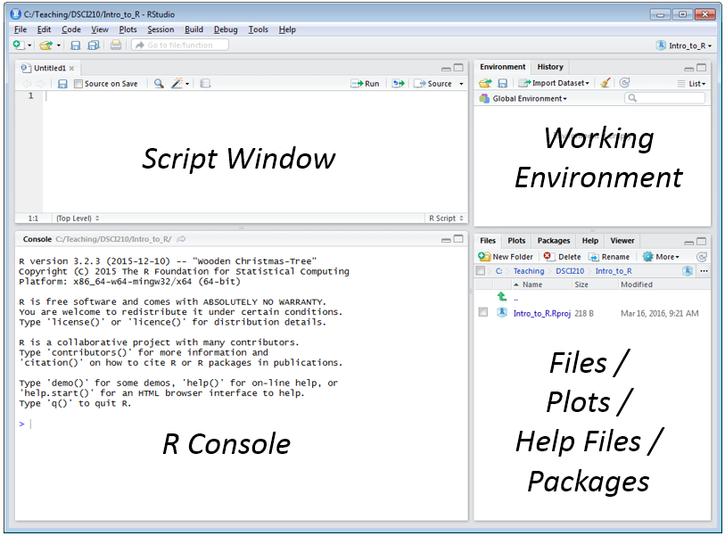
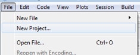
.. |image2| image:: img/h12/media/image3.png
   :width: 2.46269in
   :height: 1.57253in
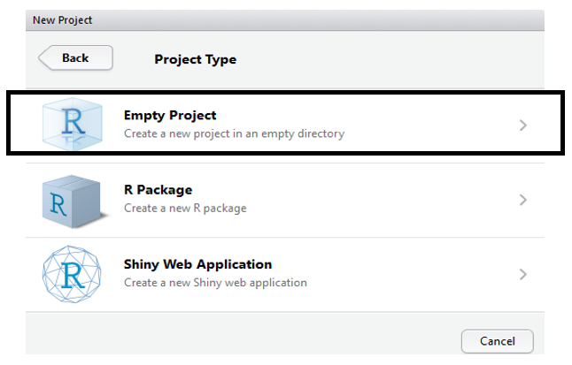
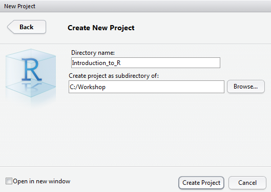
.. |image5| image:: img/h12/media/image6.png
   :width: 2.47015in
   :height: 0.73473in
.. |image6| image:: img/h12/media/image7.png
   :width: 3.86087in
   :height: 1.32874in
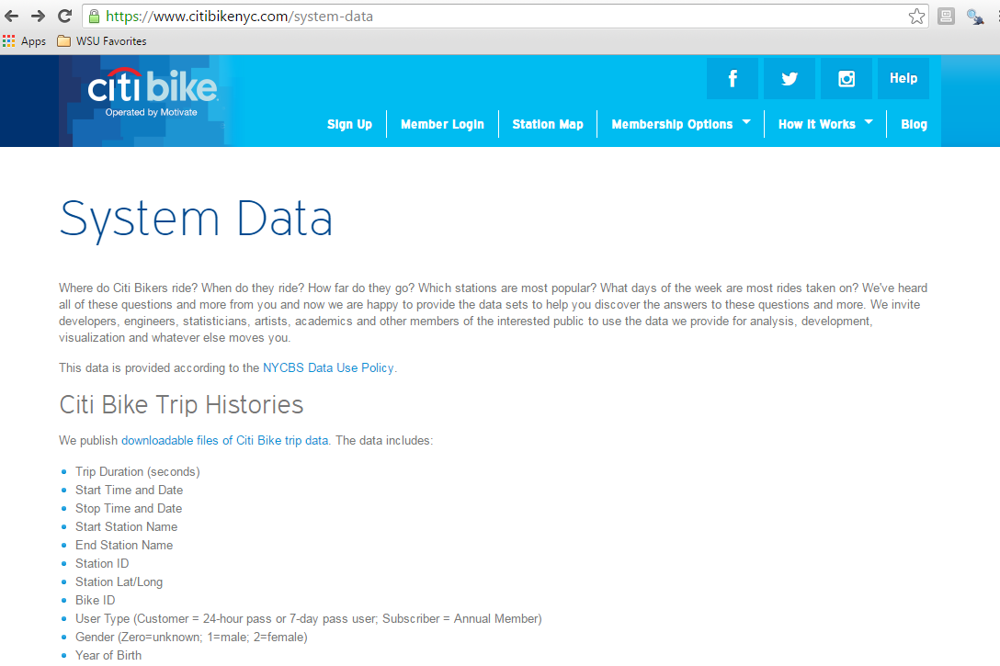
.. |http://inhabitat.com/wp-content/blogs.dir/2/files/2013/04/citi-bike-share-1-e1366036215458.jpg| image:: img/h12/media/image9.jpeg
   :width: 1.81273in
   :height: 1.20755in
.. |image9| image:: img/h12/media/image10.png
   :width: 3.62264in
   :height: 1.39684in
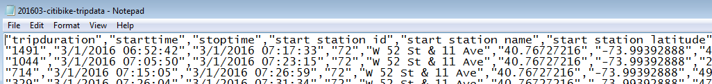
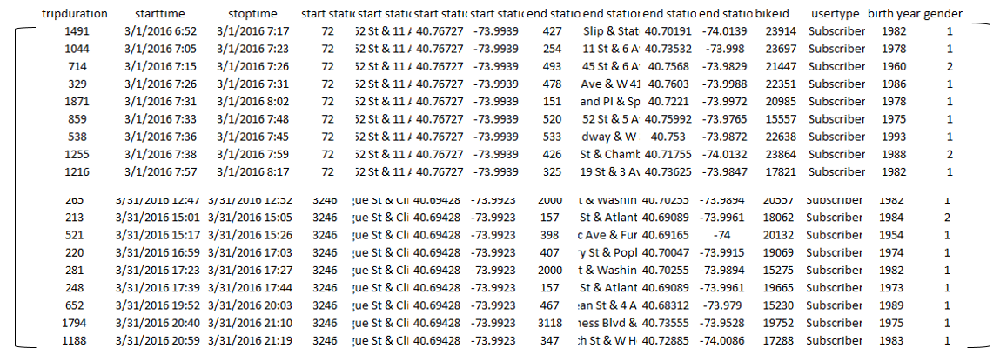
.. |image12| image:: img/h12/media/image13.png
   :width: 5.45283in
   :height: 0.84632in
.. |image13| image:: img/h12/media/image14.png
   :width: 5.19811in
   :height: 3.32583in
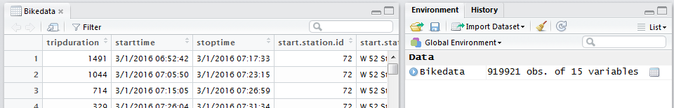
.. |image15| image:: img/h12/media/image16.png
   :width: 6.00000in
   :height: 1.50000in
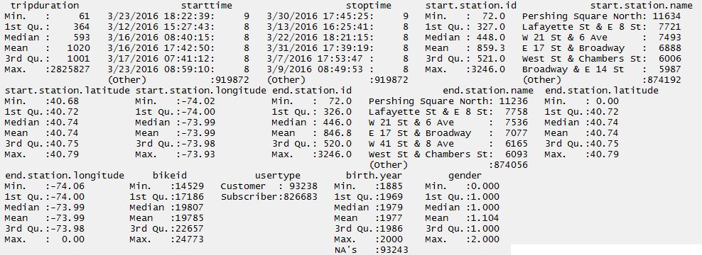
.. |image17| image:: img/h12/media/image18.png
   :width: 1.46875in
   :height: 1.10417in
.. |image18| image:: img/h12/media/image19.png
   :width: 1.58333in
   :height: 0.55208in
.. |image19| image:: img/h12/media/image20.png
   :width: 2.24528in
   :height: 0.56650in
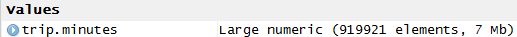
.. |image21| image:: img/h12/media/image22.png
   :width: 3.79245in
   :height: 0.35955in
.. |image22| image:: img/h12/media/image23.png
   :width: 3.84245in
   :height: 0.31806in
.. |image23| image:: img/h12/media/image24.png
   :width: 0.67708in
   :height: 1.82292in
.. |image24| image:: img/h12/media/image25.png
   :width: 0.94881in
   :height: 1.82292in
.. |image25| image:: img/h12/media/image26.png
   :width: 4.00000in
   :height: 0.43665in
.. |image26| image:: img/h12/media/image27.png
   :width: 6.00000in
   :height: 0.44900in
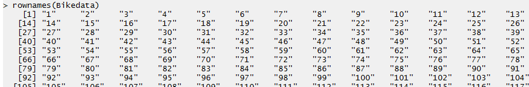
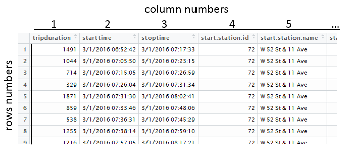
.. |image29| image:: img/h12/media/image30.png
   :width: 2.55660in
   :height: 0.65716in
.. |image30| image:: img/h12/media/image31.png
   :width: 6.48371in
   :height: 0.72642in
