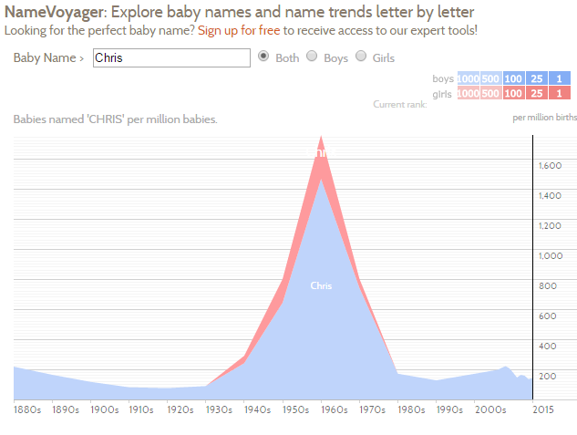
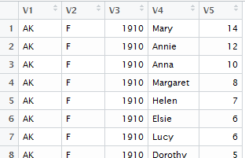
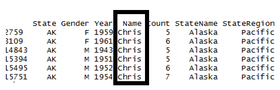
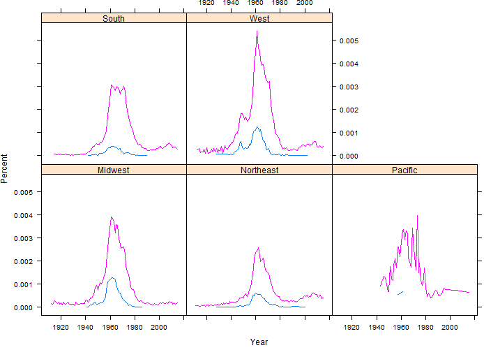
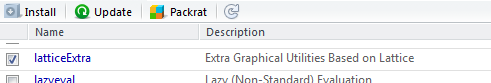

Data Management in R
====================

+--------------------------------------------------------------------------------------------------------------------------------------------------------------------------------------------------------------------------------------------------------+------------+
| For this handout, we will consider the Baby Name data this is provided by the Social Security administration. One goal of this handout is to consider regional differences in names. Thus, the State-specific data will be downloaded and used here.   | |image0|   |
|                                                                                                                                                                                                                                                        |            |
| Data: https://www.ssa.gov/oact/babynames/limits.html                                                                                                                                                                                                   |            |
+--------------------------------------------------------------------------------------------------------------------------------------------------------------------------------------------------------------------------------------------------------+------------+

American culture has several cases in which difference exist across
regions, e.g. language, food, etc. We will investigate potential
difference in baby names.

|image1|

Source: http://www.babynamewizard.com/blog

The Name Voyager link on this website allows one to investigate how
names change over time.

    http://www.babynamewizard.com/voyager#prefix=&sw=both&exact=false

+-------------------------------+-----------------------------+
| Trend for Francis over time   | Trend for Chris over time   |
|                               |                             |
| |image2|                      | |image3|                    |
+-------------------------------+-----------------------------+

The Social Security Administration provides two datasets on their
website. Regional differences are to be investigated here; thus, we will
use the State-specific data. This file is somewhat larger than the
National dataset.

Data: https://www.ssa.gov/oact/babynames/limits.html

After downloading this file, the file will need to be unzipped. Zipping
a file is common for larger datasets. Several files are unzipped as is
shown here.

|image4|

|image5|

Each data file is a text document. The contents of each line are
separated by a comma. Thus when reading this file into R, we will
specify comma delimited type.

|image6|

The following code will automatically download this file, unzip the
file, and combine all relevant datasets.

> #Reading in zip file that contains several files

>

> #Setup up directory and temporary file

> zipdir<-tempfile()

> temp<-tempfile()

>

> #Create directory

> dir.create(zipdir)

>

> #Downlaod the file, happens to be a zip file thus must be unpacked

>
download.file("https://www.ssa.gov/oact/babynames/state/namesbystate.zip",
temp, mode="wb")

>

> #Unzip the file

> unzip(temp, exdir=zipdir)

>

> #Get list of file contained in this directory, only bring in \*.TXT
files

> files <- list.files(zipdir, pattern="\\\\.TXT$")

>

> #Initialize a data.frame

> namedata<-data.frame()

> #Loop to read in files and concatenate them together via rbind

> for(i in 1:length(files)){

+ filepath <- file.path(zipdir,files[i])

+ temp <- read.csv(filepath,header=F)

+ namedata<-rbind(namedata, temp)

+ }

> #Unlink connection to directory

> unlink(zipdir)

The full dataset has over 5 million observations and 5 variables.

|image7|

A snipit of the full dataset.

|image8|

Notice that the names are generic. The names of a data.frame can be
reassigned using the code provided below.

> names(namedata)

[1] "V1" "V2" "V3" "V4" "V5"

> names(namedata)<-c("State","Gender","Year","Name","Count")

> names(namedata)

[1] "State" "Gender" "Year" "Name" "Count"

|image9|

To investigate potential differences across regions, we must identify
which states are contained with each region of the United States. The
Census Bureau has specifically defined regions and these will be used
here. These regions are contained in the StateRegions dataset. Load the
StateRegions dataset into R.

> StateRegions <- read.csv(file.choose(), header=T, stringsAsFactors =
TRUE)

This file has 51 observations (50 states + DC) and 3 columns.

|image10|

Snipit of StateRegions dataset.

|image11|

The next step is to merge the information from the StateRegions data
with the namedata. This type of merge is called a left join. There are a
variety of methods to join tables – details of these methods will not be
discussed here.

+-------------+-------------------------+---------------------+
| namesdata   | Merge Name and Region   | StateRegions data   |
|             |                         |                     |
| |image12|   |                         | |image13|           |
+-------------+-------------------------+---------------------+

The dplyr package in R is convenient for the management of data.
Download this package and load it into R.

|image14|

|image15|

The following single line of code is used to merge the two tables
together.

> #Load the dplyr package

> library(dplyr)

>

> #Join the tables

> namedata<-left\_join(namedata,StateRegions)

Joining by: "State"

A view of the namesdata table after the merge. The namedata data.frame
now contain the two additional columns.

|image16|

***Filtering Rows
***\ The filter() function in dplyr allow you to easily filter out
particular rows. Here, only rows that contain Chris are selected.

> #Obtain all rows that match Name == "Chris"

> Chris<-filter(namedata,Name == "Chris")

Certainly, a filter can be obtained without the dplyr package, but dplyr
does make common tasks easier.

> #Without dplyr

> Chris<-namedata[namedata$Name == "Chris",]

The Chris data.frame contains 4090 observations and 7 variables.

|image17|

The following code will create a picture similar to the one provided by
BabyVoyager when Chris is put into their search box. The display
provided here breaks the data out amongst the four regions of the United
States.

> #Obtain all rows that match Name == "Chris"

> Chris<-filter(namedata,Name == "Chris")

>

> #Summarize Chris by Gender, Year, Region

> by\_variable <- group\_by(Chris,Gender,Year,StateRegion)

>

> output<-summarize(by\_variable,Total=sum(Count))

The xyplot() in the lattice package allows the plotting to be done
easily.

> library(lattice)

> xyplot(Total~Year\|StateRegion, data=output,groups=Gender, type="l")

|image18|

*Questions*:

1. Based on these graphs, what is a type age for a person named Chris?

2. Does there appear to be regional difference in baby’s named Chris?
   Discuss.

One drawback of the summaries provided above is that there is \*not\*
and equal number of children born in the various regions in the United
States. This is especially true for earlier years as the west very few
people compared to the Northeast.

The following code will allow us to consider percent of baby names whose
name is Chris. These percentages are computed within Gender, Year, and
Region.

> #Summarize Gender, Year, Region

> by\_variable <- group\_by(namedata,Gender,Year,StateRegion)

>

> output2<-summarize(by\_variable,Total2=sum(Count))

>

> #Join Chris to output2

> output3<-left\_join(output,output2)

> #Get percent for Chris

> output3<-mutate(output3,Percent = Total/Total2)

>

> #Creating the plot

> xyplot(Percent~Year\|StateRegion, data=output3,groups=Gender,
type="l")

|image19|

*Questions*:

1. What information in conveyed in this plot that is not seen in the
   plot based on counts? Discuss.

The following example investigates the name Francis. This name is much
more common for males than females.

> #Obtain all rows that match Name == "Francis

> Francis<-filter(namedata,Name == "Francis")

>

> #Summarize Francis by Gender, Year, Region

> by\_variable <- group\_by(Francis,Gender,Year,StateRegion)

>

> output<-summarize(by\_variable,Total=sum(Count))

>

> #Joining Francis with output2, i.e. total counts

> output3<-left\_join(output,output2)

Joining by: c("Gender", "Year", "StateRegion")

> output3<-mutate(output3,Percent = Total/Total2)

>

> #Create plot

> xyplot(Percent~Year\|StateRegion, data=output3,groups=Gender,
type="l")

|image20|

*Questions*:

1. What regional difference in baby’s named Francis?

2. The Pacific plots appear to have a lot of variation compared to other
   regions. Why might this be the case?

The code has been rewritten so that any name can be easily investigated.
Here simply change the assignment of the LookupName to whatever name
you’d like.

> #Automating this process

> LookupName ="William"

> #Obtain all rows that match Name

> data<-filter(namedata,Name == LookupName)

>

> #Summarize Chris by Gender, Year, Region

> by\_variable <- group\_by(data,Gender,Year,StateRegion)

>

> output<-summarize(by\_variable,Total=sum(Count))

>

> output3<-left\_join(output,output2)

> output3<-mutate(output3,Percent = Total/Total2)

>

> xyplot(Percent~Year\|StateRegion, data=output3,groups=Gender,
type="l")

|image21|

*Questions*:

1. On the BabyName blog, the author suggested that William was more
   popular in the South than other regions. Does our investigation
   support this statement? Discuss.

2. Is William gaining or losing popularity? Is this true for all
   regions?

The following code will create a filled polygon similar to the one
provided by NameVoyager. This code uses the latticeExtra package.

|image22|

> #Obtain all rows that match Name == "William"

> William<-filter(namedata,Name == "William")

>

> #Summarize William by Year, Region

> by\_variable <- group\_by(William, Year,StateRegion)

>

> output<-summarize(by\_variable,Total=sum(Count))

>

>

> #Summarize Gender, Year, Region

> by\_variable <- group\_by(namedata,Year,StateRegion)

>

> output2<-summarize(by\_variable,Total2=sum(Count))

>

> #Join Chris to output2

> output3<-left\_join(output,output2)

> #Get percent for William

> output3<-mutate(output3,Percent = Total/Total2)

>

>

> library(latticeExtra)

> mypanel = function(x, y){

+ panel.xyarea(x,y, fill=TRUE)

+ }

>

> #Creating the plot

> xyplot(Percent~Year\|StateRegion, data=output3, panel=mypanel)

The resulting plot.

|image23|

***Task***

Complete the following task using the baby names dataset.

1. How much regional differences exist in your name? Create an xyplot to
   investigate any differences.

2. Consider the following graphic which shows the most common unisex
   names in American. The names Casey, Riley, and Jessie top this list.
   Investigate the similarities in these names over time and across the
   four regions of the United States.

|image24|

    Source:
    http://fivethirtyeight.com/features/there-are-922-unisex-names-in-america-is-yours-one-of-them/

.. |image0| image:: img/h16/media/image1.png
   :width: 2.25000in
   :height: 1.47059in

.. |image4| image:: img/h16/media/image5.png
   :width: 6.50000in
   :height: 1.43472in
.. |image5| image:: img/h16/media/image6.png
   :width: 6.50000in
   :height: 0.86181in
.. |image6| image:: img/h16/media/image7.png
   :width: 2.52083in
   :height: 2.11458in

.. |image9| image:: img/h16/media/image10.png
   :width: 3.39583in
   :height: 1.59375in
.. |image10| image:: img/h16/media/image11.png
   :width: 4.20833in
   :height: 0.52083in
.. |image11| image:: img/h16/media/image12.png
   :width: 2.35918in
   :height: 2.11458in
.. |image12| image:: img/h16/media/image10.png
   :width: 2.83333in
   :height: 1.32976in
.. |image13| image:: img/h16/media/image12.png
   :width: 2.35918in
   :height: 2.11458in

.. |image15| image:: img/h16/media/image14.png
   :width: 5.50000in
   :height: 0.80392in

.. |image18| image:: img/h16/media/image17.png
   :width: 6.12500in
   :height: 4.20701in

.. |image21| image:: img/h16/media/image20.png
   :width: 4.79167in
   :height: 3.41867in

.. |image23| image:: img/h16/media/image22.png
   :width: 6.50000in
   :height: 4.79097in
.. |image24| image:: img/h16/media/image23.png
   :width: 4.01721in
   :height: 3.95982in
