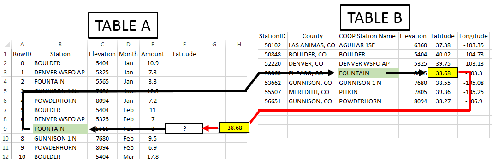
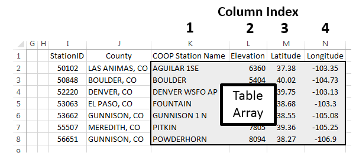
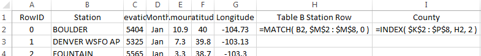
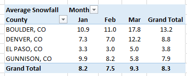

Excel: Merge Tables, i.e. MATCH() / INDEX() Functions
=====================================================

Merging Content from Tables
---------------------------

A data scientist must often merge data from one table into another
table. The discussion here will again use the subset of the CO snowfall
data from above. Table A consists of the stacked data from the example
discussed above. Table B contains information auxiliary information for
various stations in CO.

+-----------------------------------+----------------------------------------------------+
| Stacked data from above example   | Auxiliary information for weather stations in CO   |
|                                   |                                                    |
| |image0|                          | |image1|                                           |
+-----------------------------------+----------------------------------------------------+

The ``=VLOOKUP()`` function in Excel can be used to merge the content from
one table into another.

|image2|

-  First argument: specifies the value to be looked up

-  Second argument: specifies the cell range of Table B or a subset of
   Table B

-  Third arugment: an index that specifies which column is used to
   retrieve content from Table B

-  Fourth argument: This should be set to ``FALSE``. ``FALSE`` forces ``=VLOOKUP()``
   to find an exact match

The following provides a visualization of the ``=VLOOKUP()`` function for
cell F9.

|image3|

.. admonition:: Note: 

    Table B may or may not be contained in the same worksheet as
    Table A.

In this example, the second argument (i.e. the table array) is specified
as K2:N8. If the Latitude value is to be returned, then the column index
should be set to 3.

|image4|

Type the following formula into cell F2.

Cell F2: ``=VLOOKUP( B2 , $K$2:$N$8 , 3 , FALSE )``

|image5|

Copy this formula down for the remaining cells.

|image6|

Repeat this process for Longitude by typing the following into cell G2
and copying down for all cells.

Cell G2: ``=VLOOKUP( B2 , $K$2:$N$8 , 4 , FALSE )``

|image7|

Next, suppose County is to be merged into Table A. The =VLOOKUP()
function will not work for County as this function always uses the
left-most column of the table array to search for a match. The
``=VLOOKUP()`` function fails here because Station is not the left-most
column of the table array.

+------------------------------------------------------+------------+
| The following will not work.                         | |image8|   |
|                                                      |            |
| Cell H2: ``=VLOOKUP(B2 , $J$2:$N$8 , 1 , FALSE )``   |            |
+------------------------------------------------------+------------+

The column containing the lookup value must be the left-most column of
the table array.

|image9|

Using =MATCH() and =INDEX() to Merge Tables
-------------------------------------------

The ``=MATCH()`` / ``=INDEX()`` approach to merging tables in Excel is
considered to be better than ``=VLOOKUP()``. This method requires two steps.

Suppose the County for RowID 7 is to be obtained. The ``=MATCH()`` function
does not return the requested content from Table B, but instead returns
the row number of Table B that matches the lookup value.

|image10|

The second step of this process is to retrieve the actual contents from
Table B. This is done using the ``=INDEX()`` function. The ``=INDEX()`` function
is similar to the ``=OFFSET()`` function used earlier. ``=OFFSET()`` required
the specification of a single cell to be used as a reference. ``INDEX()``
requires specification of the entire range of cells along with
information regarding which row and column to return.

+-------------------------------------------------------------+------------------------------------------------+
| Specify $K$2:$P$8 as the cell range for =INDEX() function   | =INDEX() will return EL PASO, CO for RowID 7   |
|                                                             |                                                |
| |image11|                                                   | |image12|                                      |
+-------------------------------------------------------------+------------------------------------------------+

Type the following formulas into Excel and copy these formulas down for
all remaining cells.

Cell H2: ``=MATCH( B2 , $M$2,$M$8 , 0 )``

Cell I2: ``=INDEX( $K$2:$P$8,H2 , 2 )``

|image13|

.. admonition:: Questions

    1. What is the purpose of the third argument in the ``=MATCH()`` function?

    2. Why is 2 specified as the last argument in the ``=INDEX()`` function?

The following table is a successful merge of County from Table B into
Table A.

|image14|

After the successful merging these two tables, averages can now be
computed over county as is shown here. The latitude and longitude values
are necessary for mapping snowfall.

|image15|

Working with Complete Dataset
-----------------------------

Import the station data into Excel. Select Data > From Text, specify
Fixed width in Step 1 of the import wizard. The following snippet shows
the first few rows of the station dataset.

|image16|

In Excel, name this worksheet StationInfo on the tab near the lower-left
corner.

|image17|

The station dataset contains information on many stations that are not
present in our dataset. Also, several stations are replicated because
new weather stations are added and others are removed from time to time.
The ``=MATCH()`` and ``=VLOOKUP()`` functions use the first instance of a match.
These functions ignore rows after an exact match is found.

Assuming you have named the worksheet containing the station data
StationInfo, type the following into cell E2 in the stacked version of
the snowfall dataset. Column E is being used in this formula as this
column contains the Station IDs in Table B.

Cell E2: ``=MATCH(B2, StationInfo!$E$2:$E$3091, 0 )``

|image18|

Copy this formula down for all cells. Some Station IDs from Table A
cannot be found in Table B. In this case, a #N/A values is appropriately
retuned by the ``=MATCH()`` function. This formula will not provide a County
name when an #N/A is returned by the ``=MATCH()`` function. Next, the
``=INDEX()`` function can be used to retrieve County from Table B.

Cell F2: ``=IF( ISERROR(E2) , ”” , INDEX( StationInfo!$A$2:$N$3091 , E2 ,
4 ))``

|image19|

The following shows a successful merge of the County information from
the StationInfo worksheet into the Snowfall dataset.

|image20|

Next, in column G, the following formula can be used to merge Elevation
from the StationInfo worksheet into the dataset.

``=IF( ISERROR(E2), "", INDEX(StationInfo!$A$2:$N$3091, E2, 14 ) )``

.. admonition:: Questions

    1. What is the purpose of the empty string, i.e. “”, in the formula
       above?

    2. What happens if the following is used in cell F2 instead of the
       formula provided above for merging County?

       Cell F2: ``=INDEX(StationInfo!$A$2:$N$3091,E2,4)``

    3. Some software packages will create maps based on county names.
       However, abbreviations for state must be included with the county
       name. Use the following formula to concatenate County with the state
       abbreviation for CO.

       Cell G2: ``=IF(ISERROR(E2), “”, CONCATENATE(F2,”, CO“) )``

Summaries using Merged Content
------------------------------

A summary of total snowfall by county is being requested by your boss.
You have successfully merged these dataset and create the following
PivotTable.

+----------------------+-----------------------------------+
| Snowfall by County   | | The PivotTable structure used   |
|                      | | to create this table            |
| |image21|            |                                   |
|                      | |image22|                         |
+----------------------+-----------------------------------+

A map of the counties in Colorado is given here for reference.

|image23|

.. admonition:: Questions

    1. Your boss makes the following comment, “There is no way El Paso
       County has 120 weather stations.” Your boss is correct. How many
       weather stations does El Paso County have in this dataset?

    2. The SUM is being used here as the total snowfall over the entire year
       is of interest. I’d argue that a SUM should not be used as the number
       of stations per county is not the same. Do you agree or disagree?
       Explain.

A PivotTable based on averages, instead of totals, is shown below.

+------------------------------+-------------------------------------------------+
| Average Snowfall by County   | Pareto-type chart of average snowfall amounts   |
|                              |                                                 |
| |image24|                    | |image25|                                       |
+------------------------------+-------------------------------------------------+

.. admonition:: Questions

    1. The average snowfall for Mineral County is 15.8 inches. Provide an
       interpretation for this value.

    2. I’d argue that the averages provided here collapse the data too much.
       For example, do you believe the average for Mineral County provided
       above is a good estimate for snowfall in July? How about January?
       Discuss.

    3. The following table shows the snowfall by month across counties in
       CO. Recreate this table in Excel.

    |image26|

    4. The following visualization is from the PivotTable provided above. Is
       it true that for most of these counties the snowfall amount increase
       from Oct through Dec? Is it true that snowfall tends to steadily
       decrease from Jan through Apr?

    |image27|

    5. Consider the following graphs that show the relationship between
       elevation and snowfall. For January, does elevation have much impact
       below 6,000 feet? What can be said about Point A in this plot?
       Consider the plot that includes data from March? Is there much of a
       difference in the relationship between elevation and snowfall amounts
       between January and March? Discuss.

    +-------------+-------------+
    | |image28|   | |image29|   |
    +-------------+-------------+

.. |image1| image:: img/h6/media/image2.png
   :width: 2.90987in
   :height: 1.49254in
.. |image2| image:: img/h6/media/image3.png
   :width: 4.30208in
   :height: 0.58333in

.. |image5| image:: img/h6/media/image6.png
   :width: 4.50731in
   :height: 0.75373in
.. |image6| image:: img/h6/media/image7.png
   :width: 4.99254in
   :height: 0.85823in
.. |image7| image:: img/h6/media/image8.png
   :width: 3.88003in
   :height: 2.52239in
.. |image8| image:: img/h6/media/image9.png
   :width: 1.03200in
   :height: 0.36511in
.. |image9| image:: img/h6/media/image10.png
   :width: 4.44800in
   :height: 1.56868in
.. |image10| image:: img/h6/media/image11.png
   :width: 5.25373in
   :height: 1.66761in

.. |image18| image:: img/h6/media/image19.png
   :width: 6.50000in
   :height: 0.87778in

.. |image20| image:: img/h6/media/image21.png
   :width: 4.50746in
   :height: 1.22029in
.. |image21| image:: img/h6/media/image22.png
   :width: 2.15972in
   :height: 2.31792in

.. |image23| image:: img/h6/media/image24.png
   :width: 3.56125in
   :height: 2.56250in

.. |image27| image:: img/h6/media/image28.png
   :width: 4.02778in
   :height: 2.84268in
.. |image28| image:: img/h6/media/image29.png
   :width: 2.91667in
   :height: 2.04025in

