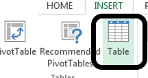
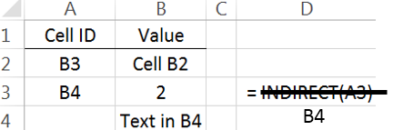

Excel: Association Rules, i.e. Market Basket Analysis
=====================================================

Market Basket Analyses are a common application of association rules.
One goal of a market basket analysis is to understand the association
between items purchases. The relationship between items purchased at a
grocery store will be considered in this handout.

|image1|

An association rule highlights the fact that some items are more (or
less) indicative of the purchase of others. For example, purchasing
cereal increases the likelihood of purchasing milk. These types of
analyses may also reveals that liquor and milk are rarely purchased
together.

|image3|

**Association Rules** are used to uncover associations or relationships
that exist between items. Often these rules are constructed to identify
relationships between items purchased, i.e. Market Basket Analysis.

Procedural Steps

1. Determine how often items are purchased

2. Determine how often items are purchased in conjunction with other
   items

3. Identify which purchased items are indicative of others being
   purchased

Data Technologies

1. Filtering/Subsets

2. Creating Tables

3. Applications of Summaries

Consider the following subset of data from a collection of transactions
from a grocery store.

+------------------+--------------------------------------+
| Transaction ID   | Items Purchased                      |
+==================+======================================+
| 1                | {Bread, Milk}                        |
+------------------+--------------------------------------+
| 2                | {Eggs, Ham}                          |
+------------------+--------------------------------------+
| 3                | {Bread, Fruit, Milk}                 |
+------------------+--------------------------------------+
| 4                | {Beer, Bread, Butter, Fruit, Soda}   |
+------------------+--------------------------------------+
| 5                | {Bread, Fruit, Milk, Soda}           |
+------------------+--------------------------------------+

Association rules are developed under the following guiding principles.

.. admonition:: Association Rule Principles

    1. Items should be purchased somewhat (**Support**)

    2. Reliability, i.e. the degree to which one set of items predicts the purchase
       of another set of items (**Confidence**)

Consider the following association rule – the purchase of Bread
indicates the purchase of Milk.

.. admonition:: Rule 1   

    .. math:: \left\{ \text{Bread} \right\}\  \rightarrow \left\{ \text{Milk} \right\}

Compute the support and confidence for this rule.

.. math:: Support(Bread\ AND\ Milk) = \ \frac{\#\ Bread\ AND\ Milk}{\#\ Transactions} =  

.. math:: Confidence\ of\ Rule\ \# 1 = \ \frac{Support(Bread\ AND\ Milk)}{Support(Bread)} =

.. admontion:: Questions

    1. What is the interpretation of the Support(Bread AND Milk)?

    2. What is the interpretation of Confidence of this rule? Discuss.
       Note: Confidence is simply a conditional probability, i.e P(Milk \|
       Bread).

Consider a second association rule for the purchase of Milk.

.. admonition:: Rule 2   

    .. math:: \left\{ \text{Fruit} \right\}\  \rightarrow \left\{ \text{Milk} \right\}

Compute the support and confidence for this rule.

.. math:: Support(Fruit\ AND\ Milk) =

.. math:: Confidence\ of\ Rule =  

.. admonition:: Question

    1. Why might Rule #1 be considered “better” than Rule #2 when interest
       lies in the purchase of Milk?

Consider a third association rule for the purchase of Milk.

.. admonition:: Rule 3

    .. math:: \left\{ Bread,\ Fruit \right\}\  \rightarrow \left\{ \text{Milk} \right\}

Compute the support and confidence for this rule.

.. math:: Support(Bread,\ Fruit,\ AND\ Milk) = 

.. math:: Confidence\ of\ Rule = 

**Lift** is another measure often considered when evaluating rules of
association.

.. math:: Lift(\ \left\{ \text{Bread} \right\} \rightarrow \left\{ \text{Milk} \right\}\ ) = \ \frac{Confidence(Bread\ AND\ Milk)}{Support(Milk)} = \frac{P(Milk|Bread)}{P(Milk)} 

For our example, realize that the support for Milk is fairly large. i.e,
Milk was purchased in 60% of the transactions. This provides a baseline
value for confidence. That is, rules that exceed this value indicate
gains when considering the association provided by the rule. When the
lift of a rule is near 1, then the rule provides little information to
understanding the purchase of the item.

-  :math:`Lift > 1` implies positive association between items

-  :math:`Lift \approx 1` implies no association between items

-  :math:`Lift < 1` implies negative association between items

+---------------------------------------------------------------------------------------+-------------------------+-----------------------------------------------------------+----------------------------------------------------+
| **Rule**                                                                              | **Support**             | **Confidence**                                            | **Lift**                                           |
+=======================================================================================+=========================+===========================================================+====================================================+
| .. math:: \left\{ \text{Bread} \right\}\  \rightarrow \left\{ \text{Milk} \right\}    | .. math:: \frac{3}{5}   | .. math:: \frac{\frac{3}{5}}{\frac{4}{5}} = \frac{3}{4}   | .. math:: \frac{\frac{3}{4}}{\frac{3}{5}} = 1.25   |
+---------------------------------------------------------------------------------------+-------------------------+-----------------------------------------------------------+----------------------------------------------------+
| .. math:: \left\{ \text{Fruit} \right\}\  \rightarrow \left\{ \text{Milk} \right\}    | .. math:: \frac{2}{5}   | .. math:: \frac{\frac{2}{5}}{\frac{3}{5}} = \frac{2}{3}   | .. math:: \frac{\frac{2}{3}}{\frac{3}{5}} = 1.11   |
+---------------------------------------------------------------------------------------+-------------------------+-----------------------------------------------------------+----------------------------------------------------+
| .. math:: \left\{ Bread,\ Fruit \right\}\  \rightarrow \left\{ \text{Milk} \right\}   | .. math:: \frac{2}{5}   | .. math:: \frac{\frac{2}{5}}{\frac{3}{5}} = \frac{2}{3}   | .. math:: \frac{\frac{2}{3}}{\frac{3}{5}} = 1.11   |
+---------------------------------------------------------------------------------------+-------------------------+-----------------------------------------------------------+----------------------------------------------------+

.. admonition:: Some Comments

    -  Association rules with no support have zero confidence. E.g. Beer is
       never purchased with Milk, so the rule
       :math:`\left\{ \text{Beer} \right\}\  \rightarrow \left\{ \text{Milk} \right\}`
       should not be considered.

    -  The confidence of a rule should not be considered independent of it’s
       support. For example, the rule
       :math:`\left\{ \text{Eggs} \right\}\  \rightarrow \left\{ \text{Ham} \right\}`
       has Confidence = 1. That is, 100% of the time eggs were purchased, so
       was Ham. However, this rule has very low support as Eggs and Ham were
       only purchased once.

    -  Association rules are not invariant. For example, the confidence for
       the rule
       :math:`\left\{ \text{Bread} \right\}\  \rightarrow \left\{ \text{Milk} \right\}`
       is different than the confidence of the rule
       :math:`\left\{ \text{Milk} \right\}\  \rightarrow \left\{ \text{Bread} \right\}`.

Common Data Structure
---------------------

|image4|

Next, consider the complete grocery dataset. This dataset contains 9835
transactions and 169 unique items. This dataset can be downloaded from
the Workshop website.

|image5|

Open the Groceries dataset in Excel. The binary representation of this
market basket dataset is provided in this Excel file. A snippet is shown
here.

|image7|

Spreadsheets consist of rows and columns. Datasets also consist of rows
and columns as well, but also contain information that is not data, e.g.
variable names. Excel does not differentiate the header row from actual
data unless you convert the collection of rows and columns into a
**Table**.

+--------------------------------------------------+-------------------------+
| Putting Data into the Table structure in Excel   | Short-cuts for cursor   |
|                                                  |                         |
| |image8|                                         | movement in Excel       |
|                                                  |                         |
| Give your table a name for easy referencing      | |image10|               |
|                                                  |                         |
| |image9|                                         |                         |
+--------------------------------------------------+-------------------------+

The following snippet shows the Groceries dataset specified as a table.

|image11|

The drop-down arrows provided for each variable (or field) are called
Filters. Filters in Excel allow you to subset rows.

+------------------------+----------------------------------------------------------------------------+
| Filter on Whole Milk   | Select Whole Milk = 1 to identify transactions that purchased whole milk   |
|                        |                                                                            |
| |image12|              | |image13|                                                                  |
+------------------------+----------------------------------------------------------------------------+

After a Filter is applied, certain rows are hidden from view. Excel
indicates this fact with changing the row label color to blue.

|image14|

The status bar in Excel, the bar across the bottom of the Excel file,
provides simple summaries for columns of the table. For example, if the
Whole Milk column (column Y) is highlighted, the following summaries are
shown.

|image15|

Applying filters to columns Whole Milk and Butter allows one to easy
compute the support and confidence for the rule
:math:`\left\{ \text{Butter} \right\}\  \rightarrow \left\{ \text{Milk} \right\}`.

+------------------------------------------------------------------------------------------------------------------------------------------------------+-------------+
| +--------+---------------------------------------------------------------------------------------+                                                   |
| | Rule   | .. math:: \left\{ \text{Butter} \right\}\  \rightarrow \left\{ \text{Milk} \right\}   |                                                   |
| +--------+---------------------------------------------------------------------------------------+                                                   |
+======================================================================================================================================================+=============+
| |image16|                                                                                                                                            | |image17|   |
+------------------------------------------------------------------------------------------------------------------------------------------------------+-------------+
| -  :math:`Support(Butter\ AND\ Milk) = \ \frac{\#\ Butter\ AND\ Milk}{\#\ Transactions} = \frac{271}{9835} = 0.028`                                  |
|                                                                                                                                                      |
| -  :math:`Confidence = \ \frac{Support(Butter\ AND\ Milk)}{Support(Butter)} = \frac{\frac{271}{9835}}{\frac{545}{9835}} = \frac{271}{545} = 0.497`   |
|                                                                                                                                                      |
| -  :math:`Lift = \ \frac{\text{Confidence}}{Support(Milk)} = \frac{0.497}{\frac{2513}{9835}} = \frac{0.497}{0.256} = 1.946`                          |
+------------------------------------------------------------------------------------------------------------------------------------------------------+-------------+

The =COUNT() function in Excel can used to count the number of nonblank
rows in a column. Excel functions also work with tables and variable
names. The following will provide a count of the number of transactions
in the Groceries dataset, i.e. 9835. The use of the table and variable
names is preferred as this avoids the need to highlight an exact range
of cells in Excel.

|image18|

The =COUNTIF() function in Excel provides a count of only the cells that
satisfy some condition. The following can be used to compute the support
for butter.

=COUNTIF( Groceries[butter] , 1 )

If more than one condition is needed, the =COUNTIFS() function can be
used. COUNTIFS is necessary to compute Support(Butter AND Whole Milk).

=COUNTIFS( Groceries[butter] , 1 , Groceries[whole milk] , 1 )

A brief description of the COUNTIFS function in Excel is provide here.

|image19|

Move to far right of the Groceries table in Excel. You can use Ctrl → to
move quickly to the far right edge. Enter the following function in
Excel to compute the counts necessary for measuring support for the rule
:math:`\left\{ \text{Butter} \right\}\  \rightarrow \left\{ \text{Milk} \right\}`.

|image20|

Use the value computed above to compute the Confidence and Lift for this
rule.

|image21|

Verify that these formulas are correct by comparing them to the output
provided below.

|image22|

*Evaluating Several Rules*

The procedure provided above lack efficiencies and does not scale well
when several rules need to be evaluated. For example, to evaluate the
rule
:math:`\left\{ \text{Yogurt} \right\}\  \rightarrow \left\{ \text{Milk} \right\}`,
the formulas for support will need to be changed. The =INDIRCT()
function in Excel will help increase the efficiency in computing the
support, confidence, and lift for several rules.

+------------------------------------------------------------------------------------------+
| INDIRECT() Function                                                                      |
+==========================================================================================+
| +---------------------------------+--------------------------------------------------+   |
| | | Consider the following data   | Step 1: Obtain value from another cell           |   |
| | | in Excel.                     |                                                  |   |
| |                                 | |image24|                                        |   |
| | |image23|                       |                                                  |   |
| +=================================+==================================================+   |
| |                                 | Step 2: Use value in specified cell in formula   |   |
| |                                 |                                                  |   |
| |                                 | |image25|                                        |   |
| +---------------------------------+--------------------------------------------------+   |
+------------------------------------------------------------------------------------------+

The =INDIRECT() function can be used in the following manner to
automatically update the variable names when computing the support for
several rules.

=COUNTIF( INDIRECT ( “ Groceries[ “ & B2 & “ ] “ ), 1)

The following setup is used to evaluate six different association rules
for Milk.

|image26|

This formula can be copied down in Excel to evaluate the support for the
remaining rules. The confidence and lift are computed for these rules as
well.

|image27|

*Questions*

1. The Lift for
   :math:`\left\{ \text{Cereal} \right\}\  \rightarrow \left\{ \text{Milk} \right\}`
   is about 2.5 which is fairly high. Thus, given that the transaction
   includes cereal, there is 2.5 fold increase in the likelihood of milk
   being purchased.

   a. Compute Support(Cereal AND Milk).

   b. This value is fairly low. Why does a low support value negate the
      usefulness of a rule?

2. The Lift value for the rule
   :math:`\left\{ \text{Canned\ Beer} \right\}\  \rightarrow \left\{ \text{Milk} \right\}`
   is lowest on this list. What can be said about the purchase of Canned
   Beer AND Milk?

3. Which of these rules is least useful in the prediction of Milk?
   Explain how you made this determination.

*Task*

Use Excel to obtain the Confidence and Lift for all association rules
for Whole Milk where only single items are considered on the left.

-  Copy all variable names and paste them into a single column. This can
   be done using Paste Special – specify Values and Transpose when
   pasting.

-  The =CONCATENATE() function can be used to create the Rule column,
   i.e. =CONCATENATE(“{“,B2,”} -> {Milk}”).

+----------------------------------------------------+--------------------+
| Specify Values and Transpose under Paste Special   | Output for Rules   |
|                                                    |                    |
| |image28|                                          | |image29|          |
+----------------------------------------------------+--------------------+

.. |image1| image:: img/h7/media/image2.png
   :width: 4.50in
   :height: 1.86in

.. |image3| image:: img/h7/media/image4.png
   :width: 4.77567in
   :height: 3.50420in

.. |image7| image:: img/h7/media/image8.png
   :width: 5.65924in
   :height: 1.54783in

.. |image9| image:: img/h7/media/image10.png
   :width: 2.47015in
   :height: 0.75512in
.. |image10| image:: img/h7/media/image11.png
   :width: 1.53748in
   :height: 2.08209in
.. |image11| image:: img/h7/media/image12.png
   :width: 4.78151in
   :height: 1.80379in

.. |image13| image:: img/h7/media/image14.png
   :width: 2.68750in
   :height: 1.06250in

.. |image15| image:: img/h7/media/image16.png
   :width: 5.80501in
   :height: 0.41739in

.. |image19| image:: img/h7/media/image20.png
   :width: 3.60870in
   :height: 0.98419in

.. |image21| image:: img/h7/media/image22.png
   :width: 5.76119in
   :height: 2.02442in

.. |image27| image:: img/h7/media/image28.png
   :width: 6.50000in
   :height: 1.43056in

.. |image29| image:: img/h7/media/image4.png
   :width: 3.80411in
   :height: 2.79130in
