Text Editor/ Excel: Text Mining
===============================

Data is an ambiguous word. A computer scientist may consider data to be
anything that can be stored in a byte of memory. A statistician may
consider data to be information that can easily be stored in a
spreadsheet with clearly defined rows and columns. A data scientist must
be able to work with data in a variety of formats.

|image0|

A simple text mining task may be to create a word cloud from a passage
of text. If a word occurs frequently in a passage, this word is printed
in larger font than other words. Word clouds allows one to easily
compare common words in two different passages.

+-------------------------------------------------------+-----------------------------------+
| Trump’s (2017) Inagural Address                       | Lincoln (1861) Inagural Address   |
+=======================================================+===================================+
| |image1|                                              | |image2|                          |
+-------------------------------------------------------+-----------------------------------+
| Word cloud created from: http://www.wordclouds.com/   |
+-------------------------------------------------------+-----------------------------------+

*Questions*:

1. Discuss the similarities / differences between the inaugural
   addresses of Trump (2017) and Lincoln (1861).

2. Are there any words that surprised you in these speeches?

3. Commonly used words such as ‘the’, ‘and’, ‘this’, etc. should be
   removed from the passage before making a word cloud. Why?

Example 1: For this example, we will consider the inaugural addresses of
Trump (2017) and Obama (2009). Source:
https://sites.google.com/a/brown.edu/partisan-bias/

*Snip-it of Trump’s (2017) Inaugural Address*

|image3|

*Snip-it of Obama’s (2009) Inaugural Address*

|image4|

*Goal*: Evaluate the degree to which these presidents used concept/idea
type words versus emotional words to carry their inaugural message.

+------------+------------+-------------------------+------------+------------+
| Passages   |            | Comparison Word Lists   |
+============+============+=========================+============+============+
| |image5|   | |image6|   |                         | |image7|   | |image8|   |
+------------+------------+-------------------------+------------+------------+

To accomplish the desired text mining task in Excel, we must first get
the word lists into Excel. Once this is accomplished the =MATCH()
function can be used to check whether or not each word in the passages
exists in either or the word lists. The website from which this work is
based off of provided a concept word list and an emotion words list.

+---------------------------------------------------------------+--------------------------------------------------------------------------------------------+
| Source: https://sites.google.com/a/brown.edu/partisan-bias/   |
+===============================================================+============================================================================================+
| Concept words                                                 | Emotion words                                                                              |
|                                                               |                                                                                            |
| |image9|                                                      | |image10|                                                                                  |
|                                                               |                                                                                            |
|                                                               | *Note*: More comprehensive emotional word lists do exist, e.g. NRC Word-Emotion Lexicon.   |
+---------------------------------------------------------------+--------------------------------------------------------------------------------------------+

The concept word list is provided in the commonly used \*.csv format.

|image11|

This concept words can be easily read into Excel. The Text Import Wizard
can be used to accomplish this task. When reading in this file, make
sure to specify that commas as being used to delineate the various
words.

|image12|

The text from this file was read into a single row. This occurred
because the original version of this file did not contain any newline
breaks.

|image13|

This data can be transposed into the more typical column format by
highlighting all words, selecting Paste > Paste Special. Select
Transpose in the Paste Special box.

+-------------------------+-------------------------+
| Paste > Paste Special   | Then select Transpose   |
|                         |                         |
| |image14|               | |image15|               |
+-------------------------+-------------------------+

After list is pasted as a column, insert an appropriate column header to
identify that these words are Concept Words. This process can be
repeated for the Emotion Words list.

+------------------------------+------------------------------+
| Concept Word list in Excel   | Concept Word list in Excel   |
|                              |                              |
| |image16|                    | |image17|                    |
+------------------------------+------------------------------+

Text Management via a Text Editor

As a data scientist it is important to become efficient in your work.
For example, you could manually verify whether or not words are concept
or emotion words; however, it makes much more sense to automate this
process somehow. Likewise, the management of text may be better done
using a text editor.

To begin, open the word list in a text editor. In this course, we will
be using Sublime as our text editor. Your text editor of choice should
be able to manipulate text using regular expressions, i.e. regex.
Regular expressions is a universal language that allows us to manage
text strings.

Sources:

-  Sublime: https://www.sublimetext.com/

-  Wiki Regular Expressions:
   https://en.wikipedia.org/wiki/Regular_expression

The emotion word list as shown in Sublime.

|image18|

The contents of this file (the individual words) are separated by
commas, i.e. comma delimited. All content is contained on a single line
– this can easily be seen when reading this file into Excel or by
noticing that only a single line number is shown in Sublime.

The first text management task will be to replace each “,” with a
“newline” hidden character, i.e. \\n. This can be done easily in
Sublime, by selecting Find > Replace.

|image19|

-  In the Find What box type ,

-  | In the Replace with box, specify \\n or press Ctrl Enter. The
     standard approach here would be to specify the \\n character as
     this is the character used to specify a newline break.
   | ***Comment:*** The regular expression box, far-left box, must be
     selected when using the newline character. This informs Sublime
     that you want to place the , with a newline versus replacing the ,
     with the literal characters \\n.

|image20|

The text should have the following structure upon success completion of
the steps above. Once this file has been modify into the appropriate
column format, it can be read directly into Excel.

|image21|

Text Management of a Passage of Text

A passage of written text often requires considerable management before
text mining can be done. The task here is to compare each word in
Trump’s Inaugural address to existing word lists. Thus, each word needs
to be separated into individual cells (in Excel) or individual items in
a list (in R or Python).

*Snip-it of Trump’s (2017) Inaugural Address*

|image22|

|image23|

The text management tasks that need to be done include removal of
punctuation, the removal of ‘, consideration of lowercase vs uppercase
letters, etc.

+----------------+----+-----------------+-----------------+
| Trump          |    | Concept Words   | Emotion Words   |
+================+====+=================+=================+
| Chief          |    | work            | amusement       |
+----------------+----+-----------------+-----------------+
| Justice        |    | help            | celebrate       |
+----------------+----+-----------------+-----------------+
| :              |    | :               | cheer           |
+----------------+----+-----------------+-----------------+
| world:         |    | :               | :               |
+----------------+----+-----------------+-----------------+
| :              |    | transition      | :               |
+----------------+----+-----------------+-----------------+
| celebrate,     |    | :               | :               |
+----------------+----+-----------------+-----------------+
| :              |    | :               | celebrate       |
+----------------+----+-----------------+-----------------+
| transition.    |    | nation          | :               |
+----------------+----+-----------------+-----------------+
| :              |    | :               | trouble         |
+----------------+----+-----------------+-----------------+
| magnificent.   |    | :               | :               |
+----------------+----+-----------------+-----------------+
| :              |    | :               | :               |
+----------------+----+-----------------+-----------------+
| nation’s       |    | :               | magnificent     |
+----------------+----+-----------------+-----------------+
| :              |    | justice         | :               |
+----------------+----+-----------------+-----------------+

The removal of text can be accomplished using Find > Replace in Sublime.

-  Removing the . from the end of sentences, replace with nothing, i.e.
   deleting this character

|image24|

-  Removing the , and replace with nothing

|image25|

Continue this process to delete the following characters.

+-----+-----+-----+
| ;   | :   | “   |
+-----+-----+-----+

Some punctuation marks need to be carefully considered. For example, in
this passage the “- -“ character, i.e. em dash, is being used to
separate parenthetical phrases of the sentence and “-“ is used for
hyphenated words. See the content of the text on Line 7.

+---------------------------+----+-------------------------+
| Existing phrase           |    | Desired outcome         |
+===========================+====+=========================+
| rusted-out                |    | rusted\_out             |
+---------------------------+----+-------------------------+
| one nation -- and their   |    | one nation\_and their   |
+---------------------------+----+-------------------------+

The safe action here is to replace the “-“ with a space, i.e. “ “

-  Replace the – with a space

|image26|

The last punctuation mark that needs to be addressed is the ‘. It will
not suffice to simple replace the ‘ with nothing as words such as we’ve
will become weve and nation’s will be come nations. Weve is not a word
and the comparison word list may or may not contain plural version of
words. Thus, careful consideration is needed here.

+-----------------+----+-------------------+
| Existing word   |    | Desired outcome   |
+=================+====+===================+
| we’ve           |    | we                |
+-----------------+----+-------------------+
| nation’s        |    | nation            |
+-----------------+----+-------------------+

-  Regular expressions can be used to find the ‘ and the \\w+ will
   continue till the end of the word. Actually, \\w+ says move ahead
   till you find a non-character and \_ is considered such a character.

|image27|

+--------------+--------------------------------------+
| Regex Code   | Outcome                              |
+==============+======================================+
| ‘ \\w+       | Find the ‘ and go till end of word   |
+--------------+--------------------------------------+

This passage of text is mostly cleaned, the only characters remaining
are words, spaces, and some \\n characters that define newlines. We can
easily remove the \\n characters so that the string of text only
contains words and spaces.

-  Replace the \\n characters, i.e. newline characters, with a space.

|image28|

Finally, we are now able to replace each space with a \\n character.
This will put each word on a separate line, i.e. create a column of
words for Trump’s 2017 inaugural speech.

|image29|

The last step is to remove any blank lines. Blank lines may have
occurred for a variety of reasons, e.g. two spaces used after a .
instead of a single space, would cause this problem. Also, when the “-“
character was replaced by a space, we actually left four spaces in the
phrase “one nation -- and their”.

+---------------------------+----+----------------------------------+
| Existing phrase           |    | Desired outcome                  |
+===========================+====+==================================+
| one nation -- and their   |    | one nation\_ \_ \_ \_and their   |
+---------------------------+----+----------------------------------+

-  Replace the \\n characters, i.e. newline characters, with a space.

|image30|

+--------------+------------------------------------------------------+
| Regex Code   | Outcome                                              |
+==============+======================================================+
| ^\\n         | ^ : beginning of line                                |
|              |                                                      |
|              | ^\\n: does line being with \\n, i.e. empty line      |
+--------------+------------------------------------------------------+
| ^\\s         | ^\\s: does line being with space, \\n, \\t, or \\f   |
+--------------+------------------------------------------------------+

The final result is a clean version of the passage where each word of
the passage is separated. This file will now be read in Excel for
further analysis.

Text Analysis via Excel

After each word of the passage of text has been separated using a text
editor, read the passage into Excel. The inaugural addresses of Trump
and Obama are shown below.

|image31|

The =MATHCH() in Excel will be used to determine whether or not each
word of the passage is contained in the Concept word list. The same will
be done for the Emotion words. The use of these function is shown below.

|image32|

*Questions*:

1. What does it mean when the =MATCH() function returns #N/A?

2. Consider the outcome of 97 returned in cell B3, i.e. looking up
   Justice in the Concept word list. What does the value 97 mean?

An =IF() statement can be used to clean up the outcome returned by the
=MATCH() function. A value of 0 is being returned here if the word is
\*not\* contained in the list and 1 if the value was contained in the
list.

|image33|

Notice that when 0/1 values are used, SUM will easily count that number
of words found in each list. Futhermore, the aveage of these columns can
be interpreted as percentages.

+-----------+--------------------------------+--------------------------------+
| Trump     | Concept Value                  | Emotion Value                  |
|           |                                |                                |
| Speech    |                                |                                |
+===========+================================+================================+
| Chief     | 0                              | 0                              |
+-----------+--------------------------------+--------------------------------+
| Justice   | 1                              | 0                              |
+-----------+--------------------------------+--------------------------------+
| Roberts   | 0                              | 0                              |
+-----------+--------------------------------+--------------------------------+
| great     | 0                              | 1                              |
+-----------+--------------------------------+--------------------------------+
| effort    | 1                              | 0                              |
+-----------+--------------------------------+--------------------------------+
+-----------+--------------------------------+--------------------------------+
| SUM       | 2                              | 1                              |
+-----------+--------------------------------+--------------------------------+
| Average   | .. math:: \frac{2}{5} = 0.40   | .. math:: \frac{1}{5} = 0.20   |
|           |                                |                                |
|           | i.e. 40%                       | i.e. 20%                       |
+-----------+--------------------------------+--------------------------------+

Using PivotTables to compute the percentage of words in Trump’s inagural
address that are concept and emotion words.

|image34|

A more complete summary of Trump’s inagural address.

|image35|

*Questions*:

1. Show the math for how the 1.7% was computed above.

2. Suppose one wanted to compare these percentages to Obama’s inaugural
   speech. Why might it be necessary to use percentages when making
   these comparisons?

On common task in text mining is to remove what is called **stop
words**, i.e. common english words like the, and, an, etc.

***Stop Words***: Commonly used english words that are often filterd out
of text before analysis

.. math:: Stop\ Words:\ \ \{ a,able,about,across,\ \ldots,\ you,\ your\}

*Questions*:

1. Suppose Stop Words are removed from Trump’s inaugural address. How
   might this effect the percentages computed above?

*Tasks*

1. Use Sublime to clean Obama’s inagural address. Read this cleaned
   version of text into Excel. Compute the % of concept words and % of
   emotion words. Is your output similar to mine which has been provided
   below? Discuss.

   |image36|

2. Compare and contrast these percentages from Trump to Obama. What is
   learned by considering these values?

3. Consider the following list of most commonly used words in Turmp’s
   speech. Notice that only 2 of the top 10, i.e. “will” and “America”,
   are meaningful. Use the Stop Words list provided on our course
   website to remove the common english words. After this is done, use
   Excel to recompute a list of top 10 words used by Trump in his 2017
   inagural address.

   |image37|

.. |image0| image:: img/h8/media/image1.png
   :width: 6.50000in
   :height: 1.48125in

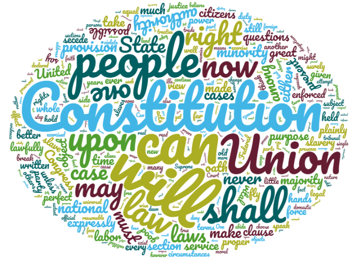
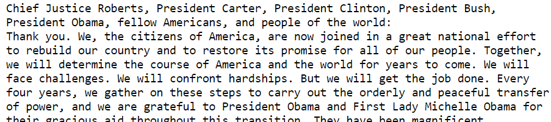
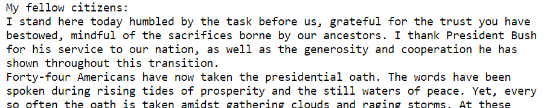
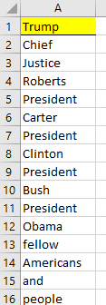
.. |image6| image:: img/h8/media/image7.png
   :width: 1.11814in
   :height: 3.36458in
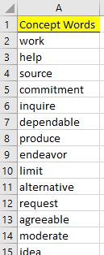
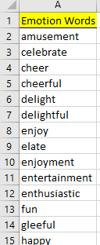
.. |image9| image:: img/h8/media/image10.png
   :width: 2.86458in
   :height: 1.24040in
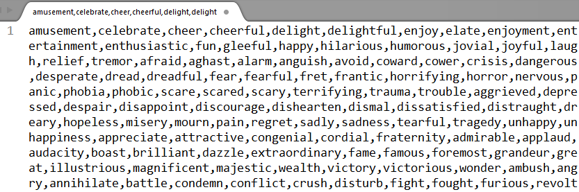
.. |image11| image:: img/h8/media/image10.png
   :width: 5.74945in
   :height: 2.48958in
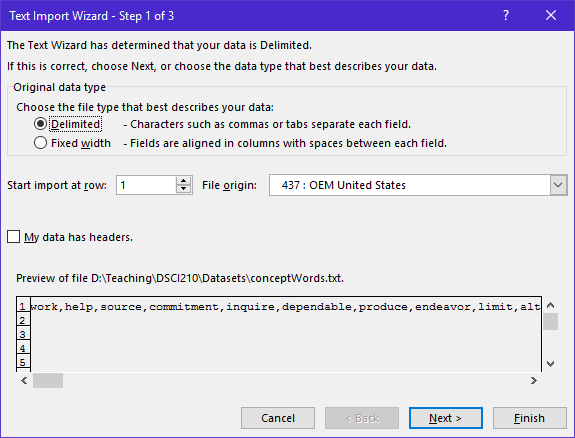
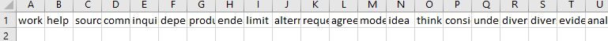
.. |image14| image:: img/h8/media/image14.png
   :width: 1.40347in
   :height: 2.45805in
.. |image15| image:: img/h8/media/image15.png
   :width: 2.74144in
   :height: 2.28125in
.. |image16| image:: img/h8/media/image16.png
   :width: 1.36458in
   :height: 3.06250in
.. |image17| image:: img/h8/media/image17.png
   :width: 1.51042in
   :height: 3.04167in
.. |image18| image:: img/h8/media/image18.png
   :width: 6.50000in
   :height: 2.13333in
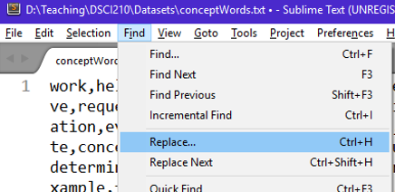
.. |image20| image:: img/h8/media/image20.png
   :width: 6.50000in
   :height: 3.17986in
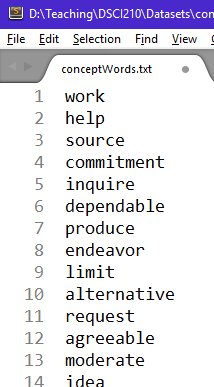

.. |image23| image:: img/h8/media/image22.png
   :width: 3.88741in
   :height: 2.18750in
.. |image24| image:: img/h8/media/image23.png
   :width: 4.91667in
   :height: 2.05229in
.. |image25| image:: img/h8/media/image24.png
   :width: 4.87500in
   :height: 2.04167in
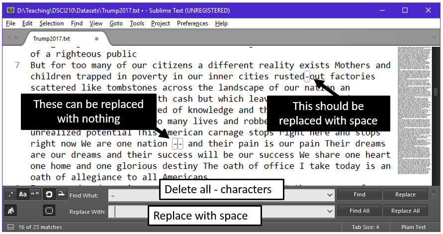
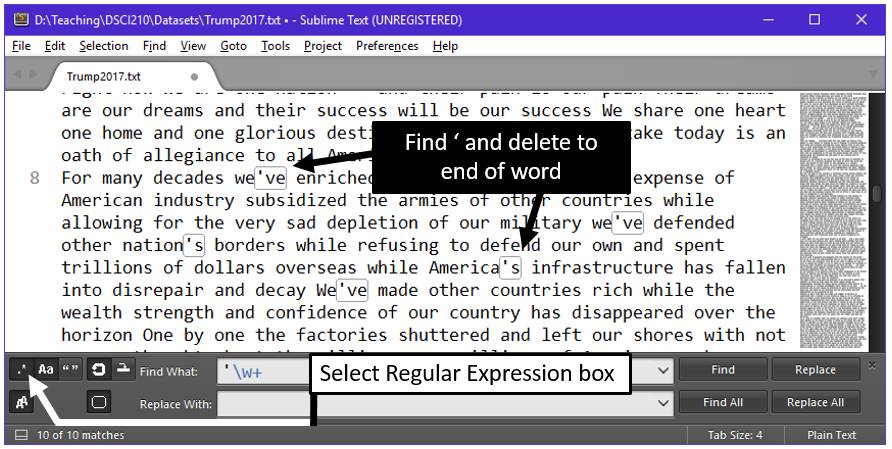
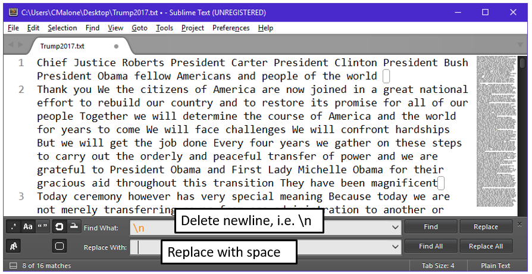
.. |image29| image:: img/h8/media/image28.png
   :width: 5.50000in
   :height: 2.24289in
.. |image30| image:: img/h8/media/image29.png
   :width: 5.33333in
   :height: 2.29174in
.. |image31| image:: img/h8/media/image22.png
   :width: 3.88741in
   :height: 2.18750in
.. |image32| image:: img/h8/media/image30.png
   :width: 5.55208in
   :height: 2.44920in
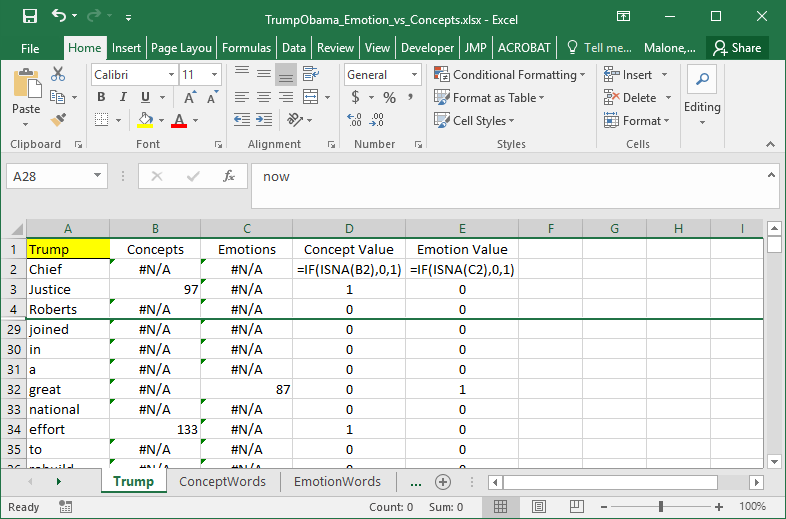
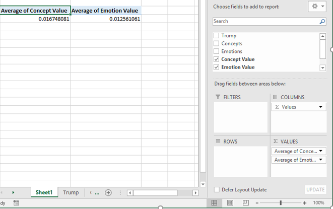
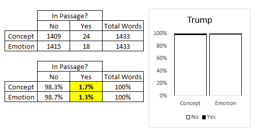
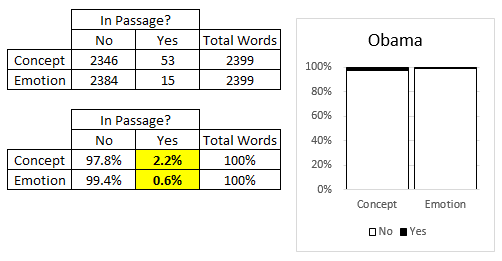
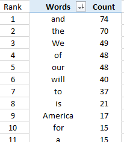
